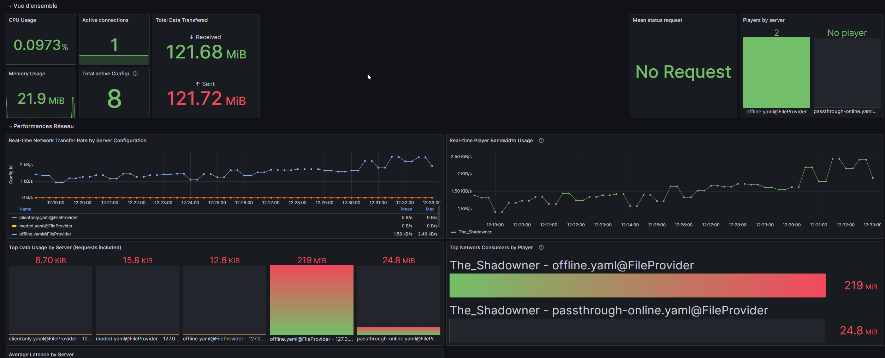

<div align="center" >
    
  
  <h1>Infrarust</h1>
  <h3>High-Performance Minecraft Reverse Proxy in Rust</h3>
    <div class="badges-container">
    <a href="https://crates.io/crates/infrarust" class="badge-link">
      
    </a>
    
  </div>
  
  <h4>Compatible with <i>almost</i> every Minecraft Versions + Modded Versions</h4>
</div>

> [!WARNING]
> Infrarust is currently in active development. This project is a Rust implementation inspired by [Infrared](https://infrared.dev/), focusing on performance and enhanced features.

A blazing fast Minecraft reverse proxy that allows you to expose multiple Minecraft servers through a single port. It uses domain/subdomain-based routing to direct clients to specific Minecraft servers.

## Key Features

- [x] Efficient Reverse Proxy
  - [x] Wildcard Domain Support
  - [x] Multi-Domain Routing
  - [x] Direct IP Connection Support
- [x] Authentication Modes
  - [x] ClientOnly Mode (only works with vanilla < 1.20)
  - [x] Passthrough Mode
  - [x] Offline Mode
- [x] Performance Optimizations
  - [x] Connection Pooling
  - [x] Zero-copy packet forwarding
- [x] Security Features
  - [x] Rate Limiting
  - [x] Basic DDoS Protection
- [x] Basic Telemetry

## Quick Start

### Prerequisites

- Rust 1.80+ and Cargo

### Installation

```bash
# From source
git clone https://github.com/shadowner/infrarust
cd infrarust
cargo build --release

# Or via cargo
cargo install infrarust
```

### Basic Configuration

Create a `config.yaml` file, known as the Proxy Configuration File:

```yaml
bind: "0.0.0.0:25565"
domains:
  - "minecraft.example.com"
```

And create your server configurations in the `proxies` directory known as the Servier Configuration File:

```yaml
domains:
  - "hub.minecraft.example.com"
addresses:
  - "localhost:25566"
proxyMode: "passthrough" # Options: passthrough, cllient-only, offline
```

## Documentation

Visit [infrarust.dev](https://infrarust.dev) for complete documentation:

- [Installation Guide](https://infrarust.dev/docs/installation)
- [Configuration Reference](https://infrarust.dev/docs/configuration)
- [Proxy Modes](https://infrarust.dev/docs/proxy-modes)

## Telemetry & Monitoring

Infrarust provides comprehensive telemetry through OpenTelemetry integration, including metrics, traces, and logs. The project includes a ready-to-use monitoring stack in the [docker/monitoring](docker/monitoring) directory.

### Quick Start Monitoring

```bash
cd docker/monitoring
docker compose up -d
```

This will start:

- Grafana (http://localhost:3000)
- Prometheus (http://localhost:9090)
- Tempo (Traces)
- OpenTelemetry Collector

### Available Metrics

- Connection metrics (active connections, errors, latency)
- Backend metrics (server status, response times)
- System metrics (CPU, memory, threads)
- Minecraft-specific metrics (protocol errors, player count)

<p align="center">
  
</p>

## Performance

Infrarust leverages Rust's performance capabilities:

- Minimal memory footprint
- Low CPU utilization
- Efficient async I/O handling
- Zero-copy packet forwarding when possible

> [!NOTE]
> This project was initiated as a learning experience in advanced Rust programming, with continuous improvements and optimizations expected as development progresses.

## Contributing

Contributions are welcome! Check out our [Contributing Guidelines](CONTRIBUTING.md) to get started.

Feel free to join our [Discord](https://discord.gg/sqbJhZVSgG) if you have any question !

## Similar Projects

- [Infrared](https://github.com/haveachin/infrared) - The original inspiration, written in Go
- [MCRouter](https://github.com/itzg/mc-router)
- [Velocity](https://github.com/PaperMC/Velocity)

## License

Infrarust is licensed under the GNU Affero General Public License v3.0 - see the [LICENSE](LICENSE) file for details.

<br />
<p align="center">
  
</p>
