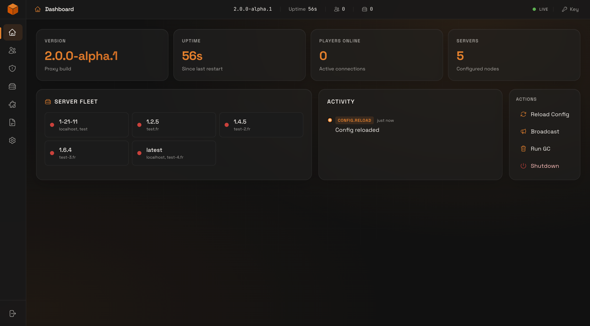
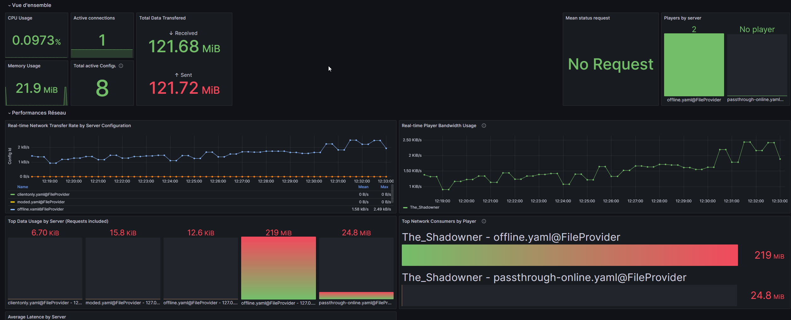

<div align="center">
  

  <h1>Infrarust</h1>

  <p>Minecraft reverse proxy written in Rust. Route players to backend servers by domain, manage everything from a web dashboard.</p>
  <a href="https://ko-fi.com/C1C41WOEBB">
    
  <br /><br />
  </a>
  <a href="https://crates.io/crates/infrarust">
    
  </a>
  
  <a href="https://discord.gg/sqbJhZVSgG">
    
  </a>

</div>

<br />

<p align="center">
  
</p>

> [!WARNING]
> Infrarust V2 is currently in active development. Excpect bug with every intercepted mode (client_only / offline)

## Features

| | |
|---|---|
| **Routing** | Domain and subdomain-based routing with wildcard support. One port, many servers. |
| **Proxy modes** | `passthrough`, `zerocopy`, `client_only`, `offline`, `server_only` - from raw TCP relay to full Mojang auth interception. |
| **Web dashboard** | Built-in admin panel with REST API, real-time event streaming (SSE), and log viewer. Add `[web]` to your config and it's running. |
| **Docker** | Auto-discover Minecraft containers via labels - no config files needed for Docker-managed servers. Scratch-based image, multi-arch. |
| **Plugins** | Event-driven plugin system with built-in auth, server wake, and queue plugins. Write your own in Rust. |
| **Security** | Rate limiting, IP filtering, ban system (IP / UUID / username). |
| **Observability** | OpenTelemetry export for metrics, traces, and logs. Ships with a Grafana dashboard. |
| **Hot reload** | Drop a `.toml` file in `servers/` and the proxy picks it up. No restart. |

## Quick Start

### Install

```bash
# Pre-built binary (Linux)
curl -LO https://github.com/Shadowner/Infrarust/releases/latest/download/infrarust
chmod +x infrarust && sudo mv infrarust /usr/local/bin/

# Docker
docker pull ghcr.io/shadowner/infrarust:latest

# From source (Rust 1.85+)
git clone https://github.com/Shadowner/Infrarust.git && cd Infrarust
cargo build --release -p infrarust
```

### Configure

`infrarust.toml`:

```toml
bind = "0.0.0.0:25565"
servers_dir = "./servers"

[web]
```

`servers/survival.toml`:

```toml
domains = ["survival.example.com"]
addresses = ["127.0.0.1:25566"]
```

### Run

```bash
infrarust
```

The web dashboard is at `http://localhost:8080`. Your API key is in `plugins/admin_api/config.toml`.

Full docs at **[infrarust.dev](https://infrarust.dev/v2/)**.

## Docker

The Docker image is built from `scratch` - statically linked binary, CA certs, nothing else. Supports amd64 and arm64.

```bash
docker run -d \
  --name infrarust \
  -p 25565:25565 \
  -p 8080:8080 \
  -v ./config:/app/config \
  ghcr.io/shadowner/infrarust:latest \
  --config /app/config/infrarust.toml
```

### Auto-discovery

Mount the Docker socket and Infrarust finds your Minecraft containers by label:

```yaml
services:
  infrarust:
    image: ghcr.io/shadowner/infrarust:latest
    command: ["--config", "/app/config/infrarust.toml"]
    ports:
      - "25565:25565"
      - "8080:8080"
    volumes:
      - /var/run/docker.sock:/var/run/docker.sock:ro
      - ./config:/app/config

  survival:
    image: itzg/minecraft-server
    environment:
      EULA: "TRUE"
    labels:
      infrarust.enable: "true"
      infrarust.domains: "survival.example.com"
```

Add `[docker]` to your `infrarust.toml` and containers with `infrarust.enable=true` get registered automatically. When they start or stop, routing updates in real time.

## Monitoring

Infrarust exports metrics, traces, and logs via OpenTelemetry. A ready-to-use monitoring stack (Grafana, Prometheus, Tempo) is included in [`docker/monitoring`](docker/monitoring).

<p align="center">
  
</p>

> Need to be updated for V2 dashboards

## Documentation

Full documentation at [infrarust.dev](https://infrarust.dev/v2/):

- [Quick Start](https://infrarust.dev/v2/guide/quick-start)
- [Configuration](https://infrarust.dev/v2/configuration/)
- [Plugins](https://infrarust.dev/v2/plugins/)
- [Docker Guide](https://infrarust.dev/v2/guide/docker)

## Contributing

Contributions welcome - see [CONTRIBUTING.md](CONTRIBUTING.md) for setup and guidelines.

Questions or ideas? Join the [Discord](https://discord.gg/sqbJhZVSgG) or open an issue.

## Similar Projects

- [Infrared](https://github.com/haveachin/infrared) - the original inspiration, written in Go
- [MCRouter](https://github.com/itzg/mc-router)
- [Velocity](https://github.com/PaperMC/Velocity)

> More can be seen on the [thank's open source web page](https://infrarust.dev/v2/thank-you-open-source) 

## License

AGPL-3.0 with plugin exceptions - see [LICENSE](LICENSE).

<p align="center">
  
</p>
