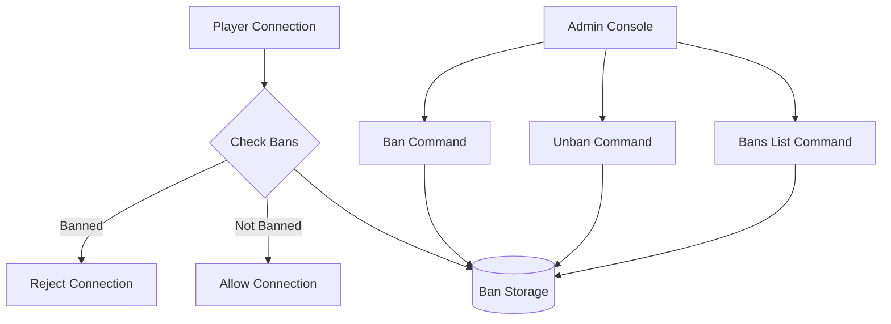

# Ban System

The Ban System in Infrarust allows you to manage player access by banning specific IP addresses, Minecraft UUIDs, or usernames. It provides permanent and temporary bans with support for detailed ban reasons.



## Configuration

To enable the ban system, add these settings to your `config.yaml` file:

```yaml
filters:
  ban:
    enabled: true
    storage_type: "file"
    file_path: "bans.json"
    enable_audit_log: true
    audit_log_path: "bans_audit.log"
    auto_cleanup_interval: 3600  # Clean expired bans every hour (in seconds)
    cache_size: 10000
```

### Complete Configuration Options

| Option | Description | Default |
|--------|-------------|---------|
| `enabled` | Enable or disable the ban system | `true` |
| `storage_type` | Type of storage ("memory" or "file") | `"file"` |
| `file_path` | Path for ban storage file | `"bans.json"` |
| `enable_audit_log` | Whether to keep audit logs | `true` |
| `audit_log_path` | Path for audit log file | `"bans_audit.log"` |
| `audit_log_rotation.max_size` | Max size of logs before rotation (bytes) | `10485760` (10MB) |
| `audit_log_rotation.max_files` | Max number of rotated files to keep | `5` |
| `audit_log_rotation.compress` | Whether to compress rotated logs | `true` |
| `auto_cleanup_interval` | Seconds between expired ban cleanups (0 to disable) | `3600` |
| `cache_size` | Size of ban cache for performance | `10000` |

## Using the Ban System

### Banning Players

To ban a player, use the `ban` command through the Infrarust console:

```
> ban [--ip/-ip <address> | --username/-u <username> | --uuid/-id <uuid>] [--reason <reason>] [--duration <duration>]
```

**Parameters:**
- `--ip` or `-ip`: The IP address to ban
- `--username` or `-u`: The username to ban
- `--uuid` or `-id`: The UUID to ban
- `--reason`: The reason for the ban (optional, defaults to "Banned by administrator")
- `--duration`: The duration of the ban (optional, defaults to permanent)

**Duration Format:**
- `Xs`: X seconds
- `Xm`: X minutes
- `Xh`: X hours
- `Xd`: X days
- `Xw`: X weeks
- `Xmo`: X months
- `Xy`: X years

**Examples:**

```
> ban --ip 192.168.1.10 --reason "Spamming" --duration 2d
Ban applied successfully:
  IP: 192.168.1.10
  Reason: Spamming
  Duration: 2 days

> ban --username Steve --reason "Griefing"
Ban applied successfully:
  Username: Steve
  Reason: Griefing
  Duration: Permanent

> ban --uuid 7f8d3a2e-9c5b-4b1d-8a7c-3d2f6e9a1b5c --duration 1w
Ban applied successfully:
  UUID: 7f8d3a2e-9c5b-4b1d-8a7c-3d2f6e9a1b5c
  Reason: Banned by administrator
  Duration: 1 week
```

### Removing Bans

To unban a player, use the `unban` command:

```
> unban [--ip/-ip <address> | --username/-u <username> | --uuid/-id <uuid>]
```

**Parameters:**
- `--ip` or `-ip`: The IP address to unban
- `--username` or `-u`: The username to unban
- `--uuid` or `-id`: The UUID to unban

**Examples:**

```
> unban --ip 192.168.1.10
Successfully removed ban for IP: 192.168.1.10

> unban --username Steve
Successfully removed ban for username: Steve

> unban --uuid 7f8d3a2e-9c5b-4b1d-8a7c-3d2f6e9a1b5c
Successfully removed ban for UUID: 7f8d3a2e-9c5b-4b1d-8a7c-3d2f6e9a1b5c
```

### Viewing Active Bans

To see all current active bans, use the `bans` command:

```
> bans
```

**Example output:**
```
=== Active Bans (2) ===

1. IP: 192.168.1.10
   Reason: Spamming
   Banned by: console
   Created: 2 hours ago
   Expires: In 1 day, 22 hours (in 1 day)

2. Username: Griefer123
   Reason: Griefing
   Banned by: console
   Created: 3 days ago
   Expires: Never (permanent ban)
```

## Storage Options

The ban system currently supports two storage backends:

### Memory Storage

- Bans are stored in memory only
- Bans are lost when Infrarust restarts
- Useful for testing environments

```yaml
filters:
  ban:
    storage_type: "memory"
    enabled: true
```

### File Storage (Recommended)

- Stores bans in a JSON file
- Persists across server restarts
- Automatically saves changes in the background

```yaml
filters:
  ban:
    storage_type: "file"
    file_path: "bans.json"
    enabled: true
```

## Automatic Features

### Expired Ban Cleanup

The system automatically removes expired bans at the interval configured in `auto_cleanup_interval`. Set to `0` to disable this feature.

```yaml
filters:
  ban:
    auto_cleanup_interval: 3600  # Every hour
```

### Audit Logging

When enabled, all ban actions (add, remove, expire) are logged with:
- Who performed the action
- When it happened
- Full details of the ban

```yaml
filters:
  ban:
    enable_audit_log: true
    audit_log_path: "bans_audit.log"
```

### Log Rotation

For long-running servers, audit log rotation prevents log files from growing too large:

```yaml
filters:
  ban:
    audit_log_rotation:
      max_size: 10485760  # 10MB
      max_files: 5
      compress: true
```

## Example Configuration

Here's a complete example configuration for the ban system in your `config.yaml`:

```yaml
filters:
  # Other filters like rate limiting may be here
  ban:
    enabled: true
    storage_type: "file"
    file_path: "data/bans.json"
    enable_audit_log: true
    audit_log_path: "logs/bans_audit.log"
    audit_log_rotation:
      max_size: 10485760  # 10MB
      max_files: 5
      compress: true
    auto_cleanup_interval: 3600
    cache_size: 10000
```

## Common Use Cases

### Temporary Ban for Rule Violations

```
> ban --username Steve --reason "Chat spam" --duration 24h
```

### Permanent Ban for Serious Offenses

```
> ban --uuid 7f8d3a2e-9c5b-4b1d-8a7c-3d2f6e9a1b5c --reason "Hacking"
```

### Ban a Malicious IP

```
> ban --ip 192.168.1.100 --reason "DDoS attempt"
```

### Multi-level Ban for Serious Cases

For serious violations, you might want to ban both the account and IP:

```
> ban --uuid 7f8d3a2e-9c5b-4b1d-8a7c-3d2f6e9a1b5c --reason "Botting"
> ban --ip 192.168.1.100 --reason "Botting from this IP"
```

### Unbanning After Appeal

```
> unban --username Steve
```

## Integration with Other Systems

The ban system automatically integrates with:

1. **Connection handling** - Automatically checks incoming connections against ban lists
2. **Username validation** - Checks username bans during the login process
3. **Console commands** - Provides the `ban`, `unban`, and `bans` commands

## Technical Details

- All ban checks are performed asynchronously for minimal performance impact
- The ban system uses efficient indexing to handle thousands of ban entries
- When using file storage, changes are saved asynchronously in the background
- Expired bans are automatically cleaned up without manual intervention

::: warning IMPORTANT
If you change the storage path in your configuration, you must restart Infrarust for the changes to take effect.
:::

::: tip COMING SOON
Future updates will include enhanced search capabilities and additional storage backends.
:::
