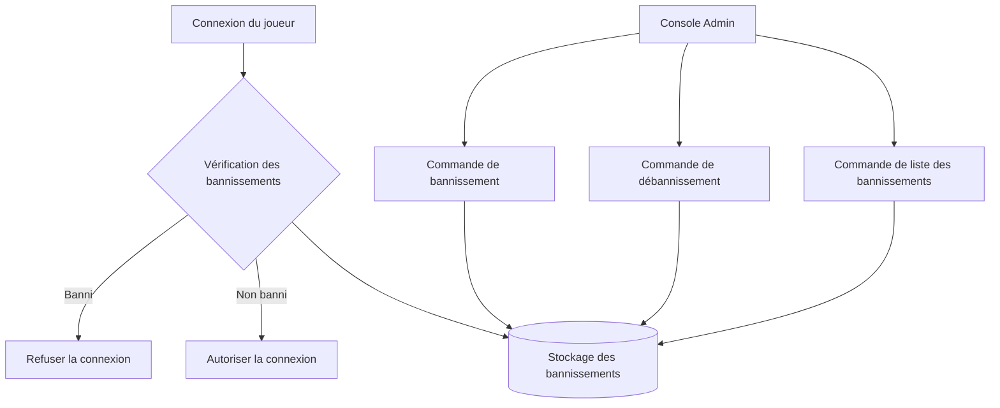

# Système de Bannissement

Le Système de Bannissement dans Infrarust vous permet de gérer l'accès des joueurs en bannissant des adresses IP spécifiques, des UUID Minecraft ou des noms d'utilisateur. Il permet des bannissements permanents et temporaires avec prise en charge de motifs de bannissement détaillés.



## Configuration

Pour activer le système de bannissement, ajoutez ces paramètres à votre fichier `config.yaml` :

```yaml
filters:
  ban:
    enabled: true
    storage_type: "file"
    file_path: "bans.json"
    enable_audit_log: true
    audit_log_path: "bans_audit.log"
    auto_cleanup_interval: 3600  # Nettoie les bannissements expirés toutes les heures (en secondes)
    cache_size: 10000
```

### Options de configuration complètes

| Option | Description | Valeur par défaut |
|--------|-------------|---------|
| `enabled` | Activer ou désactiver le système de bannissement | `true` |
| `storage_type` | Type de stockage ("memory" ou "file") | `"file"` |
| `file_path` | Chemin pour le fichier de stockage des bannissements | `"bans.json"` |
| `enable_audit_log` | Activer ou non les journaux d'audit | `true` |
| `audit_log_path` | Chemin pour le fichier de journal d'audit | `"bans_audit.log"` |
| `audit_log_rotation.max_size` | Taille maximale des journaux avant rotation (octets) | `10485760` (10MB) |
| `audit_log_rotation.max_files` | Nombre maximal de fichiers de rotation à conserver | `5` |
| `audit_log_rotation.compress` | Compression des journaux en rotation | `true` |
| `auto_cleanup_interval` | Secondes entre les nettoyages de bannissements expirés (0 pour désactiver) | `3600` |
| `cache_size` | Taille du cache de bannissement pour les performances | `10000` |

## Utilisation du système de bannissement

### Bannir des joueurs

Pour bannir un joueur, utilisez la commande `ban` via la console Infrarust :

```
> ban [--ip/-ip <adresse> | --username/-u <nom_utilisateur> | --uuid/-id <uuid>] [--reason <motif>] [--duration <durée>]
```

**Paramètres :**
- `--ip` ou `-ip` : L'adresse IP à bannir
- `--username` ou `-u` : Le nom d'utilisateur à bannir
- `--uuid` ou `-id` : L'UUID à bannir
- `--reason` : Le motif du bannissement (optionnel, par défaut "Banned by administrator")
- `--duration` : La durée du bannissement (optionnel, permanent par défaut)

**Format de durée :**
- `Xs` : X secondes
- `Xm` : X minutes
- `Xh` : X heures
- `Xd` : X jours
- `Xw` : X semaines
- `Xmo` : X mois
- `Xy` : X années

**Exemples :**

```
> ban --ip 192.168.1.10 --reason "Spamming" --duration 2d
Bannissement appliqué avec succès :
  IP : 192.168.1.10
  Motif : Spamming
  Durée : 2 jours

> ban --username Steve --reason "Griefing"
Bannissement appliqué avec succès :
  Nom d'utilisateur : Steve
  Motif : Griefing
  Durée : Permanent

> ban --uuid 7f8d3a2e-9c5b-4b1d-8a7c-3d2f6e9a1b5c --duration 1w
Bannissement appliqué avec succès :
  UUID : 7f8d3a2e-9c5b-4b1d-8a7c-3d2f6e9a1b5c
  Motif : Banned by administrator
  Durée : 1 semaine
```

### Retirer des bannissements

Pour débannir un joueur, utilisez la commande `unban` :

```
> unban [--ip/-ip <adresse> | --username/-u <nom_utilisateur> | --uuid/-id <uuid>]
```

**Paramètres :**
- `--ip` ou `-ip` : L'adresse IP à débannir
- `--username` ou `-u` : Le nom d'utilisateur à débannir
- `--uuid` ou `-id` : L'UUID à débannir

**Exemples :**

```
> unban --ip 192.168.1.10
Bannissement supprimé avec succès pour l'IP : 192.168.1.10

> unban --username Steve
Bannissement supprimé avec succès pour le nom d'utilisateur : Steve

> unban --uuid 7f8d3a2e-9c5b-4b1d-8a7c-3d2f6e9a1b5c
Bannissement supprimé avec succès pour l'UUID : 7f8d3a2e-9c5b-4b1d-8a7c-3d2f6e9a1b5c
```

### Afficher les bannissements actifs

Pour voir tous les bannissements actifs, utilisez la commande `bans` :

```
> bans
```

**Exemple de sortie :**
```
=== Bannissements actifs (2) ===

1. IP : 192.168.1.10
   Motif : Spamming
   Banni par : console
   Créé : il y a 2 heures
   Expire : Dans 1 jour, 22 heures (dans 1 jour)

2. Nom d'utilisateur : Griefer123
   Motif : Griefing
   Banni par : console
   Créé : il y a 3 jours
   Expire : Jamais (bannissement permanent)
```

## Options de stockage

Le système de bannissement prend actuellement en charge deux backends de stockage :

### Stockage en mémoire

- Les bannissements sont stockés uniquement en mémoire
- Les bannissements sont perdus au redémarrage d'Infrarust
- Utile pour les environnements de test

```yaml
filters:
  ban:
    storage_type: "memory"
    enabled: true
```

### Stockage de fichiers (Recommandé)

- Stocke les bannissements dans un fichier JSON
- Persiste à travers les redémarrages du serveur
- Enregistre automatiquement les modifications en arrière-plan

```yaml
filters:
  ban:
    storage_type: "file"
    file_path: "bans.json"
    enabled: true
```

## Fonctionnalités automatiques

### Nettoyage des bannissements expirés

Le système supprime automatiquement les bannissements expirés à l'intervalle configuré dans `auto_cleanup_interval`. Définissez à `0` pour désactiver cette fonctionnalité.

```yaml
filters:
  ban:
    auto_cleanup_interval: 3600  # Toutes les heures
```

### Journal d'audit

Lorsqu'il est activé, toutes les actions de bannissement (ajout, suppression, expiration) sont enregistrées avec :
- Qui a effectué l'action
- Quand cela s'est produit
- Détails complets du bannissement

```yaml
filters:
  ban:
    enable_audit_log: true
    audit_log_path: "bans_audit.log"
```

### Rotation des journaux

Pour les serveurs à longue durée de fonctionnement, la rotation des journaux d'audit empêche les fichiers journaux de devenir trop volumineux :

```yaml
filters:
  ban:
    audit_log_rotation:
      max_size: 10485760  # 10MB
      max_files: 5
      compress: true
```

## Configuration d'exemple

Voici un exemple complet de configuration du système de bannissement dans votre `config.yaml` :

```yaml
filters:
  # D'autres filtres comme la limitation de requête peuvent être ici
  ban:
    enabled: true
    storage_type: "file"
    file_path: "data/bans.json"
    enable_audit_log: true
    audit_log_path: "logs/bans_audit.log"
    audit_log_rotation:
      max_size: 10485760  # 10MB
      max_files: 5
      compress: true
    auto_cleanup_interval: 3600
    cache_size: 10000
```

## Cas d'utilisation courants

### Bannissement temporaire pour violations des règles

```
> ban --username Steve --reason "Spam dans le chat" --duration 24h
```

### Bannissement permanent pour infractions graves

```
> ban --uuid 7f8d3a2e-9c5b-4b1d-8a7c-3d2f6e9a1b5c --reason "Triche"
```

### Bannissement d'une IP malveillante

```
> ban --ip 192.168.1.100 --reason "Tentative de DDoS"
```

### Bannissement multi-niveaux pour cas graves

Pour les violations graves, vous pourriez vouloir bannir à la fois le compte et l'IP :

```
> ban --uuid 7f8d3a2e-9c5b-4b1d-8a7c-3d2f6e9a1b5c --reason "Botting"
> ban --ip 192.168.1.100 --reason "Botting depuis cette IP"
```

### Débannissement après appel

```
> unban --username Steve
```

## Intégration avec d'autres systèmes

Le système de bannissement s'intègre automatiquement avec :

1. **Gestion des connexions** - Vérifie automatiquement les connexions entrantes par rapport aux listes de bannissement
2. **Validation des noms d'utilisateur** - Vérifie les bannissements des noms d'utilisateur pendant le processus de connexion
3. **Commandes de console** - Fournit les commandes `ban`, `unban` et `bans`

## Détails techniques

- Toutes les vérifications de bannissement sont effectuées de manière asynchrone pour un impact minimal sur les performances
- Le système de bannissement utilise un indexage efficace pour gérer des milliers d'entrées de bannissement
- Lors de l'utilisation du stockage de fichiers, les modifications sont enregistrées de manière asynchrone en arrière-plan
- Les bannissements expirés sont automatiquement nettoyés sans intervention manuelle

::: warning IMPORTANT
Si vous modifiez le chemin de stockage dans votre configuration, vous devez redémarrer Infrarust pour que les changements prennent effet.
:::

::: tip À VENIR
Les mises à jour futures incluront des capacités de recherche améliorées et des backends de stockage supplémentaires.
:::
