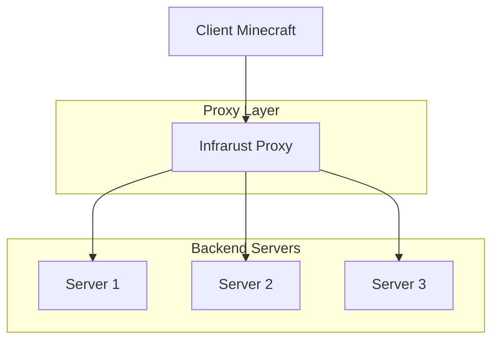
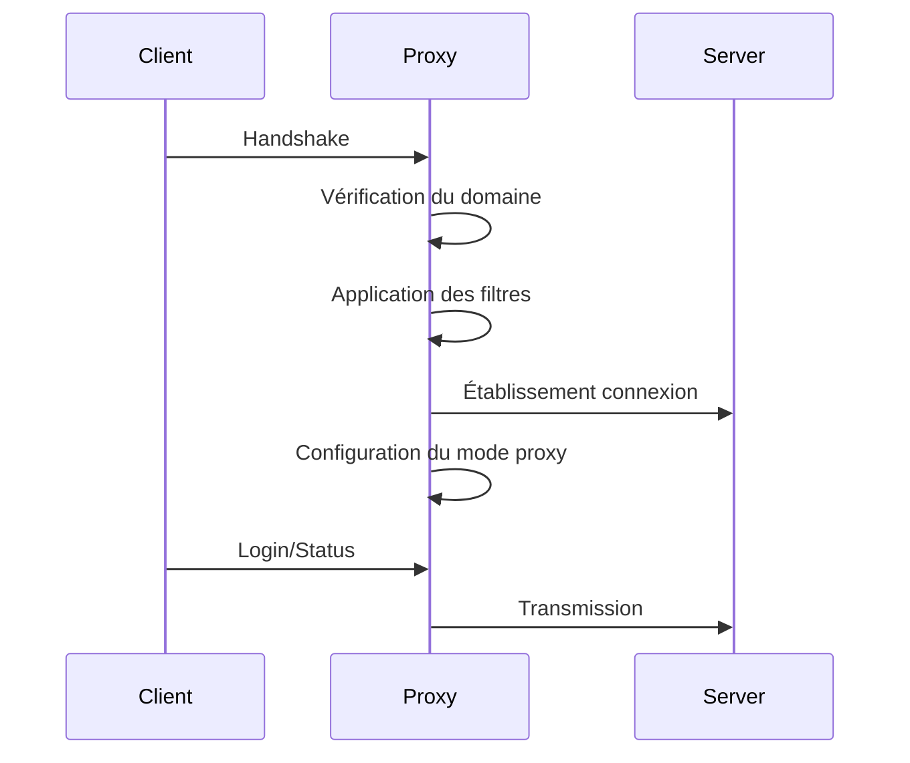
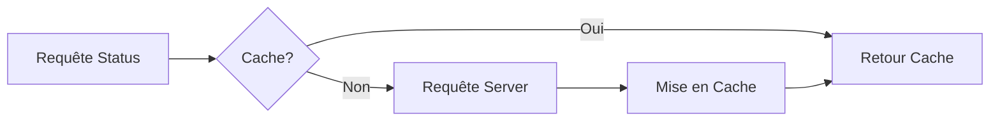
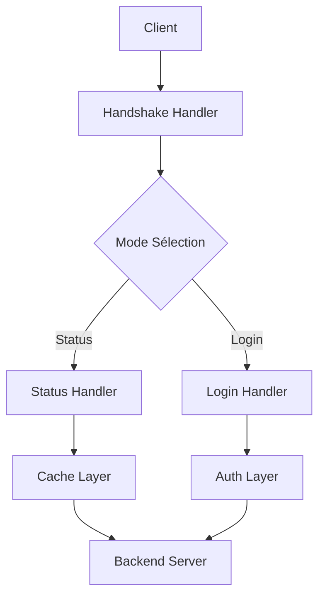

# Vue d'Ensemble du Proxy

Infrarust est un proxy inverse Minecraft haute performance écrit en Rust. Cette page explique son fonctionnement et son architecture.

## Architecture Générale



## Composants Principaux

### 1. Gestion des Connexions

Le proxy gère trois types de connexions :

- **Entrantes** : Connexions des clients Minecraft
- **Sortantes** : Connexions vers les serveurs backend
- **Pool de connexions** : Gestion optimisée des ressources

### 2. Routage

Le routage se fait principalement sur deux critères :

- **Domaine** : Correspondance avec les patterns configurés
- **Adresse IP** : Connexion directe si configurée

```yaml
# Exemple de configuration de routage
domains:
  - "hub.minecraft.example.com" -> Server 1
  - "survival.minecraft.example.com" -> Server 2
  - "*.creative.minecraft.example.com" -> Server 3
```

### 3. Pipeline de Traitement



## Modes de Fonctionnement

### 1. Mode Passthrough

- Transmission directe des paquets
- Performances maximales
- Pas de modification des données

### 2. Mode ClientOnly

- Authentification côté client
- Vérification des sessions
- Cache des authentifications

### 3. Mode Offline

- Sans authentification
- Idéal pour les serveurs crackés
- Configuration simplifiée

## Optimisations de Performance

### 1. Cache de Status



### 2. Connection Pooling

- Réutilisation des connexions
- Réduction de la latence
- Économie des ressources

### 3. Buffer Management

- Gestion optimisée de la mémoire
- Zero-copy quand possible
- Buffers pré-alloués

## Sécurité

### 1. Protection DDoS

Le proxy intègre plusieurs mécanismes de protection :

- Rate limiting par IP
- Filtrage des paquets
- Protection contre les flood

### 2. Filtrage IP

```yaml
security: ### NOT IMPLEMENTED  YET ###
  ip_filter:
    blacklist:
      - "1.2.3.4"
      - "10.0.0.0/8"
    whitelist:
      - "192.168.1.0/24"
```

### 3. Limitation de Taux

- Par IP
- Par connexion
- Par requête


## Flux de Données




::: tip
Consultez les [bonnes pratiques](./best-practices.md) pour une configuration optimale de votre proxy.
:::
