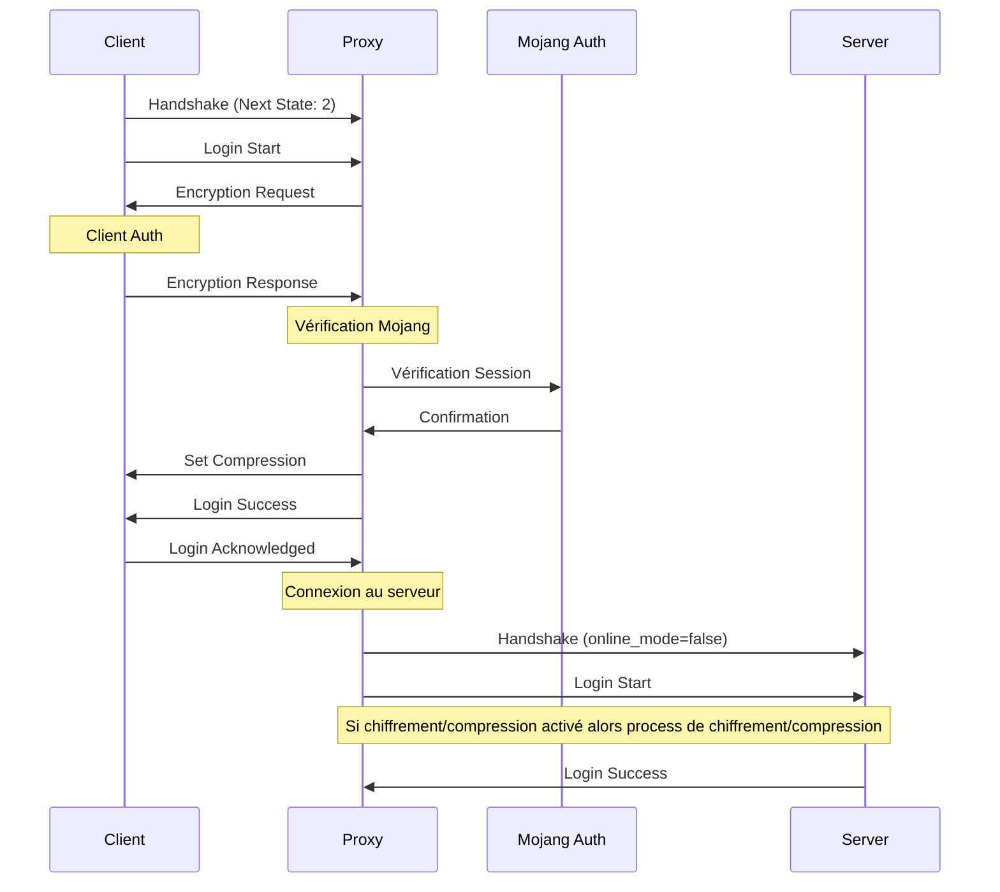

# Mode ClientOnly

Le mode ClientOnly assure l'authentification des clients Minecraft tout en permettant l'utilisation de plugins. Il fonctionne avec des serveurs configurés en `online_mode=false`.


## Fonctionnement



## Caractéristiques

- ✅ Authentification des clients
- ✅ Support complet des plugins
- ✅ Lecture des paquets
- ✅ Sécurité renforcée
- ❌ Légère perte de performance vs Passthrough

## Configuration

### Configuration Minimale

```yaml
proxy_mode: "clientOnly"
```

### Configuration Complète

```yaml
proxy_mode: "clientOnly"
authentication: ### NOT IMPLEMENTED YET ###
  # Paramètres d'authentification
  session_server: "https://sessionserver.mojang.com"
  cache_duration: 300s
  
  # Gestion des joueurs
  allowed_players: ### NOT IMPLEMENTED YET ###
    - "Player1"
    - "Player2"
  
plugins: ### NOT IMPLEMENTED YET ###
  # Configuration des plugins
  enabled: true
  directory: "plugins"
  
security: ### NOT IMPLEMENTED YET ###
  # Paramètres de sécurité
  verify_tokens: true
  encryption: true
```

## Configuration du Serveur

:::warning Important
Le serveur Minecraft doit être configuré en `online_mode=false` pour fonctionner avec ce mode.
:::

Dans `server.properties`:

```properties
online-mode=false
```

## Système de Plugins - Non implémenté

Le mode ClientOnly permet l'utilisation de plugins grâce à sa capacité à lire et modifier les paquets.

### Capacités

1. **Lecture de Paquets**
   - Intercepter les messages
   - Analyser les commandes
   - Suivre les événements

2. **Modification de Paquets**
   - Modifier le contenu
   - Ajouter des fonctionnalités
   - Gérer les événements

## Sécurité

Le mode ClientOnly offre plusieurs niveaux de sécurité :

1. **Authentification**
   - Vérification Mojang
   - Protection contre les comptes non premium

## Cas d'Utilisation

Le mode ClientOnly est idéal pour :

1. **Serveurs Premium**
   - Nécessitant une authentification
   - Avec plugins personnalisés

2. **Réseaux Multi-Serveurs**
   - Gestion centralisée des joueurs
   - Fonctionnalités cross-serveur

3. **Serveurs Sécurisés**
   - Protection contre les comptes crackés

## Performance

Considérations de performance :

- Légèrement plus lent que Passthrough
- Overhead des plugins à considérer

## Dépannage

### Problèmes Potentiel

1. **Problèmes de Plugins** `### NOT IMPLEMENTED YET ###`

   ```yaml
   plugins:
     debug: true
     reload_on_error: true
   ```

