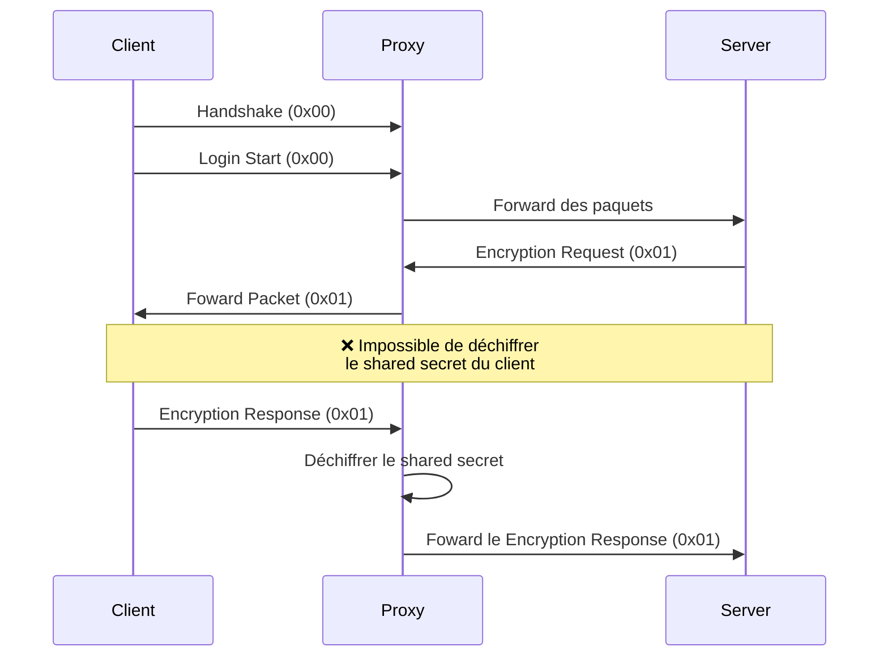

# Mode Full (Non Fonctionnel)

⚠️ **Ce mode est actuellement non fonctionnel et ne peut pas être utilisé.**

## Objectif Initial

Ce mode visait à combiner :

- Support des plugins
- Authentification complète
- Serveurs en `online_mode=true`

## Limitation Technique

## Raison de l'Échec

Le mode Full ne peut pas fonctionner car :

1. Le serveur et le client utilisent une API externe
2. Le processus dépend d'un secret partagé chiffré
3. Le proxy ne peut pas déchiffrer et retransmettre ce secret
