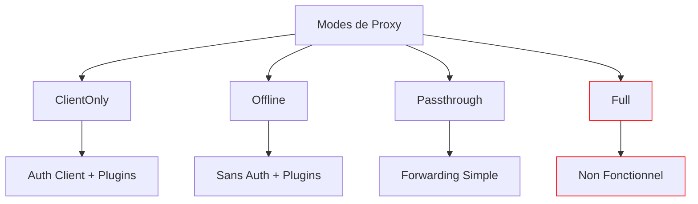

# Modes de Proxy

Infrarust propose différents modes de proxy pour s'adapter à vos besoins spécifiques. Chaque mode a ses propres caractéristiques et cas d'utilisation.

## Vue d'Ensemble

## Modes Disponibles

### [ClientOnly](./clientonly.md)

- Vérifie l'authenticité du client
- Compatible avec le système de plugins
- Serveur en `online_mode=false`

### [Offline](./offline.md)

- Relais client/serveur avec lecture des paquets
- Support des plugins
- Pas de vérification d'authenticité
- Serveur en `online_mode=false`

### [Passthrough](./passthrough.md)

- Mode simple de forwarding
- Performances optimales
- Routage basé sur le handshake initial

### [Full](./full.md)

:::warning
Ce mode est actuellement non fonctionnel en raison de limitations techniques avec le protocole d'authentification Minecraft.
:::

- Tentative de support plugins + authentification complète
- Incompatible avec le système de secret partagé de Minecraft

## Tableau Comparatif

| Fonctionnalité      | ClientOnly | Offline | Passthrough | Full |
|---------------------|------------|---------|-------------|------|
| Authentification    | ✅         | ❌      | ➖          | ❌   |
| Support Plugins*     | ✅         | ✅      | ❌          | ❌   |
| Performance         | ⭐⭐⭐     | ⭐⭐⭐   | ⭐⭐⭐⭐⭐   | ❌   |
| Online Mode Serveur | ❌         | ❌      | ✅          | ✅   |

>*Système non implémenté pour le moment

## Choisir un Mode

- **Pour un proxy simple et performant** : Utilisez le mode `Passthrough`
- **Pour les Serveurs Crackés** : Utilisez le mode `Offline`
- **Pour la Sécurité** : Utilisez le mode `ClientOnly`

::: tip
Consultez la documentation détaillée de chaque mode pour plus d'informations sur leur configuration et utilisation.
:::
