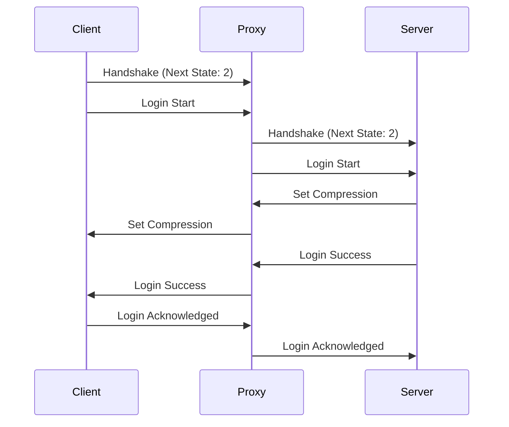

# Mode Offline

Le mode Offline permet un relais client/serveur avec support des plugins, sans authentification des clients.

::: warning
Ce mode ne doit être utilisé que dans des environnements contrôlés ou lorsque l'authentification n'est pas requise.
:::

## Processus de Connexion classique

> Sous entendu qu'il n'y a pas de demande de chiffrement du côté serveur



## Configuration

### Configuration Minimale

```yaml
proxy_mode: "offline"
```

### Configuration Complète

```yaml
proxy_mode: "offline"
options: ### NOT IMPLEMENTED YET ###
  allow_duplicate_names: false
  max_players: 100
  
plugins: ### NOT IMPLEMENTED YET ###
  enabled: true
  directory: "plugins"
```

## Sécurité

⚠️ Ce mode n'offre aucune vérification d'authenticité des clients.

### Recommandations

- Utilisez des whitelist
- Implémentez une authentification via plugins
- Limitez l'accès au réseau local si possible

## Cas d'Utilisation

- Serveurs locaux
- Environnements de test / dev
- Réseaux privés
- Serveurs crackés
