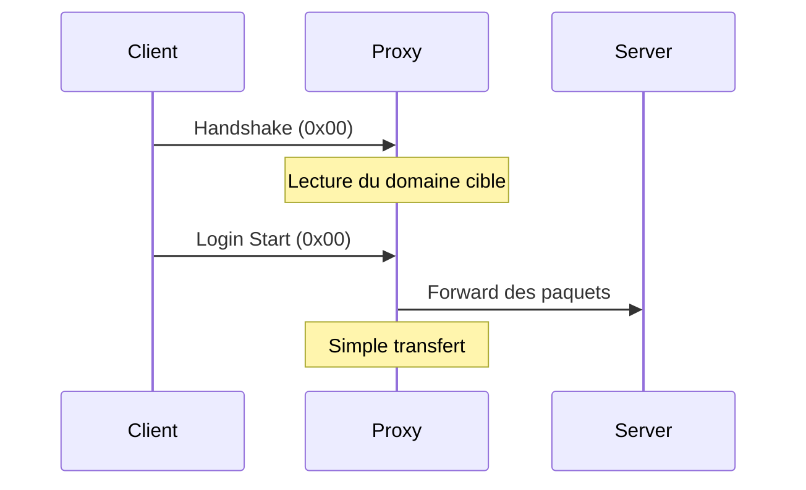
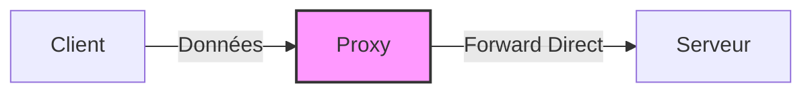

# Mode Passthrough

Le mode Passthrough est le mode le plus simple et le plus performant d'Infrarust. Il agit comme un forwarding proxy pur, ne modifiant pas le flux de données entre le client et le serveur.

::: tip Performance
Le mode Passthrough est le choix optimal pour la performance. Utilisez-le quand vous n'avez pas besoin de fonctionnalités avancées.
:::

## Fonctionnement



## Caractéristiques

- ✅ Performances maximales
- ✅ Compatibilité totale avec les serveurs en `online_mode=true`
- ✅ Overhead minimal
- ❌ Pas de support des plugins
- ❌ Pas de modification des paquets

## Configuration

### Configuration Minimale

```yaml
proxy_mode: "passthrough"
```

### Configuration Complète

```yaml
proxy_mode: "passthrough"
options:
  # Timeout de connexion
  connection_timeout: 30s
  
  # Taille du buffer de transfert
  buffer_size: 8192
  
  # Forward de l'IP du client
  forward_ip: true
```

## Cas d'Utilisation

Le mode Passthrough est idéal pour :

1. **Serveurs Premium**
   - Serveurs nécessitant une authentification officielle
   - Maintien de la sécurité Minecraft native

2. **Haute Performance**
   - Grands réseaux nécessitant une latence minimale
   - Serveurs avec trafic important

3. **Routage Simple**
   - Load balancing basique
   - Redirection par domaine

## Limitations

1. **Pas de Plugins**
   - Le mode Passthrough ne lit que les paquets nécessaires au routage
   - Aucune modification des données n'est possible

2. **Pas de Fonctionnalités Avancées**
   - Pas de filtrage avancé
   - Pas de modification du protocole

## Performances

Le mode Passthrough offre les meilleures performances car :

- Lecture minimale des paquets
- Pas de traitement supplémentaire
- Transfert direct des données

