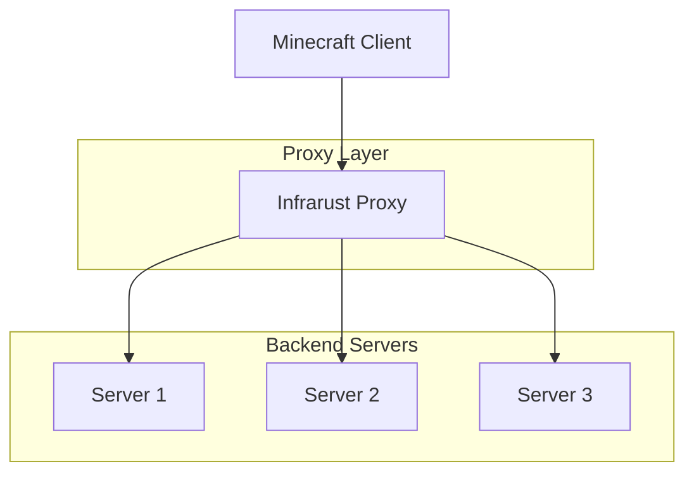
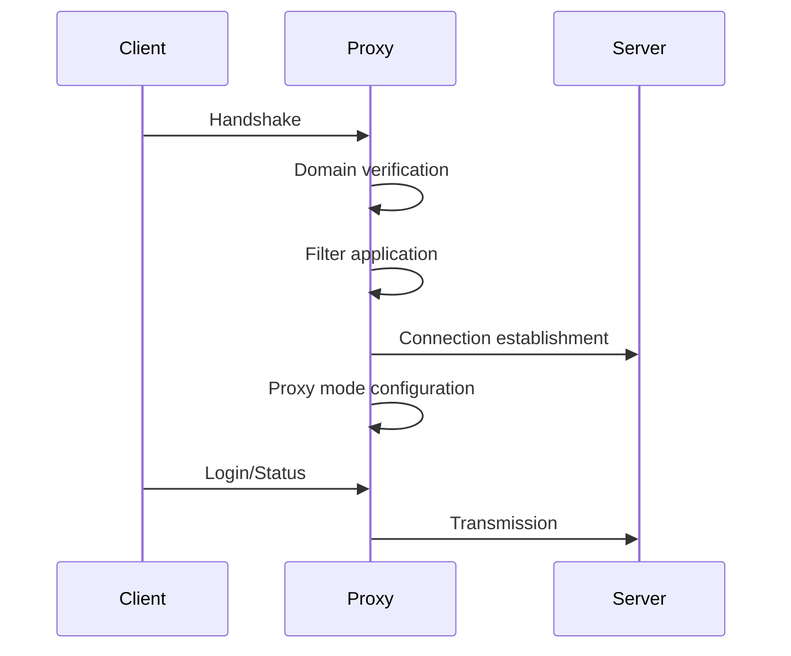
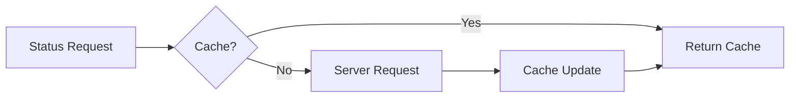
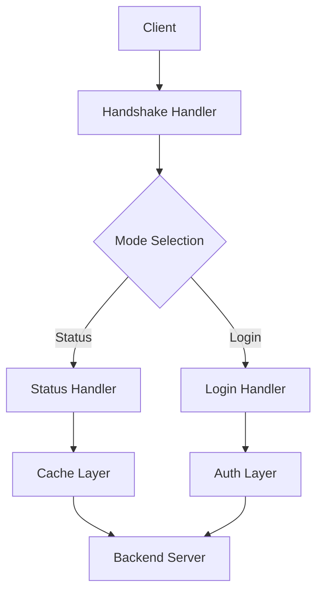

# Proxy Overview

Infrarust is a high-performance Minecraft reverse proxy written in Rust. This page explains its operation and architecture.

## General Architecture



## Main Components

### 1. Connection Management

The proxy handles three types of connections:

- **Incoming**: Minecraft client connections
- **Outgoing**: Connections to backend servers
- **Connection Pool**: Optimized resource management

### 2. Routing

Routing is primarily based on two criteria:

- **Domain**: Matching with configured patterns
- **IP Address**: Direct connection if configured

```yaml
# Routing configuration example
domains:
  - "hub.minecraft.example.com" -> Server 1
  - "survival.minecraft.example.com" -> Server 2
  - "*.creative.minecraft.example.com" -> Server 3
```

### 3. Processing Pipeline



## Operating Modes

### 1. Passthrough Mode

- Direct packet transmission
- Maximum performance
- No data modification

### 2. ClientOnly Mode

- Client-side authentication
- Session verification
- Authentication caching

### 3. Offline Mode

- No authentication
- Ideal for cracked servers
- Simplified configuration

## Performance Optimizations

### 1. Status Cache



### 2. Connection Pooling

- Connection reuse
- Latency reduction
- Resource efficiency

### 3. Buffer Management

- Optimized memory management
- Zero-copy when possible
- Pre-allocated buffers

## Security

### 1. DDoS Protection

The proxy includes several protection mechanisms:

- IP-based rate limiting
- Packet filtering
- Flood protection

### 2. IP Filtering

```yaml
security: ### NOT IMPLEMENTED YET ###
  ip_filter:
    blacklist:
      - "1.2.3.4"
      - "10.0.0.0/8"
    whitelist:
      - "192.168.1.0/24"
```

### 3. Rate Limiting

- Per IP
- Per connection
- Per request

## Data Flow



::: tip
Check out the [best practices](./best-practices.md) for optimal proxy configuration.
:::

