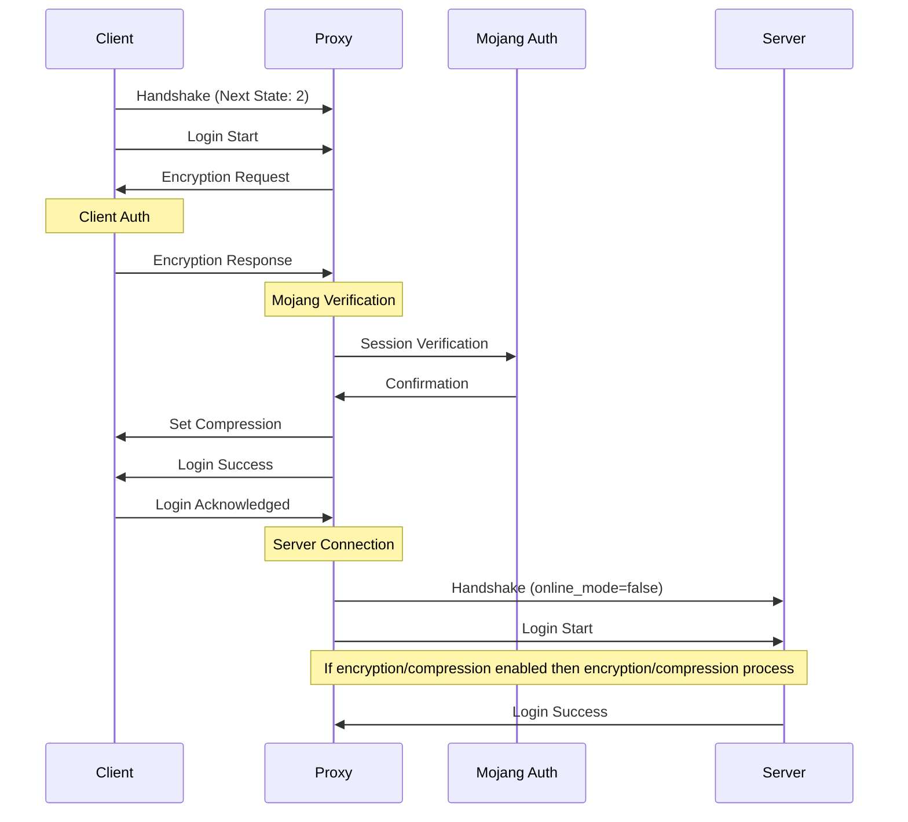

# ClientOnly Mode

ClientOnly mode ensures Minecraft client authentication while allowing plugin usage. It works with servers configured with `online_mode=false`.

:::warning
Actually ClientOnly mode only work with vanilla minecraft < 1.20, no Forge / Fabric support at the moment [#6](https://github.com/Shadowner/Infrarust/issues/6)
:::

## Operation



## Features

- ✅ Client authentication
- ✅ Full plugin support
- ✅ Packet reading
- ✅ Enhanced security
- ❌ Slight performance loss vs Passthrough

## Configuration

### Minimal Configuration

```yaml
proxy_mode: "clientOnly"
```

### Full Configuration

```yaml
proxy_mode: "clientOnly"
authentication: ### NOT IMPLEMENTED YET ###
  # Authentication parameters
  session_server: "https://sessionserver.mojang.com"
  cache_duration: 300s
  
  # Player management
  allowed_players: ### NOT IMPLEMENTED YET ###
    - "Player1"
    - "Player2"
  
plugins: ### NOT IMPLEMENTED YET ###
  # Plugin configuration
  enabled: true
  directory: "plugins"
  
security: ### NOT IMPLEMENTED YET ###
  # Security parameters
  verify_tokens: true
  encryption: true
```

## Server Configuration

:::warning Important
The Minecraft server must be configured with `online_mode=false` to work with this mode.
:::

In `server.properties`:

```properties
online-mode=false
```

## Plugin System - Not implemented

ClientOnly mode enables plugin usage through its ability to read and modify packets.

### Capabilities

1. **Packet Reading**
   - Intercept messages
   - Analyze commands
   - Track events

2. **Packet Modification**
   - Modify content
   - Add features
   - Handle events

## Security

ClientOnly mode offers several security levels:

1. **Authentication**
   - Mojang verification
   - Protection against non-premium accounts

## Use Cases

ClientOnly mode is ideal for:

1. **Premium Servers**
   - Requiring authentication
   - With custom plugins

2. **Multi-Server Networks**
   - Centralized player management
   - Cross-server features

3. **Secure Servers**
   - Protection against cracked accounts

## Performance

Performance considerations:

- Slightly slower than Passthrough
- Plugin overhead to consider

## Troubleshooting

### Potential Issues

1. **Plugin Issues** `### NOT IMPLEMENTED YET ###`

   ```yaml
   plugins:
     debug: true
     reload_on_error: true
   ```

