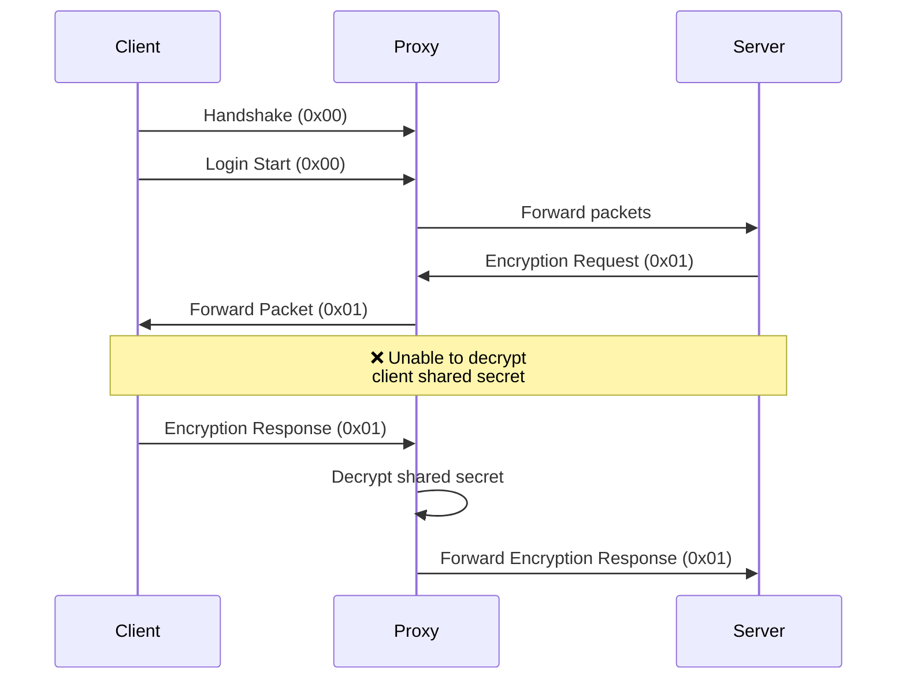

# Full Mode (Non-Functional)

⚠️ **This mode is currently non-functional and cannot be used.**

## Initial Objective

This mode aimed to combine:

- Plugin support
- Complete authentication
- Servers in `online_mode=true`

## Technical Limitation

## Reason for Failure

Full mode cannot work because:

1. The server and client use an external API
2. The process depends on an encrypted shared secret
3. The proxy cannot decrypt and relay this secret
