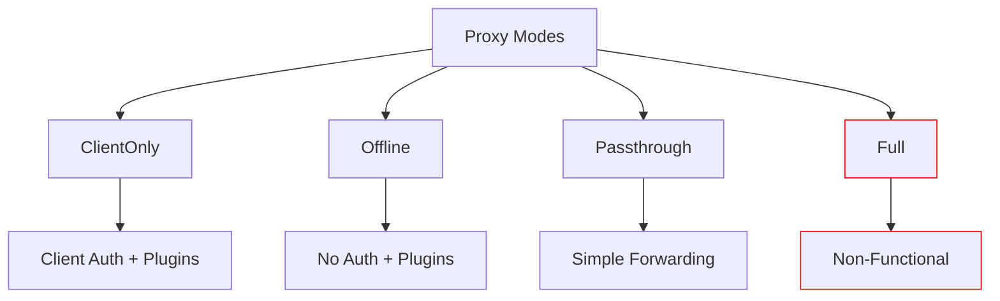

# Proxy Modes

Infrarust offers different proxy modes to adapt to your specific needs. Each mode has its own characteristics and use cases.

## Overview

## Available Modes

### [ClientOnly](./client-only.md)

- Verifies client authenticity
- Compatible with plugin system
- Server in `online_mode=false`

### [Offline](./offline.md)

- Client/server relay with packet reading
- Plugin support
- No authenticity verification
- Server in `online_mode=false`

### [Passthrough](./passthrough.md)

- Simple forwarding mode
- Optimal performance
- Routing based on initial handshake

### [Full](./full.md)

:::warning
This mode is currently non-functional due to technical limitations with Minecraft's authentication protocol.
:::

- Attempted support for plugins + complete authentication
- Incompatible with Minecraft's shared secret system

## Comparison Table

| Feature           | ClientOnly | Offline | Passthrough | Full |
|-------------------|------------|---------|-------------|------|
| Authentication    | ✅         | ❌      | ➖          | ❌   |
| Plugin Support*   | ✅         | ✅      | ❌          | ❌   |
| Performance       | ⭐⭐⭐     | ⭐⭐⭐   | ⭐⭐⭐⭐⭐   | ❌   |
| Server Online Mode| ❌         | ❌      | ✅          | ✅   |

>*System not implemented yet

## Choosing a Mode

- **For a simple and performant proxy**: Use `Passthrough` mode
- **For Cracked Servers**: Use `Offline` mode
- **For Security**: Use `ClientOnly` mode

::: tip
Check the detailed documentation of each mode for more information about their configuration and usage.
:::
