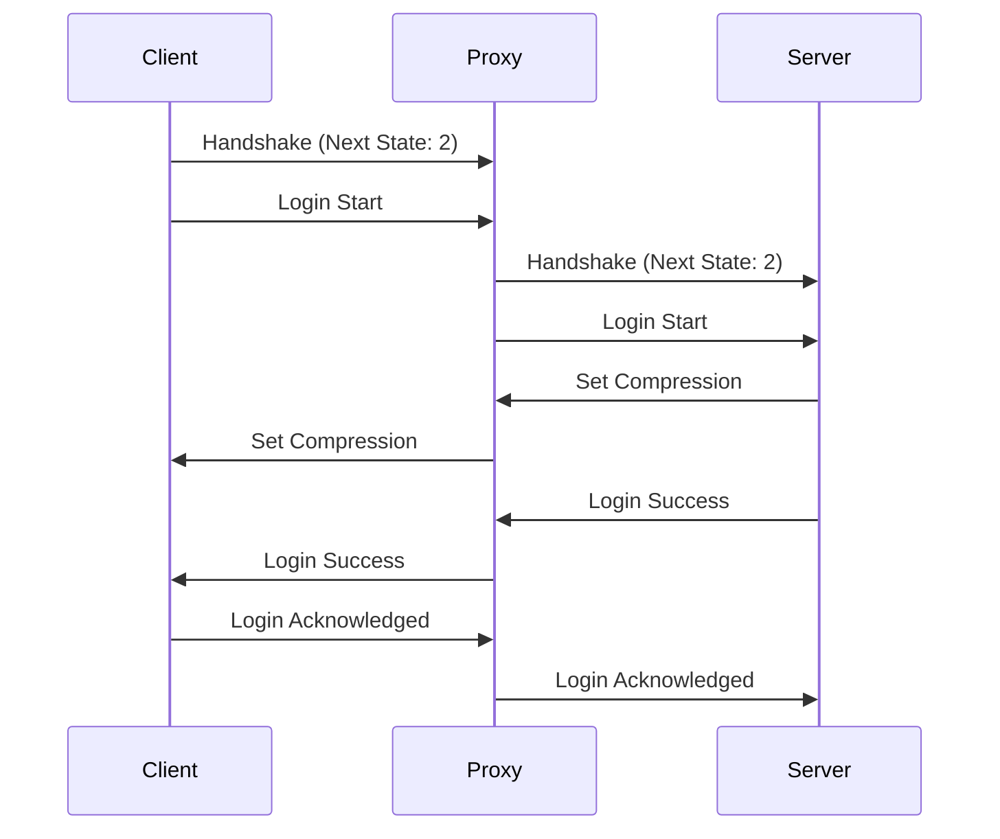

# Offline Mode

Offline mode enables client/server relay with plugin support, without client authentication.

::: warning
This mode should only be used in controlled environments or when authentication is not required.
:::

## Classic Connection Process

> Assuming there is no encryption request from the server side



## Configuration

### Minimal Configuration

```yaml
proxy_mode: "offline"
```

### Full Configuration

```yaml
proxy_mode: "offline"
options: ### NOT IMPLEMENTED YET ###
  allow_duplicate_names: false
  max_players: 100
  
plugins: ### NOT IMPLEMENTED YET ###
  enabled: true
  directory: "plugins"
```

## Security

⚠️ This mode offers no client authenticity verification.

### Recommendations

- Use whitelists
- Implement authentication via plugins
- Limit access to local network if possible

## Use Cases

- Local servers
- Test/dev environments
- Private networks
- Cracked servers
