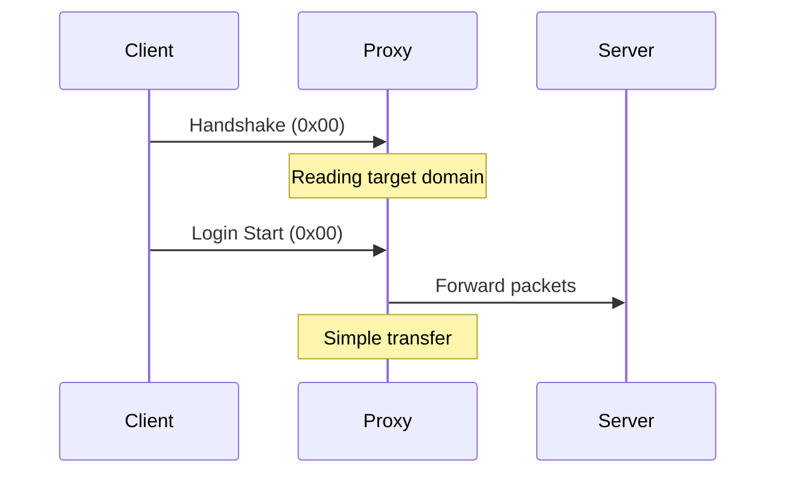

# Passthrough Mode

Passthrough mode is Infrarust's simplest and most performant mode. It acts as a pure forwarding proxy, not modifying the data flow between client and server.

::: tip Performance
Passthrough mode is the optimal choice for performance. Use it when you don't need advanced features.
:::

## Operation



## Features

- ✅ Maximum performance
- ✅ Full compatibility with `online_mode=true` servers
- ✅ Minimal overhead
- ❌ No plugin support
- ❌ No packet modification

## Configuration

### Minimal Configuration

```yaml
proxy_mode: "passthrough"
```

### Full Configuration

```yaml
proxy_mode: "passthrough"
options:
  # Connection timeout
  connection_timeout: 30s
  
  # Transfer buffer size
  buffer_size: 8192
  
  # Forward client IP
  forward_ip: true
```

## Use Cases

Passthrough mode is ideal for:

1. **Premium Servers**
   - Servers requiring official authentication
   - Maintaining native Minecraft security

2. **High Performance**
   - Large networks requiring minimal latency
   - Servers with heavy traffic

3. **Simple Routing**
   - Basic load balancing
   - Domain-based redirection

## Limitations

1. **No Plugins**
   - Passthrough mode only reads packets necessary for routing
   - No data modification possible

2. **No Advanced Features**
   - No advanced filtering
   - No protocol modification

## Performance

Passthrough mode offers the best performance because:

- Minimal packet reading
- No additional processing
- Direct data transfer


