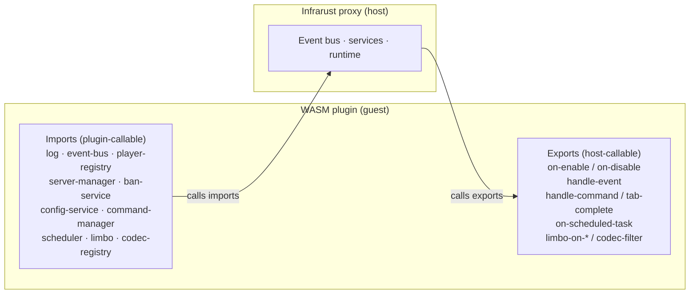

# WASM Plugin Architecture

A WASM plugin is a WebAssembly Component that Infrarust loads at startup. The proxy (the host) and the plugin (the guest) talk across a typed contract written in WIT (the WebAssembly Interface Type language). The contract is versioned `infrarust:plugin@0.2.3`.

The contract splits into two halves:

- Imports are the host services a plugin calls (logging, the event bus, the player registry, and more).
- Exports are the entry points the host calls on the plugin (lifecycle, the unified event dispatch, command and scheduler callbacks, limbo handlers, codec filters).

The rest of this page explains both halves, the dispatch direction, and how Infrarust turns a guest-registered handler id into a native callback.

## The component model

Each plugin is compiled to a standalone `.wasm` component with `crate-type = ["cdylib"]` and the `wasm32-wasip2` target. The SDK embeds `wit-bindgen`, so a plain `cargo build` produces the component directly:

```bash
rustup target add wasm32-wasip2
cargo build --release --target wasm32-wasip2
```

:::tip No cargo-component
The build is plain `cargo build`. The interface bindings are generated inside the SDK, so you do not install or run `cargo-component`.
:::

Infrarust instantiates one wasmtime `Store` per plugin. Each store holds its own linear memory, its own [WASI](https://wasi.dev) context (a single pre-opened data directory), a resource table, the plugin's [capability set](./capabilities), and a CPU budget enforced through wasmtime epoch interruption. Plugins share no memory with the host or with each other. A guest trap poisons that one store and the host stops dispatching into it.

## The contract: imports and exports

The `infrarust:plugin@0.2.3` world has 11 host imports and 2 guest exports.

### 11 host imports (plugin-callable)

| Import | Purpose | Capability gate |
|--------|---------|-----------------|
| `types` | Shared records and aliases; defines no functions | none |
| `log` | `trace` / `debug` / `info` / `warn` / `error` | always linked |
| `event-bus` | `subscribe` / `unsubscribe` | `event-bus` |
| `player-registry` | Look up players; the `player` resource | `player-read` |
| `server-manager` | Read state, `start` / `stop` backends | `server-manage` |
| `ban-service` | `ban` / `unban` / `is-banned` / `get-ban` / `get-all-bans` | `ban` |
| `config-service` | Read server configs and config values | `config-read` |
| `command-manager` | `register` / `unregister` a command | `command` |
| `scheduler` | `delay` / `interval` / `cancel` tasks | `scheduler` |
| `limbo` | `register-limbo-handler`; the session resources | always linked |
| `codec-registry` | `register-codec-filter` / `unregister-codec-filter` | `codec-filter` |

`types` carries the shared data shapes and has no linker entry. `log` and `limbo` are linked for every plugin. The remaining imports are linked only when the plugin holds the matching capability; see [How capabilities gate imports](#how-capabilities-gate-imports).

### 2 guest exports (host-callable)

| Export | Contents |
|--------|----------|
| `guest` | `metadata`, `on-enable`, `on-disable`, `handle-event`, the command/scheduler dispatch functions, and the marker+proxy handler entry points |
| `codec-filter` | `create` plus the per-session `filter-instance` resource on the codec hot path |

## Dispatch direction

The host calls guest exports. A plugin does not push events to the proxy; the proxy calls into the plugin whenever something happens.



Lifecycle is the simplest case. At load the host calls `metadata` then `on-enable`; at shutdown it calls `on-disable`. The detailed sequence is in [Lifecycle](./lifecycle).

Events arrive through a single export. Every subscribed event flows through `handle-event`:

```wit
handle-event: func(listener: listener-handle, ev: event) -> event-outcome;
```

The host owns the subscription. When a plugin calls `event-bus.subscribe`, the host mints a `listener-handle`, registers a native listener, and remembers the mapping. When the event fires, the host marshals the native event into the `event` variant, calls `handle-event` with that listener handle, and applies the returned `event-outcome` back onto the native event. Six event kinds are modifiable; the rest are observe-only and return `none`. See [Events](./events) for the full set.

## The marker + proxy pattern

Commands, scheduled tasks, limbo handlers, and codec factories are not single fixed exports. A plugin can register many of each, so the contract uses a marker + proxy bridge keyed by a `u64` id.

The flow has two steps:

1. The guest registers a handler with the host and includes an id it chose (a `callback-id` for commands and tasks, a `handler-id` for limbo handlers and codec factories).
2. The host wraps that id in a native proxy object. When the proxy fires, it calls the matching guest dispatch export and passes the id back, so the guest knows which of its handlers to run.

For a command, the host builds a `WasmCommandHandler` that holds the `callback-id`. On execution it calls `handle-command`; on tab completion it calls `tab-complete`:

```wit
handle-command: func(callback-id: u64, args: list<string>, player: option<player-id>);
tab-complete:   func(callback-id: u64, partial: list<string>, cursor: u32) -> list<string>;
on-scheduled-task: func(callback-id: u64);
```

Limbo handlers follow the same shape. `limbo.register-limbo-handler(name, handler-id)` registers a name; the host wraps the `handler-id` in a native `WasmLimboHandler` that calls back into the guest dispatch functions:

```wit
limbo-on-player-enter:  func(handler: handler-id, session: borrow<limbo-session>) -> handler-result;
limbo-on-command:       func(handler: handler-id, session: borrow<limbo-session>, command: string, args: list<string>);
limbo-on-chat:          func(handler: handler-id, session: borrow<limbo-session>, message: string);
limbo-on-disconnect:    func(handler: handler-id, player: player-id);
limbo-on-session-end:   func(handler: handler-id, player: player-id, reason: session-end-reason);
```

The same id-keyed bridge backs the custom permission checker (`permission-level-of` and `check-permission`), reached through the `permissions-setup` event's `custom(handler-id)` result. [Limbo](./limbo) covers the session model in full.

## Sync vs async

The guest sees blocking calls. The `Plugin` trait is synchronous:

```rust
fn on_enable(&self, ctx: &Context) -> Result<(), String>;
```

Several host imports are async on the host side. `start` and `stop` on `server-manager` and every `ban-service` function suspend the guest fiber: the host drives the async work to completion and resumes the guest with the result. To the guest it looks like an ordinary function that returns a value. Each of those calls runs under a host timeout (`HOST_CALL_TIMEOUT`) and returns a `service-error` if it expires.

`disconnect` and `switch-server` on the `player` resource are also marked host-async in the contract, but the host spawns them and returns immediately. The guest does not wait for the disconnect or the switch to finish, and these two calls are not bounded by the host timeout.

Codec filtering is different. It runs synchronously on the packet hot path. The host creates one `filter-instance` per connection side, then calls `filter` for every frame, then drops the instance:

```wit
filter: func(packet-id: s32, data: list<u8>) -> filter-output;
```

A separate, synchronous codec store handles this path so per-packet dispatch stays off the async machinery. See [Codec filters](./codec-filters).

## Resource handles

Some host objects cannot cross the boundary by value. A live player and a live limbo session stay on the host; the guest gets an opaque handle into a host-side resource table.

| Resource | Backed by | Lifetime |
|----------|-----------|----------|
| `player` | a native `Player` provider | one dispatch (looked up, then dropped) |
| `limbo-session` | the live native session | lent by `borrow` for one dispatch call |
| `limbo-session-handle` | a native `SessionHandle` | own-able; storable across dispatches |

When the host hands a session to `limbo-on-player-enter`, it pushes the native session into the table, lends the guest a `borrow<limbo-session>`, and drops the entry after the call returns. A guest that needs to act later calls `acquire-handle` to mint an own-able `limbo-session-handle`; that handle holds across scheduled tasks and events until the session ends. Method calls on a handle resolve through the table back to the native object. Exhaustive field and method lists are in the [API reference](./api-reference).

## How capabilities gate imports

The host links host services per plugin. Six baseline capabilities are granted to every WASM plugin: `event-bus`, `player-read`, `player-write`, `command`, `scheduler`, and `config-read`. Opt-in imports such as `server-manage`, `ban`, and `codec-filter` are linked only when the plugin lists the matching capability in its TOML permissions:

```toml
[plugins.my_plugin]
permissions = ["server-manage", "ban", "codec-filter"]
```

If a plugin imports an interface it has no capability for, the host never links it and instantiation fails for that plugin. Capability strings are kebab-case. The `limbo` import is always linked, but the host enforces the `limbo` capability at registration: `register-limbo-handler` is a no-op for a plugin that lacks the capability, so enforcement happens there rather than at link time. [Capabilities](./capabilities) lists every string, its default state, and what it grants.

:::info Virtual Backend is planned
The Virtual Backend capability is defined in the contract but not yet enforced, and no WASM bridge exists for it. Treat it as a future feature.
:::

:::warning Contract version vs constant
Cite `infrarust:plugin@0.2.3` from the WIT package. The `WORLD_VERSION` constant in `plugin-wit/src/lib.rs` still reads `0.2.0` and is stale.
:::

## See also

- [Lifecycle](./lifecycle): load order and the `on-enable` / `on-disable` sequence.
- [Capabilities](./capabilities): every capability string and what it unlocks.
- [Events](./events): the events the SDK exposes and which are modifiable.
- [Limbo](./limbo): limbo handlers, sessions, and handles.
- [Codec filters](./codec-filters): the synchronous hot-path filter API.
- [API reference](./api-reference): exhaustive type and method tables.
- [Native plugin development](../dev/getting-started): the in-process plugin API, which is async and ungated.
