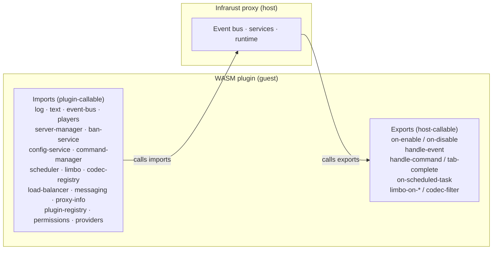

# WASM Plugin Architecture

A WASM plugin is a WebAssembly Component that Infrarust loads at startup. The proxy (the host) and the plugin (the guest) talk across a typed contract written in WIT (the WebAssembly Interface Type language). The contract is versioned `infrarust:plugin@0.3.0`; the loader refuses components built for another minor version, or for a newer patch than the host's (a `0.3.1` plugin on a `0.3.0` host), before running any of their code.

The contract splits into two halves:

- Imports are the host services a plugin calls (logging, the event bus, the player registry, and more).
- Exports are the entry points the host calls on the plugin (lifecycle, the unified event dispatch, command and scheduler callbacks, limbo handlers, codec filters).

The rest of this page explains both halves, the dispatch direction, and how Infrarust turns a guest-registered handler id into a native callback.

## The component model

Each plugin is compiled to a standalone `.wasm` component with `crate-type = ["cdylib"]` and the `wasm32-wasip2` target. The SDK embeds `wit-bindgen`, so a plain `cargo build` produces the component directly:

```bash
rustup target add wasm32-wasip2
cargo build --release --target wasm32-wasip2
```

:::tip No cargo-component
The build is plain `cargo build`. The interface bindings are generated inside the SDK, so you do not install or run `cargo-component`.
:::

Infrarust instantiates one wasmtime `Store` per plugin. Each store holds its own linear memory, its own [WASI](https://wasi.dev) context (the pre-opened data directory, plus any [mounts and network allow-list](./network) the operator configured), a resource table, the plugin's [capability set](./capabilities), and a CPU budget enforced through wasmtime epoch interruption. Plugins share no memory with the host or with each other. A guest trap discards that one store; the host never dispatches into it again and builds a fresh one for the plugin (see [Fault model](./fault-model)).

## The contract: imports and exports

The `infrarust:plugin@0.3.0` world has 19 host imports and 2 guest exports.

### 19 host imports (plugin-callable)

| Import | Purpose | Capability gate |
|--------|---------|-----------------|
| `types` | Shared ids, errors, profiles and the text-component arena; defines no functions | none |
| `events` | The event records and results; defines no functions | none |
| `log` | `trace` / `debug` / `info` / `warn` / `error` | none |
| `text` | Parse and serialize text components with the proxy's parser | none |
| `event-bus` | `subscribe` / `unsubscribe` | `event-bus`; `subscribe-packets` also needs `raw-packet`; subscribing to `chat-message` or `command-execute` needs `chat-intercept`, and to `plugin-message` needs `plugin-messaging` |
| `players` | Look up players and act on them by id | `player-read`; actions need `player-write`, `send-packet` needs `raw-packet` |
| `server-manager` | Read state, `start` / `stop` backends | `server-manage` |
| `ban-service` | `ban` / `unban` / `get` / `list` | `ban` |
| `config-service` | Read server configs and config values | `config-read`; `write-proxy-config-document` needs `config-write` |
| `command-manager` | `register` / `unregister` a command | `command` |
| `scheduler` | `delay` / `interval` / `cancel` tasks | `scheduler` |
| `limbo` | `register-limbo-handler`; the session resources | `limbo` for `register-limbo-handler` |
| `codec-registry` | `register-codec-filter` / `unregister-codec-filter` | `codec-filter` |
| `load-balancer` | Read a server's strategy and backend health; drain or reset a backend | `config-read` to read; `server-manage` for `set-drained` / `reset-backend` |
| `messaging` | Register plugin channels and send plugin messages to a player, a backend or a server | `plugin-messaging` |
| `proxy-info` | Proxy version and details, and the capabilities this plugin holds | none |
| `plugin-registry` | List the loaded plugins and read one | none |
| `permissions` | Replace or release a player's permission snapshot | `permission-provider` |
| `providers` | Become the ban provider or the permission provider | `ban-provider` / `permission-provider` |

`types` and `events` carry the shared data shapes and have no linker entry. Every other import is linked for every plugin, and the gated functions check the plugin's capabilities when they are called; see [How capabilities gate imports](#how-capabilities-gate-imports). Every fallible host function returns `result<T, host-error>`; a host function traps the guest only on a host invariant bug.

On the host, each import is implemented in its own module under `infrarust-loader-wasm/src/imp/hosts/`, and each event family has a module under `imp/events/` that implements the `WasmEvent` trait: the event kind, the conversion into the WIT record, and how an outcome applies to the native event.

### 2 guest exports (host-callable)

| Export | Contents |
|--------|----------|
| `guest` | `metadata`, `on-enable`, `on-disable`, `handle-event`, the command/scheduler dispatch functions, and the marker+proxy handler entry points |
| `codec-filter` | `create` plus the per-session `filter-instance` resource on the codec hot path |

## Dispatch direction

The host calls guest exports. A plugin does not push events to the proxy; the proxy calls into the plugin whenever something happens.



Lifecycle is the simplest case. At load the host calls `metadata` then `on-enable`; at shutdown it calls `on-disable`. The detailed sequence is in [Lifecycle](./lifecycle).

Events arrive through a single export. Every subscribed event flows through `handle-event`:

```wit
handle-event: func(listener: listener-handle, ev: event) -> event-outcome;
```

The host owns the subscription. When a plugin calls `event-bus.subscribe`, the host mints a `listener-handle`, registers a native listener, and remembers the mapping. When the event fires, the host marshals the native event into the `event` variant, with the event's current result in the record, calls `handle-event` with that listener handle, and applies the returned `event-outcome` back onto the native event. `unchanged` leaves the result alone; any other case sets it. An outcome that belongs to another event is ignored with a rate-limited warning. See [Events](./events) for the full set.

## The marker + proxy pattern

Commands, scheduled tasks, limbo handlers, and codec factories are not single fixed exports. A plugin can register many of each, so the contract uses a marker + proxy bridge keyed by a `u64` id.

The flow has two steps:

1. The guest registers a handler with the host and includes a `handler-id` it chose.
2. The host wraps that id in a native proxy object. When the proxy fires, it calls the matching guest dispatch export and passes the id back, so the guest knows which of its handlers to run.

For a command, the host builds a `WasmCommandHandler` that holds the `handler-id`. On execution it calls `handle-command`; on tab completion it calls `tab-complete`:

```wit
handle-command: func(handler: handler-id, invocation: command-invocation);
tab-complete: func(handler: handler-id, sender: command-sender, args: list<string>, cursor: u32) -> list<suggestion>;
on-scheduled-task: func(handler: handler-id);
```

Limbo handlers follow the same shape. `limbo.register-limbo-handler(name, handler-id)` registers a name; the host wraps the `handler-id` in a native `WasmLimboHandler` that calls back into the guest dispatch functions:

```wit
limbo-on-player-enter:  func(handler: handler-id, session: borrow<limbo-session>) -> handler-result;
limbo-on-command:       func(handler: handler-id, session: borrow<limbo-session>, command: string, args: list<string>);
limbo-on-chat:          func(handler: handler-id, session: borrow<limbo-session>, message: string);
limbo-on-disconnect:    func(handler: handler-id, player: player-id);
limbo-on-session-end:   func(handler: handler-id, player: player-id, reason: session-end-reason);
```

[Limbo](./limbo) covers the session model in full.

## Threading

The guest is single-threaded. The host runs one call at a time per instance, in the order the calls arrive, and never re-enters an instance: a host function the guest calls never calls back into the guest. An event that a call causes for a plugin already busy up that call's chain, such as a named event a plugin fires to itself, is queued behind the current call, and the proxy does not wait for its answer; see [Named events](./events#named-events). Plugin state therefore needs no `Send` or `Sync`: keep it in `Cell`, `RefCell` and `Rc`, and do not reach for locks.

## Sync vs async

The guest sees blocking calls. The `Plugin` trait is synchronous:

```rust
fn on_enable(&self, ctx: &Context) -> Result<(), PluginError>;
```

Several host imports are async on the host side. `start` and `stop` on `server-manager`, every `ban-service` function, `switch-server`, `connect`, `transfer`, `request-cookie` and `refresh-permissions` on `players`, `fire-named` on `event-bus`, and `set-snapshot` and `release` on `permissions` suspend the guest fiber: the host drives the async work to completion and resumes the guest with the result. To the guest it looks like an ordinary function that returns a value. Each of those calls except `switch-server` runs under a host timeout (`host_call_timeout` in the `[wasm]` table, 30 s by default), cut shorter when the deadline of the guest call that made it is closer, and returns a `host-error` of kind `timeout` if it expires. See [Lifecycle](./lifecycle#deadlines).

`players.disconnect` queues the kick and returns immediately, so the guest does not wait for it. `players.switch-server` hands the request to the player's session and waits at most 250 ms for the session to take it, less when the guest call's deadline is closer, then returns a `timeout` error if it could not.

Codec filtering is different. It runs synchronously on the packet hot path. The host creates one `filter-instance` per connection side, then calls `filter` for every frame, then drops the instance:

```wit
filter: func(packet-id: s32, data: list<u8>) -> filter-output;
```

A separate, synchronous codec store handles this path so per-packet dispatch stays off the async machinery. See [Codec filters](./codec-filters).

## Resource handles

A live limbo session stays on the host; the guest gets an opaque handle into a host-side resource table. Players are not resources: the guest names a player by its `player-id` and the host looks it up on every call, so a stale id is a `player-gone` error rather than a dangling handle.

| Resource | Backed by | Lifetime |
|----------|-----------|----------|
| `limbo-session` | the live native session | lent by `borrow` for one dispatch call |
| `limbo-session-handle` | a native `SessionHandle` | own-able; storable across dispatches |

When the host hands a session to `limbo-on-player-enter`, it pushes the native session into the table, lends the guest a `borrow<limbo-session>`, and drops the entry after the call returns. A guest that needs to act later calls `acquire-handle` to mint an own-able `limbo-session-handle`; that handle holds across scheduled tasks and events until the session ends. Method calls on a handle resolve through the table back to the native object. Exhaustive field and method lists are in the [API reference](./api-reference).

## How capabilities gate imports

Six baseline capabilities are granted to every WASM plugin: `event-bus`, `player-read`, `player-write`, `command`, `scheduler`, and `config-read`. Opt-in capabilities such as `server-manage`, `ban`, and `codec-filter` are granted when the plugin lists them in its TOML permissions:

```toml
[plugins.my_plugin]
permissions = ["server-manage", "ban", "codec-filter"]
```

Every interface is linked for every plugin; the capabilities are checked when a gated function is called. A call without its capability is refused: it returns a `permission-denied` host error (`missing capability: ban`) or, for the few infallible player reads, an empty answer, and the proxy log records it. At load the host reads the component's imports and warns once per interface the plugin imports without the grant; `strict_capabilities = true` refuses such a plugin instead. Capability strings are kebab-case. [Capabilities](./capabilities) lists every string, its default state, what it grants and what each refused call returns.

:::info Virtual Backend is planned
The Virtual Backend capability is defined in the contract but not yet enforced, and no WASM bridge exists for it. Treat it as a future feature.
:::

:::info Contract version
`WORLD_VERSION` in `infrarust-plugin-wit` reads `0.3.0`, the version of the WIT package. The loader uses it for the contract check and the AOT cache key, and a test fails the build if it drifts from `wit/world.wit`.
:::

## See also

- [Lifecycle](./lifecycle): load order and the `on-enable` / `on-disable` sequence.
- [Capabilities](./capabilities): every capability string and what it unlocks.
- [Events](./events): the events the SDK exposes and how results work.
- [Limbo](./limbo): limbo handlers, sessions, and handles.
- [Codec filters](./codec-filters): the synchronous hot-path filter API.
- [API reference](./api-reference): exhaustive type and method tables.
- [Native plugin development](../dev/getting-started): the in-process plugin API, which is async and ungated.
