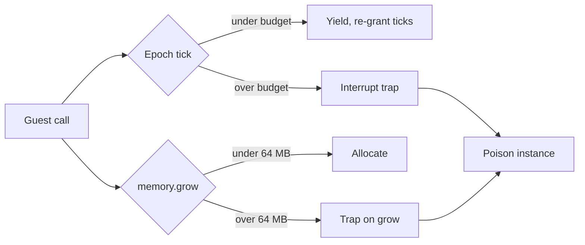

# Capabilities & Sandbox

A WASM plugin starts with no access to the host. It receives a fixed baseline of capabilities, and the proxy operator grants anything beyond that in config. Each capability maps to one host interface. If the capability is absent, the interface is omitted from the linker, and any plugin that imports it fails to instantiate.

This page covers the capability enum, the baseline-vs-opt-in split, how granting works, and the CPU, memory, and filesystem limits the runtime enforces.

## The capability model

`Capability` is the unit of access. Native plugins (compiled into the proxy binary) are trusted and receive every capability. WASM plugins receive the baseline plus whatever the operator opts in to through TOML.

```rust
// crates/infrarust-api/src/permissions.rs
pub enum Capability {
    EventBus,
    PlayerRead,
    PlayerWrite,
    RawPacket,
    ServerManage,
    Ban,
    Command,
    Scheduler,
    ConfigRead,
    CodecFilter,
    TransportFilter,
    Limbo,
    VirtualBackend,
    PermissionProvider,
    FilesystemExtended,
    Network,
}
```

Config uses the kebab-case string for each variant. The strings are exact; `codec_filter` (snake_case) is rejected, only `codec-filter` is accepted.

## Capability matrix

| Capability | Config string | Grants | Baseline |
|------------|---------------|--------|----------|
| `EventBus` | `event-bus` | Subscribe to domain events (lifecycle, connection, proxy, chat) | Yes |
| `PlayerRead` | `player-read` | Read the player registry and player state | Yes |
| `PlayerWrite` | `player-write` | Act on a player (message, title, kick, switch-server) | Yes |
| `Command` | `command` | Register commands | Yes |
| `Scheduler` | `scheduler` | Schedule tasks | Yes |
| `ConfigRead` | `config-read` | Read the proxy configuration | Yes |
| `RawPacket` | `raw-packet` | Emit raw packets and gate `player.send-packet` | No |
| `ServerManage` | `server-manage` | Start/stop servers and read their state | No |
| `Ban` | `ban` | Use the ban service | No |
| `CodecFilter` | `codec-filter` | Register codec filters | No |
| `Limbo` | `limbo` | Provide limbo handlers | No |
| `TransportFilter` | `transport-filter` | Register transport filters (never grantable via config) | No |
| `VirtualBackend` | `virtual-backend` | Provide virtual backends (planned, not implemented) | No |
| `PermissionProvider` | `permission-provider` | Provide a custom permission checker | No |
| `FilesystemExtended` | `filesystem-extended` | Filesystem access beyond the per-plugin data directory (deferred) | No |
| `Network` | `network` | Outbound network access (deferred) | No |

::: warning transport-filter is host-only
`transport-filter` is a valid capability string, but `from_config_strings` puts it in the rejected list rather than granting it. A WASM plugin cannot register transport filters. The capability exists for native plugins, which receive it through `native_trusted`.
:::

## Baseline vs. native-trusted

The baseline is the same for every WASM plugin and is built without reading config:

```rust
pub fn baseline() -> Self {
    Self::default()
        .with(Capability::EventBus)
        .with(Capability::PlayerRead)
        .with(Capability::PlayerWrite)
        .with(Capability::Command)
        .with(Capability::Scheduler)
        .with(Capability::ConfigRead)
}
```

Native plugins call `native_trusted`, which inserts all 16 capabilities. WASM plugins never use that path.

```rust
pub fn native_trusted() -> Self {
    let mut set = Self::default();
    for cap in Capability::ALL {
        set.insert(cap);
    }
    set
}
```

## Granting opt-in capabilities

Opt-ins are listed under the plugin's config block. `from_config_strings` starts from the baseline and adds each recognized string on top. It returns the resolved set plus a list of rejected strings (unknown names and `transport-filter`).

```toml
# Infrarust config: grant ban + codec-filter on top of the baseline
[plugins.my-plugin]
permissions = ["ban", "codec-filter", "limbo"]
```

```rust
pub fn from_config_strings(strings: &[String]) -> (Self, Vec<String>) {
    let mut set = Self::baseline();
    let mut rejected = Vec::new();
    for s in strings {
        match Capability::from_kebab(s) {
            Some(Capability::TransportFilter) | None => rejected.push(s.clone()), // [!code focus]
            Some(cap) => set.insert(cap),                                          // [!code focus]
        }
    }
    (set, rejected)
}
```

You do not list the baseline capabilities; they are always present. List only the opt-ins. See [Deploying](./deploying) for where this block lives and how rejected strings are reported.

## What a missing capability does

The linker decides which host interfaces a plugin can import. `build_linker` always links `log` and `limbo`, then conditionally links the rest based on the granted set:

```rust
// crates/infrarust-loader-wasm/src/linker.rs
link!(linker, plugin_id, log); // always available
link!(linker, plugin_id, limbo);

if caps.has(Capability::EventBus) {
    link!(linker, plugin_id, event_bus);
}
// ...
if caps.has(Capability::Ban) {
    link!(linker, plugin_id, ban_service);
}
if caps.has(Capability::CodecFilter) {
    link!(linker, plugin_id, codec_registry);
}
```

If a plugin imports an interface that was not linked, instantiation fails. The `capability-denied` test fixture imports and calls `ban-service` without the `ban` capability:

```rust
// tests/fixtures/capability-denied/src/lib.rs
on_enable: {
    let _ = ban_service::is_banned(&BanTarget::Username("nobody".to_string()));
    Ok(())
}
```

Because the host omits `ban-service` from the linker, `load()` returns `Err`. The failure surfaces at instantiation, not at the call site, so a plugin missing a capability never enters its `on_enable`.

### Method-level gating

Some methods inside a linked interface need an extra capability. `player.send-packet` requires `raw-packet` even though `player-read` and `player-write` are baseline. The interface is present, so the call resolves; without `raw-packet` the host returns a `player-error` (`send-failed: "missing capability: raw-packet"`) rather than sending.

## The sandbox

Every WASM plugin runs under three limits enforced by the wasmtime runtime: a CPU budget, a linear-memory cap, and a filesystem view. The numbers are hardcoded today; wiring them to `ProxyConfig` is a TODO (`consts.rs` carries the `TODO(config)` markers).



### CPU budget (epoch interruption)

A dedicated OS thread bumps the engine epoch on a fixed interval. Each store is given a deadline measured in those ticks; when the deadline fires, the callback either re-grants ticks (a cooperative yield) or interrupts the guest with a hard trap.

| Constant | Value | Meaning |
|----------|-------|---------|
| `EPOCH_TICK_INTERVAL` | `50 ms` | How often the epoch thread ticks |
| `EPOCH_DEADLINE_TICKS` | `1` | Ticks granted before the deadline callback first fires, re-granted on each yield |
| `MAX_EPOCH_YIELDS_BEFORE_TRAP` | `60` | Yields tolerated per call before the hard `Interrupt` trap (about 3 s of pure spin) |

```rust
// crates/infrarust-loader-wasm/src/store_state.rs
store.epoch_deadline_callback(|mut ctx| {
    let state = ctx.data_mut();
    state.epoch_yields += 1;
    if state.epoch_yields > MAX_EPOCH_YIELDS_BEFORE_TRAP {
        Ok(UpdateDeadline::Interrupt)
    } else {
        Ok(UpdateDeadline::Yield(EPOCH_DEADLINE_TICKS))
    }
});
```

A plugin that spins without yielding past the budget is interrupted and its instance is poisoned. The yield counter resets at the start of each call, so well-behaved plugins that return promptly never approach the limit.

Codec filters run on a separate, tighter per-call budget, since each filter call is synchronous and must complete in microseconds:

| Constant | Value | Meaning |
|----------|-------|---------|
| `CODEC_EPOCH_DEADLINE_TICKS` | `16` | Ticks granted to a single synchronous codec call before a hard trap |

The 16-tick headroom is reset before every `create`/`filter`/lifecycle call. A normal per-packet filter finishes in microseconds, so only a runaway filter can exhaust it. See [Codec Filters](./codec-filters) for the filter contract.

::: info Host calls have their own timeout
Epoch interruption cannot preempt a guest parked inside a host `.await` (such as a ban lookup or a server start). Each async host call is wrapped in a 30 s `HOST_CALL_TIMEOUT`; on expiry the guest sees a `service-error` instead of hanging.
:::

### Memory cap

Each instance is built with a `StoreLimits` that caps linear memory and traps on a growth that would exceed it:

```rust
// crates/infrarust-loader-wasm/src/store_state.rs
fn default_limits() -> StoreLimits {
    StoreLimitsBuilder::new()
        .memory_size(MEMORY_LIMIT)    // 64 MB
        .trap_on_grow_failure(true)
        .build()
}
```

| Constant | Value | Meaning |
|----------|-------|---------|
| `MEMORY_LIMIT` | `64 MB` (`64 * 1024 * 1024`) | Linear-memory cap per plugin instance |

A `memory.grow` that crosses 64 MB traps. Instance, table, and memory *counts* keep wasmtime's defaults; only memory growth is bounded.

### Filesystem and WASI

The WASI context grants one preopened directory per plugin, mounted at `/` inside the guest and backed by the plugin's data directory on the host. The directory is created on load if it does not exist.

```rust
// crates/infrarust-loader-wasm/src/store_state.rs
builder
    .preopened_dir(data_dir, "/", DirPerms::all(), FilePerms::all())?;
```

There is no network access, no inherited stdio, and no second preopen. Outbound network (`network`) and access outside the data directory (`filesystem-extended`) are deferred; the capabilities are defined but the WASI context does not yet widen for them.

## Trap, poison, fail-closed

A trap from any of the limits above does not just abort the current call. The runtime marks the instance poisoned, and every later call into that plugin returns an error instead of running guest code. This is the fail-closed rule: a misbehaving plugin is fenced off rather than retried into the same fault. The full state machine is on [Lifecycle](./lifecycle).

## See also

- [Deploying](./deploying): where the `permissions` config block lives and how rejected strings surface.
- [Lifecycle](./lifecycle): trap, poison, and fail-closed semantics in full.
- [Architecture](./architecture): how the linker, store, and engine fit together.
- [Services](./services): the host interfaces each capability unlocks.
- [Codec Filters](./codec-filters): the `codec-filter` capability and the per-call budget.
- [Limbo](./limbo): the `limbo` capability and limbo handlers.
- [Virtual Backend](./virtual-backend): the planned `virtual-backend` capability.
- [Native plugins](../dev/getting-started): the trusted API that receives all capabilities.
