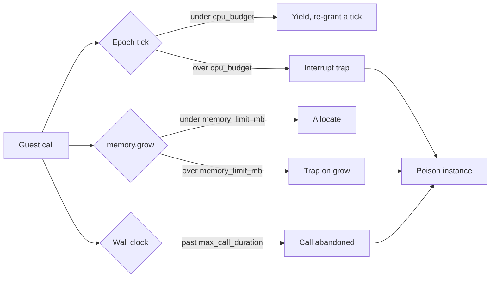

# Capabilities & Sandbox

A WASM plugin starts with no access to the host. It receives a fixed baseline of capabilities, and the proxy operator grants anything beyond that in config. Each capability maps to one host interface. If the capability is absent, the interface is omitted from the linker, and any plugin that imports it fails to instantiate.

This page covers the capability enum, the baseline-vs-opt-in split, how granting and revoking work, and the CPU, memory, call-queue, and filesystem limits the runtime enforces.

## The capability model

`Capability` is the unit of access. Native plugins (compiled into the proxy binary) are trusted and receive every capability. WASM plugins receive the baseline plus whatever the operator opts in to through TOML.

```rust
// crates/infrarust-api/src/permissions.rs
pub enum Capability {
    EventBus,
    PlayerRead,
    PlayerWrite,
    RawPacket,
    ServerManage,
    Ban,
    Command,
    Scheduler,
    ConfigRead,
    CodecFilter,
    TransportFilter,
    Limbo,
    VirtualBackend,
    PermissionProvider,
    FilesystemExtended,
    Network,
}
```

Config uses the kebab-case string for each variant. The strings are exact; `codec_filter` (snake_case) is rejected, only `codec-filter` is accepted.

## Capability matrix

| Capability | Config string | Grants | Baseline |
|------------|---------------|--------|----------|
| `EventBus` | `event-bus` | Subscribe to domain events (lifecycle, connection, proxy, chat) | Yes |
| `PlayerRead` | `player-read` | Read the player registry and player state | Yes |
| `PlayerWrite` | `player-write` | Act on a player (message, title, kick, switch-server) | Yes |
| `Command` | `command` | Register commands | Yes |
| `Scheduler` | `scheduler` | Schedule tasks | Yes |
| `ConfigRead` | `config-read` | Read the proxy configuration | Yes |
| `ConfigWrite` | `config-write` | Rewrite the global `infrarust.toml` (no host binding yet, see below) | No |
| `RawPacket` | `raw-packet` | Emit raw packets and gate `player.send-packet` | No |
| `ServerManage` | `server-manage` | Start/stop servers and read their state | No |
| `Ban` | `ban` | Use the ban service | No |
| `CodecFilter` | `codec-filter` | Register codec filters | No |
| `Limbo` | `limbo` | Provide limbo handlers | No |
| `TransportFilter` | `transport-filter` | Register transport filters (never grantable via config) | No |
| `VirtualBackend` | `virtual-backend` | Provide virtual backends (planned, not implemented) | No |
| `PermissionProvider` | `permission-provider` | Provide a custom permission checker | No |
| `FilesystemExtended` | `filesystem-extended` | Filesystem access beyond the per-plugin data directory (deferred) | No |
| `Network` | `network` | Outbound network access (deferred) | No |

::: warning config-write has no WASM binding
`config-write` parses and can be granted, but the WIT contract exposes no write function, so a WASM plugin holding it still cannot rewrite `infrarust.toml`. The capability gates the native path: `ConfigService::write_proxy_config_document` is served by a read-only wrapper unless the plugin holds it.
:::

::: warning transport-filter is host-only
`transport-filter` is a valid capability string, but `from_config_strings` puts it in the rejected list rather than granting it. A WASM plugin cannot register transport filters. The capability exists for native plugins, which receive it through `native_trusted`.
:::

## Baseline vs. native-trusted

The baseline is the same for every WASM plugin and is built without reading config:

```rust
pub fn baseline() -> Self {
    Self::default()
        .with(Capability::EventBus)
        .with(Capability::PlayerRead)
        .with(Capability::PlayerWrite)
        .with(Capability::Command)
        .with(Capability::Scheduler)
        .with(Capability::ConfigRead)
}
```

Native plugins call `native_trusted`, which inserts all 16 capabilities. WASM plugins never use that path.

```rust
pub fn native_trusted() -> Self {
    let mut set = Self::default();
    for cap in Capability::ALL {
        set.insert(cap);
    }
    set
}
```

## Granting opt-in capabilities

Opt-ins are listed under the plugin's config block. `from_config_strings` starts from the baseline and adds each recognized string on top. It returns the resolved set plus a list of rejected strings (unknown names and `transport-filter`).

```toml
# Infrarust config: grant ban + codec-filter on top of the baseline
[plugins.my-plugin]
permissions = ["ban", "codec-filter", "limbo"]
```

```rust
pub fn from_config_strings(strings: &[String]) -> (Self, Vec<String>) {
    let mut set = Self::baseline();
    let mut rejected = Vec::new();
    for s in strings {
        match Capability::from_kebab(s) {
            Some(Capability::TransportFilter) | None => rejected.push(s.clone()), // [!code focus]
            Some(cap) => set.insert(cap),                                          // [!code focus]
        }
    }
    (set, rejected)
}
```

You do not list the baseline capabilities; they are always present. List only the opt-ins. See [Deploying](./deploying) for where this block lives and how rejected strings are reported.

## Revoking capabilities

`deny` takes capabilities away. It is applied after the baseline and the grants, so it can remove a baseline capability, and a capability that appears in both `permissions` and `deny` ends up denied.

```toml
[plugins.my-plugin]
permissions = ["ban"]
deny = ["player-write", "scheduler"]
```

`CapabilitySet::from_config` builds the set in that order, and the context factory uses it for every WASM plugin:

```rust
pub fn from_config(grants: &[String], denies: &[String]) -> (Self, Vec<String>) {
    let (mut set, mut rejected) = Self::from_config_strings(grants);
    rejected.extend(set.revoke_config_strings(denies));
    (set, rejected)
}
```

Unknown names in `deny` are reported with the same warning as unknown grants. `deny` also applies to compiled-in plugins: they start from every capability and lose the ones listed.

A denied capability behaves exactly like one that was never granted. Denying `event-bus`, `player-read`, `command`, `scheduler` or `config-read` removes the matching interface from the linker, so a plugin that imports it fails to load (see below). Denying `player-write` keeps `player-registry` linked but refuses the calls that act on a player; see [Method-level gating](#method-level-gating).

## What a missing capability does

The linker decides which host interfaces a plugin can import. `build_linker` always links `log` and `limbo`, then conditionally links the rest based on the granted set:

```rust
// crates/infrarust-loader-wasm/src/linker.rs
link!(linker, plugin_id, log); // always available
link!(linker, plugin_id, limbo);

if caps.has(Capability::EventBus) {
    link!(linker, plugin_id, event_bus);
}
// ...
if caps.has(Capability::Ban) {
    link!(linker, plugin_id, ban_service);
}
if caps.has(Capability::CodecFilter) {
    link!(linker, plugin_id, codec_registry);
}
```

If a plugin imports an interface that was not linked, instantiation fails. The `capability-denied` test fixture imports and calls `ban-service` without the `ban` capability:

```rust
// tests/fixtures/capability-denied/src/lib.rs
on_enable: {
    let _ = ban_service::is_banned(&BanTarget::Username("nobody".to_string()));
    Ok(())
}
```

Because the host omits `ban-service` from the linker, `load()` returns `Err`. The failure surfaces at instantiation, not at the call site, so a plugin missing a capability never enters its `on_enable`.

### Method-level gating

Some methods inside a linked interface need an extra capability. `player.send-packet` requires `raw-packet` even though `player-read` and `player-write` are baseline. The interface is present, so the call resolves; without `raw-packet` the host returns a `player-error` (`send-failed: "missing capability: raw-packet"`) rather than sending.

The methods that act on a player need `player-write`. It is baseline, so this only matters when it is denied:

| Method | Without `player-write` |
|--------|------------------------|
| `send-message`, `send-title`, `send-action-bar` | `player-error` `send-failed: "missing capability: player-write"` |
| `switch-server` | `player-error` `switch-failed: "missing capability: player-write"` |
| `disconnect` | Ignored, with a warning in the proxy log (the call has no error channel) |

Reading a player (`id`, `profile`, `current-server`, and so on) only needs `player-read`.

## The sandbox

Every WASM plugin runs under limits enforced by the wasmtime runtime: a CPU budget, a linear-memory cap, a wall-clock limit per call, a bounded call queue, and a filesystem view. The numbers come from the `[wasm]` table of `infrarust.toml`, and `[plugins.<id>.wasm]` overrides them for one plugin. The defaults:

| Key | Default | Applies to |
|-----|---------|------------|
| `epoch_tick` | `50ms` | The whole proxy: how often the epoch thread ticks |
| `cpu_budget` | `3s` | CPU time per guest call before an `Interrupt` trap |
| `codec_cpu_budget` | `800ms` | CPU time per codec filter call before a trap |
| `memory_limit_mb` | `64` | Linear memory per plugin instance |
| `host_call_timeout` | `30s` | One ban-service or server-manager call made by the guest |
| `max_call_duration` | `60s` | Wall-clock time of one guest call, host calls included |
| `queue_capacity` | `1024` | Calls waiting for a busy plugin |

```toml
[wasm]
cpu_budget = "2s"

[plugins.heavy-plugin.wasm]
memory_limit_mb = 256
queue_capacity = 4096
```

The ranges accepted at startup are listed in [Global Settings](../../configuration/global#wasm-plugin-sandbox).



### CPU budget (epoch interruption)

A dedicated OS thread bumps the engine epoch every `epoch_tick`. Each guest call gets one tick before the deadline callback fires; the callback then either re-grants a tick (a cooperative yield) or, once the call has used `cpu_budget` worth of ticks, interrupts the guest with a hard trap. The budget is converted to ticks by rounding up, so the defaults give 60 yields of 50 ms.

A plugin that spins past the budget is interrupted and its instance is poisoned. The yield counter resets at the start of each call, so well-behaved plugins that return promptly never approach the limit.

Codec filters run on their own budget, `codec_cpu_budget`, since each filter call is synchronous and normally finishes in microseconds. It is re-armed before every `create`/`filter`/lifecycle call; with the defaults that is 16 ticks. See [Codec Filters](./codec-filters) for the filter contract.

::: info Host calls have their own timeout
Epoch interruption cannot preempt a guest parked inside a host `.await` (such as a ban lookup or a server start), and that waiting time does not count against `cpu_budget`. Each such host call is wrapped in `host_call_timeout`, and cut shorter when the deadline of the guest call that made it is closer; on expiry the guest sees a `service-error` instead of hanging. See [Lifecycle](./lifecycle#deadlines).
:::

### Memory cap

Each instance is built with a `StoreLimits` that caps linear memory at `memory_limit_mb` and traps on a growth that would exceed it. The cap also applies to the memory a component declares up front, so a limit smaller than the component's initial memory makes it fail to load. Instance, table, and memory *counts* keep wasmtime's defaults; only memory growth is bounded. Codec filter instances get the same cap as their plugin.

### One call at a time

Each plugin instance is owned by its own task. Every call into the guest (events, commands, tab completion, scheduled tasks, limbo callbacks, `on_enable` and `on_disable`) is sent to that task as a job and runs to the end before the next one starts.

- A job that has started always runs to completion, even if the caller stops waiting. When the event bus gives up on a listener after `[events] handler_timeout`, the event moves on without the plugin's answer, but the guest call finishes and the instance stays healthy.
- Each job carries a deadline: `[events] handler_timeout` for events, `max_call_duration` for commands, tab completion, scheduled tasks and limbo callbacks. Host calls made during the job return an error shortly before it, so a handler waiting on a slow service still answers before the event bus gives up. See [Lifecycle](./lifecycle#deadlines).
- A job whose caller has already given up, or whose deadline has passed, by the time it reaches the front of the queue is skipped; the guest never sees it.
- At most `queue_capacity` jobs wait. When the queue is full, a new call is refused immediately rather than waiting: an event gets no answer from the plugin, a command does nothing, a tab completion returns no suggestions. A warning naming the plugin and the operation is logged, at most once every 5 seconds per plugin.
- `max_call_duration` is the safety net for a call that never returns, for instance an `on_enable` that makes many slow host calls in a row (lifecycle calls carry no deadline). The call is abandoned and the instance is poisoned, because wasmtime cannot re-enter a component whose call was cut off.
- `on_disable` is the last job: jobs queued behind it are dropped, and the task stops once it has run. Unloading a plugin stops its task the same way and drops the instance.

### Filesystem and WASI

The WASI context grants one preopened directory per plugin, mounted at `/` inside the guest and backed by the plugin's data directory on the host. The directory is created on load if it does not exist.

```rust
// crates/infrarust-loader-wasm/src/store_state.rs
builder
    .preopened_dir(data_dir, "/", DirPerms::all(), FilePerms::all())?;
```

There is no network access, no inherited stdio, and no second preopen. Outbound network (`network`) and access outside the data directory (`filesystem-extended`) are deferred; the capabilities are defined but the WASI context does not yet widen for them.

## Trap, poison, fail-closed

A trap from any of the limits above does not just abort the current call. The runtime marks the instance poisoned, and every later call into that plugin returns an error instead of running guest code. A call that never finished (cut off by `max_call_duration`, or interrupted by a panic in a host function) poisons the instance the same way. This is the fail-closed rule: a misbehaving plugin is fenced off rather than retried into the same fault. A caller that merely stopped waiting does not poison anything. The full state machine is on [Lifecycle](./lifecycle).

## See also

- [Deploying](./deploying): where the `permissions` and `deny` config keys live and how rejected strings surface.
- [Global Settings](../../configuration/global#wasm-plugin-sandbox): the `[wasm]` table and its accepted ranges.
- [Lifecycle](./lifecycle): trap, poison, and fail-closed semantics in full.
- [Architecture](./architecture): how the linker, store, and engine fit together.
- [Services](./services): the host interfaces each capability unlocks.
- [Codec Filters](./codec-filters): the `codec-filter` capability and the per-call budget.
- [Limbo](./limbo): the `limbo` capability and limbo handlers.
- [Virtual Backend](./virtual-backend): the planned `virtual-backend` capability.
- [Native plugins](../dev/getting-started): the trusted API that receives all capabilities.
