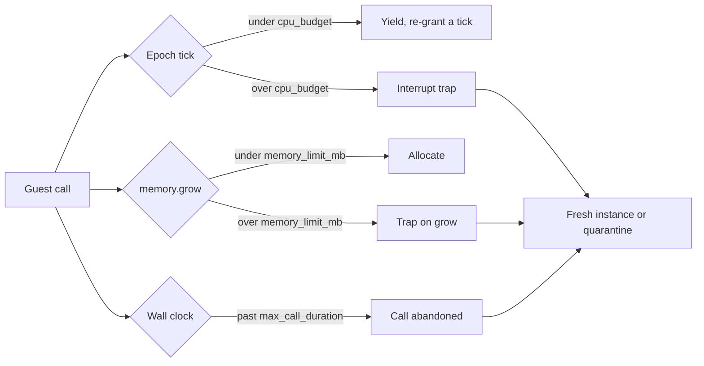

# Capabilities & Sandbox

A WASM plugin starts with no access to the host. It receives a fixed baseline of capabilities, and the proxy operator grants anything beyond that in config. Each capability gates one host interface, or a few methods of one. Every interface is linked for every plugin: the host checks the capability each time a gated function is called and refuses the call when it is missing. At load time the host logs which imports will be refused, and `strict_capabilities = true` turns that report into a load failure.

This page covers the capability enum, the baseline-vs-opt-in split, how granting and revoking work, what a refused call returns, and the CPU, memory, call-queue, and filesystem limits the runtime enforces.

## The capability model

`Capability` is the unit of access. Native plugins (compiled into the proxy binary) are trusted and receive every capability. WASM plugins receive the baseline plus whatever the operator opts in to through TOML.

```rust
// crates/infrarust-api/src/permissions.rs
pub enum Capability {
    EventBus,
    PlayerRead,
    PlayerWrite,
    RawPacket,
    ServerManage,
    Ban,
    Command,
    Scheduler,
    ConfigRead,
    CodecFilter,
    TransportFilter,
    Limbo,
    VirtualBackend,
    PermissionProvider,
    FilesystemExtended,
    Network,
    ChatIntercept,
}
```

Config uses the kebab-case string for each variant. The strings are exact; `codec_filter` (snake_case) is rejected, only `codec-filter` is accepted.

## Capability matrix

| Capability | Config string | Grants | Baseline |
|------------|---------------|--------|----------|
| `EventBus` | `event-bus` | Subscribe to domain events (lifecycle, connection, proxy) | Yes |
| `PlayerRead` | `player-read` | Read the player registry and player state | Yes |
| `PlayerWrite` | `player-write` | Act on a player (message, title, kick, switch-server) | Yes |
| `Command` | `command` | Register commands | Yes |
| `Scheduler` | `scheduler` | Schedule tasks | Yes |
| `ConfigRead` | `config-read` | Read the proxy configuration | Yes |
| `ConfigWrite` | `config-write` | Rewrite the global `infrarust.toml` (no host binding yet, see below) | No |
| `RawPacket` | `raw-packet` | Emit raw packets and gate `player.send-packet` | No |
| `ChatIntercept` | `chat-intercept` | Subscribe to `chat-message`: read, deny and rewrite what players type in chat | No |
| `ServerManage` | `server-manage` | Start/stop servers and read their state | No |
| `Ban` | `ban` | Use the ban service | No |
| `CodecFilter` | `codec-filter` | Register codec filters | No |
| `Limbo` | `limbo` | Provide limbo handlers | No |
| `TransportFilter` | `transport-filter` | Register transport filters (never grantable via config) | No |
| `VirtualBackend` | `virtual-backend` | Provide virtual backends (planned, not implemented) | No |
| `PermissionProvider` | `permission-provider` | Provide a custom permission checker | No |
| `FilesystemExtended` | `filesystem-extended` | Filesystem access beyond the per-plugin data directory (deferred) | No |
| `Network` | `network` | Outbound network access (deferred) | No |

::: warning config-write has no WASM binding
`config-write` parses and can be granted, but the WIT contract exposes no write function, so a WASM plugin holding it still cannot rewrite `infrarust.toml`. The capability gates the native path: `ConfigService::write_proxy_config_document` is served by a read-only wrapper unless the plugin holds it.
:::

::: warning transport-filter is host-only
`transport-filter` is a valid capability string, but `from_config_strings` puts it in the rejected list rather than granting it. A WASM plugin cannot register transport filters. The capability exists for native plugins, which receive it through `native_trusted`.
:::

## Baseline vs. native-trusted

The baseline is the same for every WASM plugin and is built without reading config:

```rust
pub fn baseline() -> Self {
    Self::default()
        .with(Capability::EventBus)
        .with(Capability::PlayerRead)
        .with(Capability::PlayerWrite)
        .with(Capability::Command)
        .with(Capability::Scheduler)
        .with(Capability::ConfigRead)
}
```

Native plugins call `native_trusted`, which inserts every capability, `chat-intercept` included. WASM plugins never use that path.

```rust
pub fn native_trusted() -> Self {
    let mut set = Self::default();
    for cap in Capability::ALL {
        set.insert(cap);
    }
    set
}
```

## Granting opt-in capabilities

Opt-ins are listed under the plugin's config block. `from_config_strings` starts from the baseline and adds each recognized string on top. It returns the resolved set plus a list of rejected strings (unknown names and `transport-filter`).

```toml
# Infrarust config: grant ban + codec-filter on top of the baseline
[plugins.my-plugin]
permissions = ["ban", "codec-filter", "limbo"]
```

```rust
pub fn from_config_strings(strings: &[String]) -> (Self, Vec<String>) {
    let mut set = Self::baseline();
    let mut rejected = Vec::new();
    for s in strings {
        match Capability::from_kebab(s) {
            Some(Capability::TransportFilter) | None => rejected.push(s.clone()), // [!code focus]
            Some(cap) => set.insert(cap),                                          // [!code focus]
        }
    }
    (set, rejected)
}
```

You do not list the baseline capabilities; they are always present. List only the opt-ins. See [Deploying](./deploying) for where this block lives and how rejected strings are reported.

## Revoking capabilities

`deny` takes capabilities away. It is applied after the baseline and the grants, so it can remove a baseline capability, and a capability that appears in both `permissions` and `deny` ends up denied.

```toml
[plugins.my-plugin]
permissions = ["ban"]
deny = ["player-write", "scheduler"]
```

`CapabilitySet::from_config` builds the set in that order, and the context factory uses it for every WASM plugin:

```rust
pub fn from_config(grants: &[String], denies: &[String]) -> (Self, Vec<String>) {
    let (mut set, mut rejected) = Self::from_config_strings(grants);
    rejected.extend(set.revoke_config_strings(denies));
    (set, rejected)
}
```

Unknown names in `deny` are reported with the same warning as unknown grants. `deny` also applies to compiled-in plugins: they start from every capability and lose the ones listed.

A denied capability behaves exactly like one that was never granted: the plugin still loads, and every call that needs the capability is refused (see [Refused calls](#refused-calls)). Denying `config-read`, for example, makes `get-value` answer `none` even for a key the proxy has.

## What a missing capability does

Every host interface is linked for every plugin, whatever it was granted. A plugin that imports `ban-service` but only calls it when the operator granted `ban` loads either way. The check happens when a gated function is called: without the capability the host does not run the call, and answers with the interface's own error type or, when the function has no error channel, with a neutral value.

### Refused calls

| Interface | Function | Needs | Answer when refused |
|-----------|----------|-------|---------------------|
| `ban-service` | `ban`, `unban`, `is-banned`, `get-ban`, `get-all-bans` | `ban` | `service-error` `operation-failed: "missing capability: ban"` |
| `server-manager` | `start`, `stop` | `server-manage` | `service-error` `operation-failed: "missing capability: server-manage"` |
| `server-manager` | `get-state`, `get-all-servers` | `server-manage` | `none`, empty list |
| `config-service` | `get-server-config`, `get-all-server-configs`, `get-value` | `config-read` | `none`, empty list, `none` |
| `player-registry` | `get-player`, `get-player-by-uuid`, `get-player-by-id` | `player-read` | `none` |
| `player-registry` | `get-players-on-server`, `get-all-players` | `player-read` | empty list |
| `player-registry` | `online-count`, `online-count-on` | `player-read` | `0` |
| `player` | `send-message`, `send-title`, `send-action-bar` | `player-write` | `player-error` `send-failed: "missing capability: player-write"` |
| `player` | `switch-server` | `player-write` | `player-error` `switch-failed: "missing capability: player-write"` |
| `player` | `disconnect` | `player-write` | nothing happens |
| `player` | `send-packet` | `raw-packet` | `player-error` `send-failed: "missing capability: raw-packet"` |
| `event-bus` | `subscribe` | `event-bus` | a fresh listener handle with no listener behind it: no event is delivered |
| `event-bus` | `subscribe` with kind `raw-packet` | `event-bus` and `raw-packet` | same as above |
| `event-bus` | `subscribe` with kind `chat-message` | `event-bus` and `chat-intercept` | same as above: the plugin never sees a chat message and cannot deny or change one |
| `event-bus` | `unsubscribe` | `event-bus` | nothing happens |
| `command-manager` | `register`, `unregister` | `command` | nothing happens: the command is not routed to the plugin |
| `scheduler` | `delay`, `interval` | `scheduler` | task handle `0`: the callback never runs |
| `scheduler` | `cancel` | `scheduler` | nothing happens |
| `codec-registry` | `register-codec-filter`, `unregister-codec-filter` | `codec-filter` | nothing happens: no filter joins the codec chain |
| `limbo` | `register-limbo-handler` | `limbo` | nothing happens: the handler never fires |

The `player` methods that only read (`id`, `profile`, `current-server`, and so on) have no check of their own: a plugin only holds a `player` handle it got from `player-registry`, which needs `player-read`. The limbo session resources only reach a plugin through a handler it registered, which needs `limbo`. `log` and `types` are never gated.

The WIT contract has no error channel for the calls answered with a neutral value, so the guest cannot tell that such a call was refused. The host logs every refusal instead, naming the plugin, the call (`call="ban-service.is-banned"`) and the missing capability. It logs at `warn`, and at `error` for `register-limbo-handler`, whose refusal leaves the plugin believing it registered a handler. The log is rate-limited to one line per capability per minute for each plugin instance; the `suppressed` field counts the refusals skipped since the previous line.

The `capability-denied` test fixture calls `ban-service` without the `ban` capability and records the answer:

```rust
match ban_service::is_banned(&BanTarget::Username("nobody".to_string())) {
    Ok(banned) => format!("ok: {banned}"),
    Err(ServiceError::NotFound(message)) => format!("not-found: {message}"),
    Err(ServiceError::OperationFailed(message)) => format!("operation-failed: {message}"),
    Err(ServiceError::Unavailable(message)) => format!("unavailable: {message}"),
}
```

It loads, runs its `on_enable`, and records `operation-failed: missing capability: ban`.

### The load-time report

Before it instantiates a plugin, the host reads the component's import list, which names every host function the plugin can call. For each gated interface the plugin imports without the matching grant, it logs one warning:

```
WARN plugin my-plugin imports ban-service but lacks the `ban` capability; calls will be refused
```

The warning also carries the imported functions in its `functions` field. The report works per function, not per interface. Every component imports the `limbo` interface for its session resource types, but only `register-limbo-handler` needs `limbo`, so a plugin that never registers a limbo handler is not reported. In the same way `player-registry` is reported against `player-write` only when the plugin imports a method that acts on a player, and against `raw-packet` only when it imports `send-packet`.

The report reads imports, not arguments, so it cannot tell which event kinds a plugin subscribes to: a `raw-packet` or `chat-message` subscription without its capability is only reported when the call is refused.

### Chat needs `chat-intercept`

A chat listener sees every message players type, including private messages, and can drop or rewrite them. Subscribing to `chat-message` therefore needs the opt-in `chat-intercept` capability on top of `event-bus`. Earlier versions accepted the subscription with `event-bus` alone, so a plugin that moderates or logs chat needs a new grant after upgrading:

```toml
[plugins.chat-filter]
permissions = ["chat-intercept"]
```

Without it the plugin still loads and `subscribe` still returns a handle, but no chat message reaches the handler, and the host logs the refusal with `call="event-bus.subscribe(chat-message)"` and `capability="chat-intercept"`. Compiled-in plugins hold the capability unless their config denies it.

### Strict mode

`strict_capabilities = true` refuses to load a plugin the report would warn about, which was the behaviour of earlier versions for every plugin:

```toml
[plugins.my-plugin]
permissions = ["ban"]
strict_capabilities = true
```

The load fails with a capability error that lists each interface, the capability it needs and the functions involved:

```
plugin 'my-plugin' imports a host interface it lacks the capability for: infrarust:plugin/config-service needs `config-read` (get-value); refused because strict_capabilities = true
```

Use it for a plugin that cannot do its job without the capabilities it imports, so a missing grant or a `deny` stops it at startup instead of leaving it running with calls refused. The default is `false`. Strict mode only reads the import list; the calls are checked the same way either way.

## The sandbox

Every WASM plugin runs under limits enforced by the wasmtime runtime: a CPU budget, a linear-memory cap, a wall-clock limit per call, a bounded call queue, and a filesystem view. The numbers come from the `[wasm]` table of `infrarust.toml`, and `[plugins.<id>.wasm]` overrides them for one plugin. The defaults:

| Key | Default | Applies to |
|-----|---------|------------|
| `epoch_tick` | `50ms` | The whole proxy: how often the epoch thread ticks |
| `cpu_budget` | `3s` | CPU time per guest call before an `Interrupt` trap |
| `codec_cpu_budget` | `800ms` | CPU time per codec filter call before a trap |
| `memory_limit_mb` | `64` | Linear memory per plugin instance |
| `host_call_timeout` | `30s` | One ban-service or server-manager call made by the guest |
| `max_call_duration` | `60s` | Wall-clock time of one guest call, host calls included |
| `queue_capacity` | `1024` | Calls waiting for a busy plugin |

```toml
[wasm]
cpu_budget = "2s"

[plugins.heavy-plugin.wasm]
memory_limit_mb = 256
queue_capacity = 4096
```

The ranges accepted at startup are listed in [Global Settings](../../configuration/global#wasm-plugin-sandbox).



### CPU budget (epoch interruption)

A dedicated OS thread bumps the engine epoch every `epoch_tick`. Each guest call gets one tick before the deadline callback fires; the callback then either re-grants a tick (a cooperative yield) or, once the call has used `cpu_budget` worth of ticks, interrupts the guest with a hard trap. The budget is converted to ticks by rounding up, so the defaults give 60 yields of 50 ms.

A plugin that spins past the budget is interrupted and its instance is replaced by a fresh one (see [Fault model](./fault-model)). The yield counter resets at the start of each call, so well-behaved plugins that return promptly never approach the limit.

Codec filters run on their own budget, `codec_cpu_budget`, since each filter call is synchronous and normally finishes in microseconds. It is re-armed before every `create`/`filter`/lifecycle call; with the defaults that is 16 ticks. See [Codec Filters](./codec-filters) for the filter contract.

::: info Host calls have their own timeout
Epoch interruption cannot preempt a guest parked inside a host `.await` (such as a ban lookup or a server start), and that waiting time does not count against `cpu_budget`. Each such host call is wrapped in `host_call_timeout`, and cut shorter when the deadline of the guest call that made it is closer; on expiry the guest sees a `service-error` instead of hanging. See [Lifecycle](./lifecycle#deadlines).
:::

### Memory cap

Each instance is built with a `StoreLimits` that caps linear memory at `memory_limit_mb` and traps on a growth that would exceed it. The cap also applies to the memory a component declares up front, so a limit smaller than the component's initial memory makes it fail to load. Instance, table, and memory *counts* keep wasmtime's defaults; only memory growth is bounded. Codec filter instances get the same cap as their plugin.

### One call at a time

Each plugin instance is owned by its own task. Every call into the guest (events, commands, tab completion, scheduled tasks, limbo callbacks, `on_enable` and `on_disable`) is sent to that task as a job and runs to the end before the next one starts.

- A job that has started always runs to completion, even if the caller stops waiting. When the event bus gives up on a listener after `[events] handler_timeout`, the event moves on without the plugin's answer, but the guest call finishes and the instance stays healthy.
- Each job carries a deadline: `[events] handler_timeout` for events, `max_call_duration` for commands, tab completion, scheduled tasks and limbo callbacks. Host calls made during the job return an error shortly before it, so a handler waiting on a slow service still answers before the event bus gives up. See [Lifecycle](./lifecycle#deadlines).
- A job whose caller has already given up, or whose deadline has passed, by the time it reaches the front of the queue is skipped; the guest never sees it.
- At most `queue_capacity` jobs wait. When the queue is full, a new call is refused immediately rather than waiting: an event gets no answer from the plugin, a command does nothing, a tab completion returns no suggestions. A warning naming the plugin and the operation is logged, at most once every 5 seconds per plugin.
- `max_call_duration` is the safety net for a call that never returns, for instance an `on_enable` that makes many slow host calls in a row (lifecycle calls carry no deadline). The call is abandoned and the instance is replaced by a fresh one, because wasmtime cannot re-enter a component whose call was cut off.
- `on_disable` is the last job: jobs queued behind it are dropped, and the task stops once it has run. Unloading a plugin stops its task the same way and drops the instance.

### Filesystem and WASI

The WASI context grants one preopened directory per plugin, mounted at `/` inside the guest and backed by the plugin's data directory on the host. The directory is created on load if it does not exist.

```rust
// crates/infrarust-loader-wasm/src/store_state.rs
builder
    .preopened_dir(data_dir, "/", DirPerms::all(), FilePerms::all())?;
```

There is no network access, no inherited stdio, and no second preopen. Outbound network (`network`) and access outside the data directory (`filesystem-extended`) are deferred; the capabilities are defined but the WASI context does not yet widen for them.

Codec filter instances get a narrower host than this: clocks, randomness, an empty environment and discarded stdio, with no filesystem at all. See [Codec Filters](./codec-filters#what-a-filter-can-call).

## Traps and recovery

A trap from any of the limits above does not just abort the current call. The host never runs guest code in that instance again: it discards the instance, removes the listeners and tasks it registered, releases the players it held in limbo, and starts a fresh instance that runs `on_enable` again. A call that never finished (cut off by `max_call_duration`, or interrupted by a panic in a host function) is handled the same way. The call that faulted gets no answer from the plugin, and a limbo entry fails closed.

Restarts are budgeted by `[wasm.recovery]`. A plugin that keeps faulting is quarantined with an exponential backoff: calls to it are answered at once without running guest code until the proxy tries a fresh instance again. A caller that merely stopped waiting is not a fault. The full model is on [Fault model](./fault-model).

## See also

- [Deploying](./deploying): where the `permissions` and `deny` config keys live and how rejected strings surface.
- [Global Settings](../../configuration/global#wasm-plugin-sandbox): the `[wasm]` table and its accepted ranges.
- [Fault model](./fault-model): recovery, restart budget and quarantine in full.
- [Lifecycle](./lifecycle): the stages from discovery to disable.
- [Architecture](./architecture): how the linker, store, and engine fit together.
- [Services](./services): the host interfaces each capability unlocks.
- [Codec Filters](./codec-filters): the `codec-filter` capability and the per-call budget.
- [Limbo](./limbo): the `limbo` capability and limbo handlers.
- [Virtual Backend](./virtual-backend): the planned `virtual-backend` capability.
- [Native plugins](../dev/getting-started): the trusted API that receives all capabilities.
