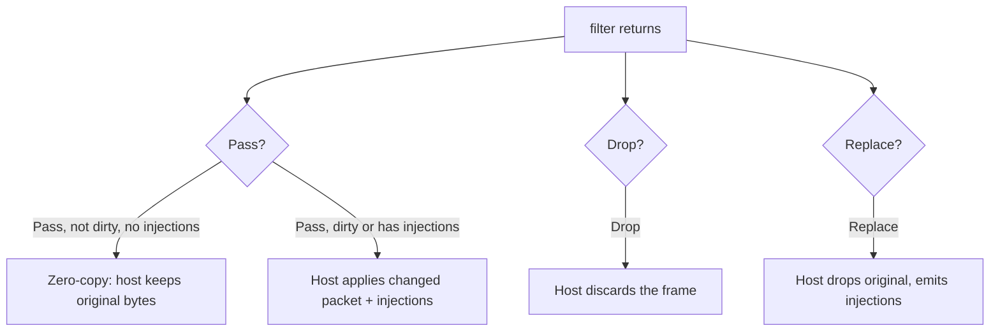

# Codec Filters

A codec filter runs on every decoded Minecraft frame for a single connection. From a WASM plugin you register a filter, and the host calls it for each packet so you can read it, mutate it, drop it, replace it, or inject extra frames around it. This is the lowest-level packet hook the WASM plugin API exposes.

The filter runs synchronously on the proxy's data path. Keep each call cheap.

## Capability

Codec filters need the `codec-filter` capability. It is opt-in, so it must be listed in the plugin's `permissions` in config. The baseline capabilities granted to every WASM plugin do not include it.

```toml
[plugins.my-plugin]
permissions = ["codec-filter"]
```

If the plugin calls `reg.add(...)` without the capability granted, the host omits the codec-registry import and the plugin fails to load.

:::tip
See [Capabilities](./capabilities) for the full baseline and opt-in lists.
:::

## Registration

Implement `Plugin::register_codec_filters` and call `reg.add(id, priority, constructor)`. The method is associated (no plugin `self`), because codec filters are per-connection and carry no state across connections.

```rust
use infrarust_plugin_sdk::prelude::*;

#[derive(Default)]
struct MyPlugin;

struct Flip;

impl CodecFilter for Flip {
    fn filter(&mut self, _ctx: &CodecContext, packet: &mut Packet, _out: &mut Injections) -> Verdict {
        if let Some(b) = packet.data_mut().first_mut() {
            *b ^= 0xff;
        }
        Verdict::Pass
    }
}

#[plugin(id = "my-plugin", name = "My Plugin")]
impl Plugin for MyPlugin {
    fn on_enable(&self, _ctx: &Context) -> Result<(), String> {
        Ok(())
    }

    fn register_codec_filters(reg: &mut CodecRegistrar) {
        reg.add("flip", FilterPriority::Normal, |_init| Box::new(Flip)); // [!code focus]
    }
}
```

`reg.add` takes:

| Argument | Type | Purpose |
|----------|------|---------|
| `id` | `&str` | Unique id for the filter, used for ordering and unregistration. |
| `priority` | `FilterPriority` | Ordering bucket across all registered filters. |
| `constructor` | `impl Fn(&CodecSessionInit) -> Box<dyn CodecFilter> + 'static` | Per-connection factory. |

`FilterPriority` is `First`, `Early`, `Normal` (the default), `Late`, or `Last`, mapping to `0..=4`.

## Per-connection state

The constructor is a factory. The host calls it once per connection-side and builds a fresh filter from the [`CodecSessionInit`](#codecsessioninit). The client side and server side of one connection get separate instances, so their state is independent.

```rust
struct Counter {
    count: u32,
}

impl CodecFilter for Counter {
    fn filter(&mut self, _ctx: &CodecContext, packet: &mut Packet, _out: &mut Injections) -> Verdict {
        self.count += 1;
        packet.set_data(self.count.to_le_bytes().to_vec());
        Verdict::Pass
    }
}

fn register_codec_filters(reg: &mut CodecRegistrar) {
    reg.add("counter", FilterPriority::Normal, |_init| {
        Box::new(Counter { count: 0 }) // [!code focus]
    });
}
```

Each instance keeps its own `count`. The client-side `Counter` and the server-side `Counter` count their own frames.

### CodecSessionInit

The constructor receives the session init by reference. Read it to set up per-connection state.

| Field | Type | Meaning |
|-------|------|---------|
| `client_version` | `i32` | The client's protocol version number. |
| `connection_id` | `u64` | Stable id for the connection. |
| `side` | `ConnectionSide` | `ClientSide` or `ServerSide`. |
| `remote_addr` | `String` | The peer address. |
| `real_ip` | `Option<String>` | The resolved real IP, when proxy-protocol or a similar source provided one. |

## The CodecFilter trait

```rust
pub trait CodecFilter {
    fn filter(&mut self, ctx: &CodecContext, packet: &mut Packet, out: &mut Injections) -> Verdict;

    fn on_state_change(&mut self, new_state: ConnectionState) {}
    fn on_compression_change(&mut self, threshold: i32) {}
    fn on_encryption_enabled(&mut self) {}
    fn on_close(&mut self) {}
}
```

`filter` is the only required method. The lifecycle hooks default to no-ops, so implement only the ones you need.

| Hook | Called when |
|------|-------------|
| `on_state_change` | The protocol state changed (for example Login to Configuration to Play). |
| `on_compression_change` | Compression was enabled or its threshold changed. The `threshold` is the new value. |
| `on_encryption_enabled` | Encryption was enabled. |
| `on_close` | The connection-side is closing. This is the last call before the instance is dropped. |

### Why context comes from session-init and hooks

At the WIT boundary (`infrarust:plugin@0.2.3`), the host calls `filter` with `(packet-id, data)` only. The richer `CodecContext` is reconstructed on the guest side from the `CodecSessionInit` plus the lifecycle hooks, instead of being re-marshalled for every packet.

`CodecContext` exposes:

| Field | Type |
|-------|------|
| `client_version` | `i32` |
| `server_version` | `Option<i32>` |
| `state` | `ConnectionState` |
| `connection_id` | `u64` |
| `side` | `ConnectionSide` |
| `player_info` | `Option<PlayerInfo>` |
| `is_proxy_consumed` | `bool` |

The lifecycle hooks are how connection-level changes reach your filter without per-packet overhead. Track state you care about (compression threshold, current `ConnectionState`) in your filter struct from the hooks, and read it in `filter`.

## The Packet API

```rust
packet.id();                       // i32: cheap read
packet.data();                     // &[u8]: cheap read
packet.set_id(0x10);               // marks dirty
packet.set_data(bytes);            // marks dirty
packet.data_mut();                 // &mut Vec<u8>: marks dirty
Packet::new(packet_id, bytes);     // build a new packet to inject
```

Reads are free. Any mutation through `set_id`, `set_data`, or `data_mut` marks the packet dirty so the host re-copies it only when it actually changed.

## Verdicts

`filter` returns a `Verdict`:

| Verdict | Effect |
|---------|--------|
| `Verdict::Pass` | Forward the packet (mutated in place if you changed it). |
| `Verdict::Drop` | Discard the packet. It is not forwarded. |
| `Verdict::Replace` | Drop the original packet but still emit the injected frames. |

### Injections

`Injections` carries extra frames to emit around the current packet:

```rust
out.before(Packet::new(0xfe, b"before".to_vec()));
out.after(Packet::new(0xff, b"after".to_vec()));
```

`before` frames are emitted ahead of the current packet, `after` frames behind it. Injections combine with `Pass` and `Replace`. With `Drop`, the verdict discards everything for that frame.

### Mutate, drop, and inject in one filter

```rust
impl CodecFilter for OpFilter {
    fn filter(&mut self, _ctx: &CodecContext, packet: &mut Packet, out: &mut Injections) -> Verdict {
        match packet.id() {
            0x01 => Verdict::Drop,                              // drop this packet
            0x02 => {
                packet.set_data(b"MODIFIED".to_vec());         // mutate the payload
                Verdict::Pass
            }
            0x03 => {
                out.before(Packet::new(0xfe, b"before".to_vec())); // inject around it
                out.after(Packet::new(0xff, b"after".to_vec()));
                Verdict::Pass
            }
            _ => Verdict::Pass,
        }
    }
}
```

## Zero-copy pass

Returning `Verdict::Pass` on a packet you did not mutate, with no injections, sends nothing back to the host. The host keeps the original bytes and forwards them unchanged.



Only mutate when you mean to. A read-only filter that returns `Pass` adds no copy.

## Hot path and the CPU budget

`filter` runs synchronously for every frame on every connection that the filter applies to. A per-packet filter completes in microseconds. Treat it as a hot path: avoid allocations you do not need, and do not block.

Each guest call (`create`, `filter`, and the lifecycle hooks) gets an epoch deadline of `CODEC_EPOCH_DEADLINE_TICKS = 16` ticks, reset before every call. A tick is about 50 ms, so this is roughly 16 epochs of pure CPU headroom that only a runaway filter can exceed. When a call exceeds it, the guest traps.

:::warning
The codec filter has no async runtime and no `.await`. It is single-threaded guest code. Keep per-packet work small.
:::

## Trap behavior

If a guest codec call traps (including exhausting the epoch budget), the host poisons that connection-side instance. From then on, every `filter` call on that side returns `Verdict::Pass` (the packet passes through unchanged) and the lifecycle hooks become no-ops. The trap is logged with the plugin id and the operation that trapped. The other connection-side and other connections are not affected.

If the host fails to create the filter instance for a connection (for example instantiation fails), that connection-side passes through for its entire lifetime.

:::info
The WIT contract also defines a `filter-output::error(codec-filter-error)` variant for translation and payload failures. The SDK's `Verdict` does not expose it; surface errors through your own logging and return `Pass`, `Drop`, or `Replace`.
:::

## Connection-state transitions

`on_state_change` reports protocol-state moves. The states are:

```
handshake → status        (a status ping)
handshake → login → configuration → play   (a joining client)
```

`ConnectionState` is `Handshake`, `Status`, `Login`, `Configuration`, or `Play`. A new connection starts in `Handshake`; the `CodecContext` reconstructed from session-init reflects that until the first `on_state_change`.

## Building

Codec filters compile the same way as any WASM plugin: a `cdylib` for the `wasm32-wasip2` target. There is no `cargo-component` step; `wit-bindgen` is embedded in the SDK.

:::code-group
```toml [Cargo.toml]
[lib]
crate-type = ["cdylib"]

[dependencies]
infrarust-plugin-sdk = "0.2"
```
```bash [build]
rustup target add wasm32-wasip2
cargo build --release --target wasm32-wasip2
```
:::

## See also

- [Capabilities](./capabilities): baseline grants and the opt-in list, including `codec-filter`.
- [Architecture](./architecture): how the host instantiates and drives codec instances.
- [API Reference](./api-reference): the full `CodecFilter`, `Packet`, and `Verdict` types.
- [Examples](./examples): runnable codec filter samples.
- [Configuration](../../configuration/): where `permissions` lives in the config file.
