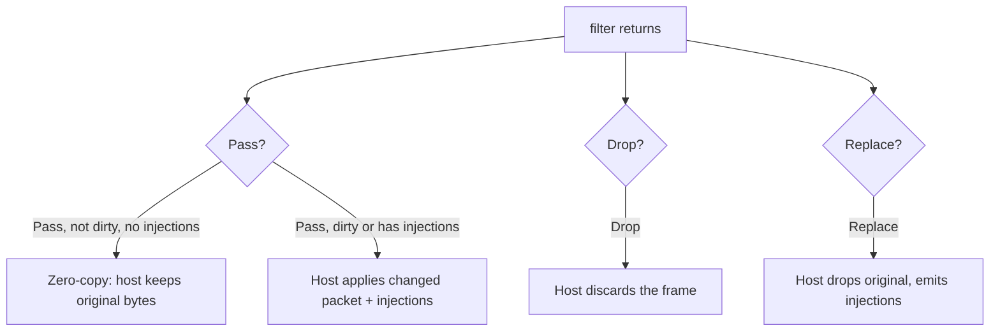

# Codec Filters

A codec filter runs on every decoded Minecraft frame for a single connection. From a WASM plugin you register a filter, and the host calls it for each packet so you can read it, mutate it, drop it, replace it, or inject extra frames around it. This is the lowest-level packet hook the WASM plugin API exposes.

The filter runs synchronously on the proxy's data path, and a slow call delays other connections too (see [What a filter costs the other connections](#what-a-filter-costs-the-other-connections)). Keep each call cheap.

## Capability

Codec filters need the `codec-filter` capability. It is opt-in, so it must be listed in the plugin's `permissions` in config. The baseline capabilities granted to every WASM plugin do not include it.

```toml
[plugins.my-plugin]
permissions = ["codec-filter"]
```

If the plugin calls `reg.add(...)` without the capability granted, the plugin still loads, but the host refuses the registration: no filter joins the codec chain, and the proxy log shows a `missing capability` warning for `codec-registry.register-codec-filter` plus the load-time report for `codec-registry`. With `strict_capabilities = true` the plugin is refused at load instead. See [Capabilities](./capabilities#what-a-missing-capability-does).

:::tip
See [Capabilities](./capabilities) for the full baseline and opt-in lists.
:::

## Registration

Implement `Plugin::register_codec_filters` and call `reg.add(id, priority, constructor)`. The method is associated (no plugin `self`), because codec filters are per-connection and carry no state across connections.

```rust
use infrarust_plugin_sdk::prelude::*;

#[derive(Default)]
struct MyPlugin;

struct Flip;

impl CodecFilter for Flip {
    fn filter(&mut self, _ctx: &CodecContext, packet: &mut Packet, _out: &mut Injections) -> Verdict {
        if let Some(b) = packet.data_mut().first_mut() {
            *b ^= 0xff;
        }
        Verdict::Pass
    }
}

#[plugin(id = "my-plugin", name = "My Plugin")]
impl Plugin for MyPlugin {
    fn on_enable(&self, _ctx: &Context) -> Result<(), PluginError> {
        Ok(())
    }

    fn register_codec_filters(reg: &mut CodecRegistrar) {
        reg.add("flip", FilterPriority::Normal, |_init| Box::new(Flip)); // [!code focus]
    }
}
```

`reg.add` takes:

| Argument | Type | Purpose |
|----------|------|---------|
| `id` | `&str` | Unique id for the filter, used for ordering and unregistration. |
| `priority` | `FilterPriority` | Ordering bucket across all registered filters. |
| `constructor` | `impl Fn(&CodecSessionInit) -> Box<dyn CodecFilter> + 'static` | Per-connection factory. |

`reg.add_required` takes the same arguments and declares a [required filter](#required-filters): when it cannot filter a connection, the proxy closes that connection instead of letting its packets through unfiltered. At the WIT level this is the `required` field of `codec-filter-metadata`.

`FilterPriority` is `First`, `Early`, `Normal` (the default), `Late`, or `Last`, the same names as the WIT `filter-priority` enum. When the host refuses the registration (no `codec-filter` capability, no codec registry, or an id another plugin or the proxy already owns), the filter is simply not part of the chain and the host logs why.

A filter id belongs to the plugin that registered it. At the WIT level, `register-codec-filter` answers `conflict` for an id owned by someone else, and registering one of your own ids again replaces it. A plugin holds at most `[wasm.quotas] codec_filters` ids (32 by default); a new id past that answers `limit-exceeded`, and unregistering one of your filters frees room. The filters a plugin registered are kept across a [recovery](./fault-model) and keep counting. `unregister-codec-filter` removes only your own filters: it answers `conflict` for an id another plugin owns and `not-found` for an id nobody registered. The host removes all of a plugin's codec filters when the plugin is disabled or unloaded, so connections opened afterwards run none of its filter code.

In the SDK, `reg.add` declares the filter and the host's answer is not returned to it, because the same method is replayed on every codec instance to rebuild the constructor table. A refused registration drops its constructor and the host logs the refusal. To withdraw one of your filters at runtime, call `ctx.unregister_codec_filter(id)`, which returns the host's answer as a `Result<(), Error>`:

```rust
if let Err(error) = ctx.unregister_codec_filter("flip") {
    warn!("flip filter not removed: {error}");
}
```

Connections already open keep the instance they were created with until they close.

## Per-connection state

The constructor is a factory. The host calls it once per connection-side and builds a fresh filter from the [`CodecSessionInit`](#codecsessioninit). The client side and server side of one connection get separate instances, so their state is independent.

```rust
struct Counter {
    count: u32,
}

impl CodecFilter for Counter {
    fn filter(&mut self, _ctx: &CodecContext, packet: &mut Packet, _out: &mut Injections) -> Verdict {
        self.count += 1;
        packet.set_data(self.count.to_le_bytes().to_vec());
        Verdict::Pass
    }
}

fn register_codec_filters(reg: &mut CodecRegistrar) {
    reg.add("counter", FilterPriority::Normal, |_init| {
        Box::new(Counter { count: 0 }) // [!code focus]
    });
}
```

Each instance keeps its own `count`. The client-side `Counter` and the server-side `Counter` count their own frames.

### CodecSessionInit

The constructor receives the session init by reference. Read it to set up per-connection state.

| Field | Type | Meaning |
|-------|------|---------|
| `client_version` | `i32` | The client's protocol version number. |
| `connection_id` | `u64` | Stable id for the connection. |
| `side` | `ConnectionSide` | `ClientSide` or `ServerSide`. |
| `remote_addr` | `SocketAddr` | The peer address. |
| `real_ip` | `Option<IpAddr>` | The resolved real IP, when proxy-protocol or a similar source provided one. |

## The CodecFilter trait

```rust
pub trait CodecFilter {
    fn filter(&mut self, ctx: &CodecContext, packet: &mut Packet, out: &mut Injections) -> Verdict;

    fn on_state_change(&mut self, new_state: ConnectionState) {}
    fn on_compression_change(&mut self, threshold: i32) {}
    fn on_encryption_enabled(&mut self) {}
    fn on_close(&mut self) {}
}
```

`filter` is the only required method. The lifecycle hooks default to no-ops, so implement only the ones you need.

| Hook | Called when |
|------|-------------|
| `on_state_change` | The protocol state changed (for example Login to Configuration to Play). |
| `on_compression_change` | Compression was enabled or its threshold changed. The `threshold` is the new value. |
| `on_encryption_enabled` | Encryption was enabled. |
| `on_close` | The connection-side is closing. This is the last call before the instance is dropped. |

### Why context comes from session-init and hooks

At the WIT boundary (`infrarust:plugin@0.3.0`), the host calls `filter` with `(packet-id, data)` only. The richer `CodecContext` is reconstructed on the guest side from the `CodecSessionInit` plus the lifecycle hooks, instead of being re-marshalled for every packet.

`CodecContext` exposes:

| Field | Type |
|-------|------|
| `client_version` | `i32` |
| `state` | `ConnectionState` |
| `connection_id` | `u64` |
| `side` | `ConnectionSide` |

`state` starts at `Handshake` and follows `on_state_change`.

The lifecycle hooks are how connection-level changes reach your filter without per-packet overhead. Track state you care about (compression threshold, current `ConnectionState`) in your filter struct from the hooks, and read it in `filter`.

## The Packet API

```rust
packet.id();                       // i32: cheap read
packet.data();                     // &[u8]: cheap read
packet.set_id(0x10);               // marks dirty
packet.set_data(bytes);            // marks dirty
packet.data_mut();                 // &mut Vec<u8>: marks dirty
Packet::new(packet_id, bytes);     // build a new packet to inject
```

Reads are free. Any mutation through `set_id`, `set_data`, or `data_mut` marks the packet dirty so the host re-copies it only when it actually changed.

## Verdicts

`filter` returns a `Verdict`:

| Verdict | Effect |
|---------|--------|
| `Verdict::Pass` | Forward the packet (mutated in place if you changed it). |
| `Verdict::Drop` | Discard the packet. It is not forwarded. |
| `Verdict::Replace` | Drop the original packet but still emit the injected frames. |

### Injections

`Injections` carries extra frames to emit around the current packet:

```rust
out.before(Packet::new(0xfe, b"before".to_vec()));
out.after(Packet::new(0xff, b"after".to_vec()));
```

`before` frames are emitted ahead of the current packet, `after` frames behind it. Injections combine with `Pass` and `Replace`. With `Drop`, the verdict discards everything for that frame.

### Mutate, drop, and inject in one filter

```rust
impl CodecFilter for OpFilter {
    fn filter(&mut self, _ctx: &CodecContext, packet: &mut Packet, out: &mut Injections) -> Verdict {
        match packet.id() {
            0x01 => Verdict::Drop,                              // drop this packet
            0x02 => {
                packet.set_data(b"MODIFIED".to_vec());         // mutate the payload
                Verdict::Pass
            }
            0x03 => {
                out.before(Packet::new(0xfe, b"before".to_vec())); // inject around it
                out.after(Packet::new(0xff, b"after".to_vec()));
                Verdict::Pass
            }
            _ => Verdict::Pass,
        }
    }
}
```

## Zero-copy pass

Returning `Verdict::Pass` on a packet you did not mutate, with no injections, sends nothing back to the host. The host keeps the original bytes and forwards them unchanged. At the WIT level, `filter` answers `pass` or `drop` as a plain enum; only a modified, injected, replaced or failed frame makes the host fetch the full `filter-output` with a second call, `take-output`.


```mermaid
flowchart TD
    F[filter returns] --> P{Pass?}
    P -->|"Pass, not dirty, no injections"| ZC[Zero-copy: host keeps original bytes]
    P -->|"Pass, dirty or has injections"| MOD[Host applies changed packet + injections]
    F --> D{Drop?}
    D -->|Drop| DROP[Host discards the frame]
    F --> R{Replace?}
    R -->|Replace| REP[Host drops original, emits injections]
```

Only mutate when you mean to. A read-only filter that returns `Pass` adds no copy.

## What a filter can call

A codec filter instance runs in its own synchronous store, separate from the plugin's main instance, and sees a smaller host. What it can import:

| Import | Behaviour inside a filter |
|--------|---------------------------|
| `log` (`info!` and the other macros) | Written to the proxy log with the plugin id, at most 20 lines per second for all the plugin's filter instances together. Lines over the limit are dropped; the next line that gets through carries a `suppressed` count. A macro at a level the proxy does not log formats nothing, makes no host call and does not use up the budget: the SDK asks the host for the proxy's level once when the instance is created, and each macro only compares its level with the answer. A line at a logged level costs its formatting and one host call. |
| `wasi:clocks` wall and monotonic clocks | `now` and `resolution` work, so `Instant::now()` and `SystemTime::now()` do. |
| `wasi:random` (`random`, `insecure`, `insecure-seed`) | Work, so `HashMap::new()` (its `RandomState` asks for a seed) and random numbers do. |
| `wasi:cli/environment` | Empty environment, no arguments, no working directory. |
| stdout, stderr | Writes succeed and are discarded, so a stray `println!` does not break the filter. |
| stdin | Always at end of stream. |
| Everything else | Traps: the filesystem (there is no preopened directory), sockets and `wasi:http` (even when the plugin has the `network` capability), `exit`, sleeping on a clock (`subscribe-duration`, `subscribe-instant`), and every other `infrarust:plugin` interface. |

A trap discards that connection-side instance as described in [Trap behavior](#trap-behavior), so a filter that calls a trapping import passes every later packet through unchanged (or closes its connection, for a required filter). The plugin's other host services (players, bans, config, the scheduler) are not reachable from a filter; read what you need in `on_enable` and pass it through the constructor, or reconstruct it from the [`CodecSessionInit`](#codecsessioninit).

```rust
struct Tally {
    seen: HashMap<i32, u32>,
}

impl CodecFilter for Tally {
    fn filter(&mut self, _ctx: &CodecContext, packet: &mut Packet, _out: &mut Injections) -> Verdict {
        let count = self.seen.entry(packet.id()).or_insert(0);
        *count += 1;
        debug!("packet {:#x} seen {count} times", packet.id());
        Verdict::Pass
    }
}
```

## Hot path and the CPU budget

`filter` runs synchronously for every frame on every connection that the filter applies to, on the tokio worker thread that runs the connection. A per-packet filter completes in microseconds: crossing the boundary costs about 0.3 µs for a small packet and 55 to 85 µs for a 2 MiB one. Treat it as a hot path: avoid allocations you do not need, and do not block.

Each guest call (`create`, `filter`, the lifecycle hooks and the instance's final drop) gets `codec_cpu_budget`, 5 ms by default, set in `[wasm]` or per plugin under `[plugins.<id>.wasm]`. The budget is counted in epoch ticks (`epoch_tick`, 1 ms by default) during which the guest is running, re-armed at the start of every call. A stretch the thread spends preempted by the operating system counts as one tick, so a filter is not cut because the host was busy. A call that runs past its budget traps; see [Trap behavior](#trap-behavior). The budget is headroom for a runaway filter, not a time slice to plan for: a filter that needs more for a large packet can have its plugin's `codec_cpu_budget` raised.

### What a filter costs the other connections

A filter call does not yield. While it runs, it holds its worker thread, and when the proxy is lightly loaded that worker is often the one watching the network for the whole proxy: no other socket is read until the call returns. Every millisecond a filter spends is therefore a millisecond of added latency for other players, not only for its own connection. The 5 ms budget bounds that cost per call, and the [quarantine](#quarantine) bounds how many such calls one client address can cause.

:::warning
The codec filter has no async runtime and no `.await`. It is single-threaded guest code. Keep per-packet work small.
:::

## Trap behavior

If a guest codec call traps (a panic, running past `codec_cpu_budget`, running out of memory, or calling an import a filter cannot use), the host discards that connection-side instance. From then on, every `filter` call on that side returns `Verdict::Pass` (the packet passes through unchanged) and the lifecycle hooks become no-ops. The proxy logs a warning with the plugin id, the filter id, the operation that trapped, the client address and the cause: `ran past codec_cpu_budget (5ms)`, the panic message and its location (`panicked at src/filter.rs:12:9: ...`) for a filter built with the SDK, which reports its panics to the host, `hit an unreachable instruction` for a panic the host was not told about, or the error otherwise. These warnings are limited to 10 per minute per filter; the next one that gets through carries a `suppressed` count. The other connection side and other connections keep their instances, unless the fault puts the client address in [quarantine](#quarantine).

If the host cannot create the filter instance for a connection side (for example `instance_pool` has no free slot, or the process cannot reserve more address space), that side passes through for its entire lifetime. The proxy logs an error for it, at most 10 per minute per filter with a `suppressed` count. Running out of slots is not counted as a fault of the client.

A required filter closes the connection instead of passing its packets through; see [Required filters](#required-filters).

:::info
The WIT contract also defines a `filter-output::error(codec-filter-error)` variant for translation and payload failures. The SDK's `Verdict` does not expose it; surface errors through your own logging and return `Pass`, `Drop`, or `Replace`.
:::

## Quarantine

Every trap of a filter is also counted against the client address of its connection (the real client IP when the proxy knows it, otherwise the peer address). When one address reaches `faults` traps of the same filter within `window`, that filter is quarantined for that address:

- its live instances on connections from that address stop filtering (they pass through, or close their connection if the filter is required);
- new connections from that address get no instance of the filter for `backoff_initial`, and pass through unfiltered (or are refused if the filter is required);
- the proxy logs one warning naming the plugin, the filter, the address, the threshold, the time until retry and the cause of the fault that tripped it. Quarantine warnings are limited to 10 per minute per filter.

A client who makes a filter fault only affects its own connections; other addresses keep the filter. When the backoff has passed, the address gets the filter again. If the address faults again within `window` after its quarantine ended, its next quarantine lasts twice as long, up to `backoff_max`; a whole `window` without a fault after a quarantine ended starts the backoff over at `backoff_initial`. A filter that is buggy for everyone is still bounded per call by `codec_cpu_budget`.

```toml
[wasm.codec_quarantine]
faults = 5              # traps of one filter from one address; 0 turns the quarantine off
window = "10s"
backoff_initial = "10s"
backoff_max = "5m"

[plugins.anticheat.wasm.codec_quarantine]
faults = 3
```

See [Global Settings](../../configuration/global#wasm-plugin-sandbox) for the ranges.

## Required filters

A filter registered with `reg.add_required` is required: the proxy does not let a connection through without it.

- If the instance cannot be created for a connection side (a trap in `create`, no free instance slot, no address space left), the player is disconnected before the proxy connects to a backend, with `Connection refused: a required packet filter is not available.`
- If the instance traps later, or its client address is quarantined while the connection is open, the connection is closed at its next packet with `Disconnected: a required packet filter failed.` Other connections are not affected.
- While the filter is quarantined for an address, new connections from that address are refused the same way.

The proxy logs the refusal or the close with the reason, next to the trap or quarantine warning. Use it for filters whose absence would be a security problem (packet sanitising, anti-cheat); leave cosmetic filters optional, since a required filter that fails for everyone refuses everyone.

## Connection-state transitions

`on_state_change` reports protocol-state moves. The states are:

```
handshake → status        (a status ping)
handshake → login → configuration → play   (a joining client)
```

`ConnectionState` is `Handshake`, `Status`, `Login`, `Configuration`, or `Play`. A new connection starts in `Handshake`; the `CodecContext` reconstructed from session-init reflects that until the first `on_state_change`.

## Building

Codec filters compile the same way as any WASM plugin: a `cdylib` for the `wasm32-wasip2` target. There is no `cargo-component` step; `wit-bindgen` is embedded in the SDK.

:::code-group
```toml [Cargo.toml]
[lib]
crate-type = ["cdylib"]

[dependencies]
infrarust-plugin-sdk = "2.0.0-beta.3"
```
```bash [build]
rustup target add wasm32-wasip2
cargo build --release --target wasm32-wasip2
```
:::

## See also

- [Capabilities](./capabilities): baseline grants and the opt-in list, including `codec-filter`.
- [Architecture](./architecture): how the host instantiates and drives codec instances.
- [API Reference](./api-reference#the-codec-filter-export): the WIT `codec-filter` interface that the SDK's `CodecFilter`, `Packet` and `Verdict` types are built on.
- [Examples](./examples): runnable codec filter samples.
- [Configuration](../../configuration/): where `permissions` lives in the config file.
