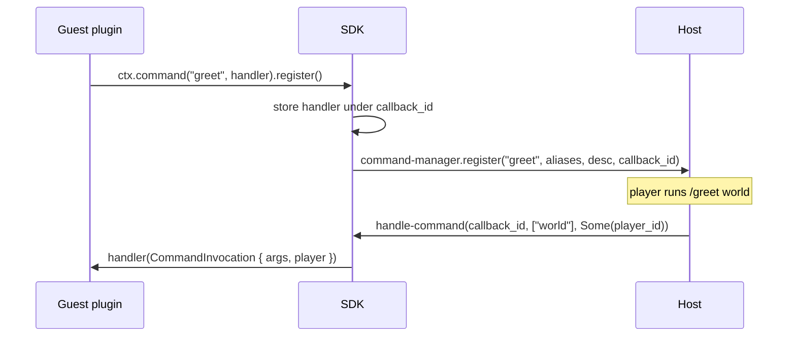

# Commands

A WASM plugin registers proxy commands through `ctx.command(name, handler)`. The call returns a builder for aliases, a description, and a tab-completer; `register()` installs the command on the host. The `command` capability is in the [baseline set](./capabilities), so commands work without any extra grant in config.

## Register a command

Call `ctx.command` inside `on_enable` and finish the chain with `register()`:

```rust
use infrarust_plugin_sdk::prelude::*;

#[derive(Default)]
struct GreetPlugin;

#[plugin(id = "greet", name = "Greet Plugin")]
impl Plugin for GreetPlugin {
    fn on_enable(&self, ctx: &Context) -> Result<(), String> {
        ctx.command("greet", |invocation| {
            info!("greet ran with args {:?}", invocation.args);
        })
        .alias("hi")
        .description("Greets the caller")
        .register(); // [!code focus]
        Ok(())
    }
}
```

The first argument is the primary name. The second is the handler closure, which runs whenever the command is invoked.

::: warning
Nothing is registered until you call `register()`. The builder is consumed by that call, so chain every option before it.
:::

## The builder

`Context::command` returns a `CommandBuilder`. Each method takes `self` and returns `self`, so the calls chain.

| Method | Signature | Effect |
|--------|-----------|--------|
| `alias` | `alias(impl Into<String>)` | Add one alias |
| `aliases` | `aliases(impl IntoIterator<Item = impl Into<String>>)` | Add several aliases |
| `description` | `description(impl Into<String>)` | Set the help text |
| `completer` | `completer(impl Fn(&[String], u32) -> Vec<String> + 'static)` | Set the tab-completion function |
| `register` | `register(self)` | Install the command (terminal) |

```rust
ctx.command("warp", handler)
    .aliases(["tp", "go"])
    .description("Teleport to a configured warp point")
    .completer(|parts, cursor| complete_warps(parts, cursor))
    .register();
```

## The handler

The handler is `impl FnMut(CommandInvocation) + 'static`. `CommandInvocation` carries the parsed arguments and the caller:

```rust
pub struct CommandInvocation {
    pub args: Vec<String>,
    pub player: Option<u64>,
}
```

`args` holds the tokens after the command name. `player` is the [player id](./services) of the sender, or `None` when the command came from the proxy console.

```rust
ctx.command("ping", |invocation| {
    match invocation.player {
        Some(id) => info!("ping from player {id}"),
        None => info!("ping from console"),
    }
})
.register();
```

## Tab-completion

The completer is `impl Fn(&[String], u32) -> Vec<String> + 'static`. It receives the current argument tokens and a cursor index, and returns the candidate completions for the token being typed:

```rust
.completer(|partial, _cursor| {
    let prefix = partial.last().map(String::as_str).unwrap_or("");
    ["world", "everyone", "friend"]
        .iter()
        .filter(|c| c.starts_with(prefix))
        .map(|c| (*c).to_string())
        .collect()
})
```

The completer is `Fn`, not `FnMut`: it cannot mutate captured state. The handler is `FnMut` and can. A command without a completer returns no candidates.

## Under the hood

The SDK assigns each command a callback id and registers the name through the `command-manager` host import, passing that id. The handler and completer closures stay in a per-instance table keyed by the id. When a player or the console runs the command, the host calls the guest `handle-command` export (or `tab-complete` for completion) with the same id, and the SDK dispatches to the stored closure.



The id is what links a host invocation back to the right closure, so two commands in the same plugin never collide.

## Worked example

This is the `command-plugin` fixture, extended to message the caller. It registers `greet` with a description and a completer, then looks the sender up in the [player registry](./services) and sends them a message.

```rust
use infrarust_plugin_sdk::prelude::*;

#[derive(Default)]
struct CommandPlugin;

#[plugin(id = "command-plugin", name = "Command Plugin")]
impl Plugin for CommandPlugin {
    fn on_enable(&self, ctx: &Context) -> Result<(), String> {
        let players = ctx.player_registry();
        ctx.command("greet", move |invocation| {
            let target = invocation.args.first().map_or("world", String::as_str);
            let Some(id) = invocation.player else {
                info!("greet {target} (from console)");
                return;
            };
            if let Some(player) = players.get_by_id(id) {
                let message = Component::text(format!("Hello, {target}!")).color("gold");
                let _ = player.send_message(&message.into_json());
            }
        })
        .description("Greets the caller")
        .completer(|partial, _cursor| {
            let prefix = partial.last().map(String::as_str).unwrap_or("");
            ["world", "everyone", "friend"]
                .iter()
                .filter(|c| c.starts_with(prefix))
                .map(|c| (*c).to_string())
                .collect()
        })
        .register();
        Ok(())
    }
}
```

`get_by_id` returns `Option<Player>` because the sender can disconnect before the command runs. `send_message` returns `Result<(), PlayerError>`, so handle or ignore the error explicitly. Both `Players` and `Player` come from the `command` and `player-read`/`player-write` baseline capabilities, so this example needs no opt-in grants.

## See also

- [Services](./services): the player registry, server manager, ban, and config accessors used inside handlers.
- [Events](./events): react to connection and chat events instead of explicit commands.
- [Capabilities](./capabilities): why `command` works out of the box and which capabilities are opt-in.
- [Examples](./examples): full plugins built from these pieces.
