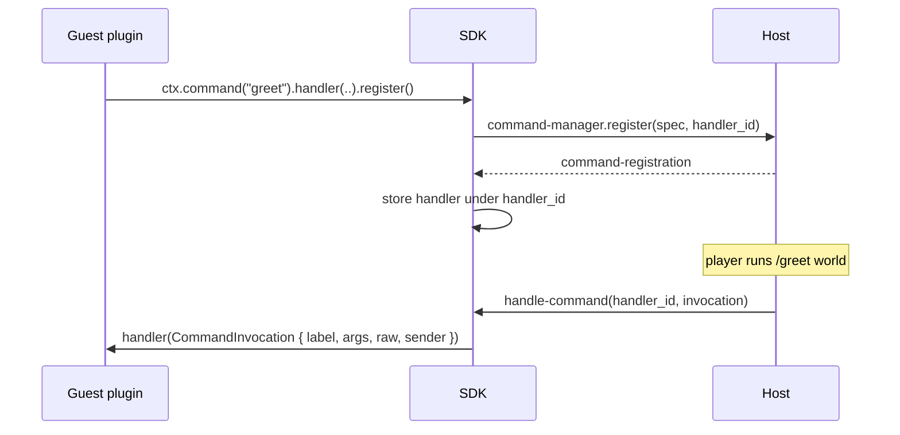

# Commands

A WASM plugin registers proxy commands through `ctx.command(name)`. The call returns a builder for aliases, a description, usage, a permission node, the handler and a tab-completer; `register()` installs the command on the host and answers what the host registered. The `command` capability is in the [baseline set](./capabilities), so commands work without any extra grant in config.

## Register a command

Call `ctx.command` inside `on_enable` and finish the chain with `register()`:

```rust
use infrarust_plugin_sdk::prelude::*;

#[derive(Default)]
struct GreetPlugin;

#[plugin(id = "greet", name = "Greet Plugin")]
impl Plugin for GreetPlugin {
    fn on_enable(&self, ctx: &Context) -> Result<(), PluginError> {
        ctx.command("greet")
            .alias("hi")
            .description("Greets the caller")
            .handler(|invocation| {
                let _ = invocation.reply(format!("hello, {}!", invocation.sender.name()));
            })
            .register()?; // [!code focus]
        Ok(())
    }
}
```

::: warning
Nothing is registered until you call `register()`. The builder is consumed by that call, so chain every option before it. A command without a handler does nothing when it runs.
:::

## The builder

`Context::command` returns a `CommandBuilder`. Each method takes `self` and returns `self`, so the calls chain.

| Method | Signature | Effect |
|--------|-----------|--------|
| `alias` | `alias(impl Into<String>)` | Add one alias |
| `aliases` | `aliases(impl IntoIterator<Item = impl Into<String>>)` | Add several aliases |
| `description` | `description(impl Into<String>)` | Set the help text |
| `usage` | `usage(impl Into<String>)` | Set the usage line shown in help |
| `permission` | `permission(impl Into<String>)` | Require a permission node to see and run the command |
| `hidden` | `hidden(bool)` | Keep the command out of help listings |
| `handler` | `handler(impl FnMut(CommandInvocation) + 'static)` | Set what runs when the command is invoked |
| `completer` | `completer(impl Fn(&Completion) -> Vec<S> + 'static)` where `S: Into<Suggestion>` | Set the tab-completion function |
| `register` | `register(self) -> Result<CommandRegistration, Error>` | Install the command (terminal) |

```rust
let registration = ctx
    .command("warp")
    .aliases(["tp", "go"])
    .description("Teleport to a configured warp point")
    .usage("/warp <name>")
    .permission("warps.use")
    .handler(|invocation| warp(&invocation))
    .completer(|completion| complete_warps(completion.partial()))
    .register()?;
if !registration.rejected_aliases.is_empty() {
    warn!("aliases taken by other plugins: {:?}", registration.rejected_aliases);
}
```

`CommandRegistration` carries the registered `name`, its `namespaced` form, the `aliases` the host accepted and the `rejected_aliases` it skipped.

## The handler

The handler receives a `CommandInvocation`:

```rust
pub struct CommandInvocation {
    pub label: String,
    pub args: Vec<String>,
    pub raw: String,
    pub sender: CommandSender,
}

pub enum CommandSender {
    Console,
    Player(PlayerRef),
}
```

`label` is the name or alias the sender typed, `args` the tokens after it, and `raw` the whole line. `sender.player()` returns the `PlayerRef` of a player sender, `sender.name()` the player's username or `Console`. The console runs a plugin command when the line is not one of its own commands; `<plugin-id>:<name>` always works there.

`invocation.reply(message)` answers the sender: a player gets a chat message (which needs `player-write`), the console gets a log line.

```rust
ctx.command("ping")
    .handler(|invocation| match invocation.player() {
        Some(player) => info!("ping from {}", player.username),
        None => info!("ping from console"),
    })
    .register()?;
```

A player's command does not run in that player's session: the host hands it to the player's command queue, which runs the player's commands one at a time, in the order they were typed, while the session goes on with the player's packets. A handler can therefore call `connect` or `request_cookie` for the player who typed the command and wait for the answer. Tab completions take the same queue. See [Calls that wait on the player's own session](./threading#calls-that-wait-on-the-player-s-own-session).

## Tab-completion

The completer receives a `Completion` with the `sender`, the argument tokens typed so far (`args`, the last one being the token under the cursor, empty after a trailing space), and the `cursor`. `completion.partial()` returns the last token. It answers suggestions; a `&str` or `String` converts into a plain `Suggestion`, and `Suggestion::new(text).with_tooltip(component)` adds a hover tooltip.

```rust
.completer(|completion| {
    ["world", "everyone", "friend"]
        .into_iter()
        .filter(|candidate| candidate.starts_with(completion.partial()))
        .map(|candidate| Suggestion::new(candidate).with_tooltip("greet them"))
        .collect::<Vec<_>>()
})
```

The completer is `Fn`, not `FnMut`: it cannot mutate captured state. The handler is `FnMut` and can. A command without a completer returns no candidates. A tooltip the host cannot accept is dropped, keeping the suggestion.

## Unregister a command

`ctx.unregister_command(name)` removes a command this plugin registered, both on the host and in the guest, and returns `Ok(true)`. It returns `Ok(false)` and leaves the host alone when the plugin does not own that name, so it cannot remove another plugin's command. `CommandRegistration::unregister()` does the same for the command it describes. Names match case-insensitively, like on the host. A handler or completer may unregister its own command; the closure is dropped once the running call returns.

```rust
let event = ctx.command("event").handler(|_| start_event()).register()?;
ctx.command("stop-event")
    .handler(|_| {
        let _ = Context::new().unregister_command("event");
    })
    .register()?;
```

Registering a name the plugin already registered replaces the earlier command and drops its closures once the host accepts the new one.

## Name conflicts and ownership

The host keeps one command table for every plugin, native and WASM alike, and applies the same rules to both:

- Every command is also reachable as `<plugin-id>:<name>`, for example `greet:greet`. That form always runs your command.
- The built-in names and aliases (`infrarust`, `ir`) are reserved.
- A bare name goes to the first plugin that registers it. If another plugin already owns the name, your registration is refused.
- An alias that is reserved or already taken is skipped; the command keeps its other names and the alias shows up in `rejected_aliases`.

A refused registration returns an `Error`: `Conflict` for a name that is reserved or owned by another plugin, `InvalidArgument` for a name that is not a valid command name, `PermissionDenied` without the `command` capability. The guest keeps no handler for a refused command, so `unregister_command` on it returns `Ok(false)`. The host also logs the refusal, rate-limited so a guest that retries in a loop cannot flood the log.

`unregister_command` goes through the same ownership check on the host: it can only remove commands this plugin registered, even if the guest passes another plugin's name.

## Under the hood

The SDK assigns each command a handler id and registers the spec through the `command-manager.register` host import, passing that id. The handler and completer closures stay in a per-instance table keyed by the id. When a player or the console runs the command, the host calls the guest `handle-command` export (or `tab-complete` for completion) with the same id, and the SDK dispatches to the stored closure.



The id is what links a host invocation back to the right closure, so two commands in the same plugin never collide. After a [recovery](./fault-model), the fresh instance registers its commands again and the host points the existing commands at the new handler ids.

## Worked example

This command greets a target and answers the caller with a styled message.

```rust
use infrarust_plugin_sdk::prelude::*;

#[derive(Default)]
struct CommandPlugin;

#[plugin(id = "command-plugin", name = "Command Plugin")]
impl Plugin for CommandPlugin {
    fn on_enable(&self, ctx: &Context) -> Result<(), PluginError> {
        ctx.command("greet")
            .description("Greets the caller")
            .handler(|invocation| {
                let target = invocation.args.first().map_or("world", String::as_str);
                let message = Component::text(format!("Hello, {target}!")).color(NamedColor::Gold);
                if let Err(error) = invocation.reply(message) {
                    warn!("greet reply failed: {error}");
                }
            })
            .completer(|completion| {
                ["world", "everyone", "friend"]
                    .into_iter()
                    .filter(|candidate| candidate.starts_with(completion.partial()))
                    .collect::<Vec<_>>()
            })
            .register()?;
        Ok(())
    }
}
```

`reply` returns `PlayerGone` when the sender disconnected before the command ran. This example needs only the baseline `command` and `player-write` capabilities.

## See also

- [Services](./services): the player registry, server manager, ban, and config accessors used inside handlers.
- [Events](./events): react to connection and chat events instead of explicit commands.
- [Capabilities](./capabilities): why `command` works out of the box and which capabilities are opt-in.
- [Examples](./examples): full plugins built from these pieces.
