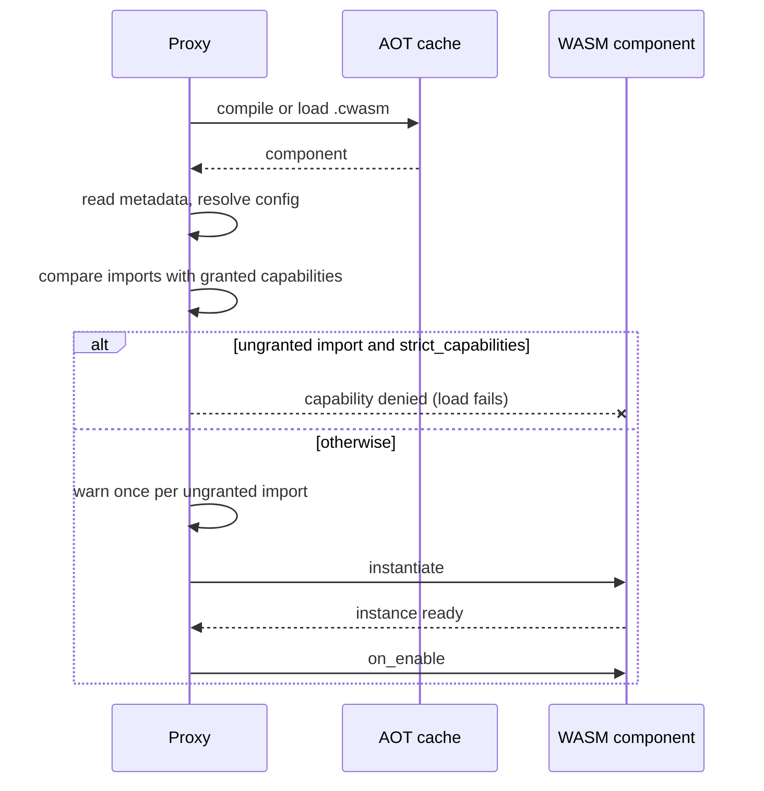

# Deploying & Configuring Plugins

A WASM plugin is a single `.wasm` file. You drop it into the plugins directory and the proxy compiles, sandboxes, and loads it at startup. Capabilities beyond the baseline set are granted per plugin in `infrarust.toml`, where you can also deny capabilities and change the sandbox limits.

## Where plugins live

The proxy scans the directory named by `plugins_dir` in `infrarust.toml`. The default is `./plugins`, relative to the working directory.

```toml
# infrarust.toml
plugins_dir = "./plugins"
```

Copy your compiled artifact into that directory:

```bash
cp target/wasm32-wasip2/release/my_plugin.wasm ./plugins/
```

The scan is recursive and matches every file with a `.wasm` extension, so subdirectories work for organizing many plugins. The `.cache` subdirectory is the one exception and is always skipped during discovery.

::: tip
See [Building a Plugin](./building) for producing the `.wasm` artifact with `cargo build --release --target wasm32-wasip2`.
:::

## The plugin id

Each plugin reports a `PluginMetadata` from its guest code. The `id` is a unique `snake_case` string set in the SDK:

```rust
fn metadata(&self) -> PluginMetadata {
    PluginMetadata::new("my_plugin", "My Plugin", "0.1.0")
}
```

The proxy keys every plugin by this id, not by the file name. The config table for a plugin must match the id exactly.

## Per-plugin configuration

Plugin settings live in a `[plugins.<plugin-id>]` table. The table is keyed by the plugin id from its metadata.

```toml
# infrarust.toml
[plugins.my_plugin]
permissions = ["ban", "server-manage"]  # [!code focus]
```

The `PluginConfig` table accepts these keys:

| Key | Type | Default | Applies to |
|-----|------|---------|------------|
| `permissions` | list of strings | `[]` | All plugins. Opt-in capability strings (kebab-case). |
| `deny` | list of strings | `[]` | All plugins. Capabilities to remove, applied after the baseline and `permissions`. |
| `strict_capabilities` | bool | `false` | WASM plugins. `true` refuses to load the plugin when it imports a host function it lacks the capability for, see [Missing capability](#missing-capability). |
| `enabled` | bool | `true` | All plugins. `false` skips the plugin at startup. |
| `wasm` | table | none | WASM plugins. Per-plugin sandbox limits, see [Sandbox limits](#sandbox-limits). |
| `path` | string | none | Native plugins only. WASM plugins omit it. |

::: warning
`path` points a native plugin at a compiled library on disk. WASM plugins are always resolved from `plugins_dir` by scanning, so a WASM plugin never sets `path`. Setting it has no effect on WASM resolution.
:::

A plugin with no `[plugins.<id>]` table loads with the baseline capabilities. Add a table only to grant opt-in capabilities.

```toml
# Grant opt-in capabilities to a specific plugin
[plugins.analytics]
permissions = ["ban", "server-manage"]
```

## Capabilities

Every WASM plugin receives a baseline set of capabilities automatically. Anything beyond that baseline must be listed in `permissions`.

Baseline (always granted):

`event-bus`, `player-read`, `player-write`, `command`, `scheduler`, `config-read`

Opt-in (must be listed in `permissions`):

`ban`, `server-manage`, `codec-filter`, `limbo`, `raw-packet`, `chat-intercept`, `network`, `filesystem-extended`, `permission-provider`, `virtual-backend`.

Capability strings are kebab-case. An unknown string, or one that is not grantable through config, is ignored with a warning at load and the plugin loads without it. The `transport-filter` capability exists internally but cannot be granted via config and is always rejected with a warning.

```toml
[plugins.my_plugin]
# Baseline caps are implicit; list only the opt-ins you need.
permissions = ["limbo", "ban"]
```

To take a capability away, including a baseline one, list it in `deny`. `deny` is applied last, so it wins over `permissions`:

```toml
[plugins.my_plugin]
permissions = ["ban"]
deny = ["player-write"]
```

With this, the plugin can look players up but cannot message, move or kick them.

A denied capability behaves as if it had never been granted: the plugin loads, and the calls that need it are refused. A denied `config-read` makes config lookups answer `none`, and a denied `player-write` makes the player-acting calls return a `player-error`. Details in [Capabilities](./capabilities#refused-calls).

::: info
Native (compiled-in) plugins are trusted and receive every capability. WASM plugins receive the baseline plus whatever opt-ins you declare. The full table of capabilities, what each unlocks, and which host interfaces they map to is in [Capabilities](./capabilities).
:::

## What happens at load

Every host interface is linked for every plugin. Before instantiating, the host compares the plugin's imports with its granted capabilities and logs one warning per import it will refuse, or refuses the plugin when `strict_capabilities` is set.



### Missing capability

If a plugin imports a host function it was not granted, it still loads and the host logs one warning per interface:

```
WARN plugin analytics imports ban-service but lacks the `ban` capability; calls will be refused
```

Each call to that function is then refused: functions with an error type return a `missing capability` error, the others return an empty answer and do nothing. Grant the capability in `permissions` if the plugin needs it. A limbo handler registered without `limbo` is refused the same way and logged at `error`, since the plugin cannot tell.

To refuse such a plugin at startup instead, set `strict_capabilities`:

```toml
[plugins.analytics]
permissions = ["ban"]
strict_capabilities = true
```

The full list of what each refused call returns is in [Capabilities](./capabilities#what-a-missing-capability-does).

### A trap during `on_enable` fails the plugin

If the guest traps during its first `on_enable` (a panic, an out-of-bounds access, or a CPU-time overrun), the host reports the failure and the plugin is not enabled. Once a plugin is enabled, a trap or a call past `max_call_duration` does not disable it: the host starts a fresh instance and runs `on_enable` again, and quarantines a plugin that keeps failing. See [Fault model](./fault-model) and the `[wasm.recovery]` settings.

## The AOT cache

The proxy precompiles each `.wasm` to a native `.cwasm` artifact under a `.cache` subdirectory inside `plugins_dir`. Subsequent startups load the cached artifact and skip compilation.

The cache key is the content hash of the `.wasm` plus a wasmtime version tag plus the WIT contract version (`infrarust:plugin@0.2.3`). Changing the plugin, upgrading wasmtime, or bumping the contract produces a new key, so stale artifacts are never reused. A `.cwasm` that fails to load is detected, removed, and recompiled automatically.

::: tip
The `.cache` directory is safe to delete. The proxy recreates it on the next startup by recompiling from the `.wasm` files. You never place a `.cwasm` there by hand.
:::

## Sandbox limits

Each plugin runs in an isolated wasmtime instance with hard limits:

| Resource | Limit |
|----------|-------|
| CPU | Cooperative epoch interruption; a guest call that uses more than `cpu_budget` (3 s) traps instead of blocking the proxy. |
| Memory | Linear memory is capped per instance at `memory_limit_mb` (64 MiB). |
| Call time | One call may run for `max_call_duration` (60 s), host calls included; each ban or server-manager call is capped at `host_call_timeout` (30 s). |
| Call queue | The plugin handles one call at a time; up to `queue_capacity` (1024) calls wait, further calls are refused immediately. |
| Filesystem | One preopened directory, `plugins_dir/<plugin-id>`, mounted as `/`. No other host paths are reachable. |
| Network | No outbound access in the current build. |

The defaults come from the `[wasm]` table of `infrarust.toml`. Override them for one plugin under `[plugins.<id>.wasm]`:

```toml
[wasm]
cpu_budget = "3s"
queue_capacity = 1024

[plugins.my_plugin.wasm]
memory_limit_mb = 128
queue_capacity = 4096
```

Every `[wasm]` key except `epoch_tick` can be overridden; keys left out keep the proxy-wide value. See [Global Settings](../../configuration/global#wasm-plugin-sandbox) for each key and its accepted range.

Capabilities gate which host services a plugin can call; the sandbox gates how much machine it can consume. The two together mean a misbehaving plugin cannot stall the proxy or read files outside its own data directory. Capability details are in [Capabilities](./capabilities).

## Next steps

- [Building a Plugin](./building): produce the `.wasm` artifact.
- [Capabilities](./capabilities): the full capability table and host interfaces.
- [Getting Started](./getting-started): write your first plugin against the SDK.
- [Configuration reference](../../configuration/): every `infrarust.toml` setting.
