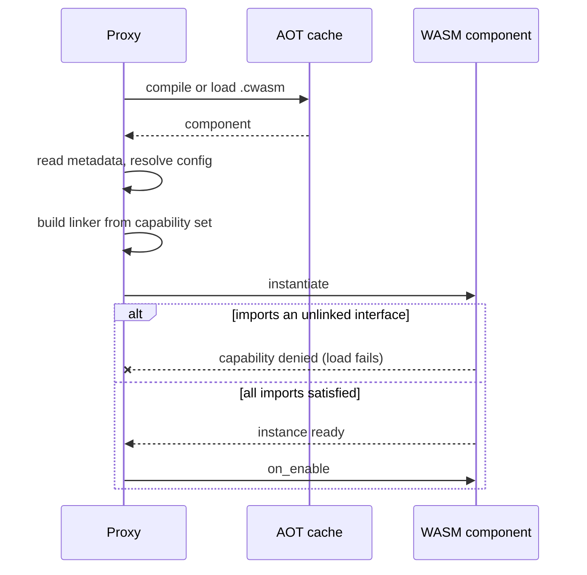

# Deploying & Configuring Plugins

A WASM plugin is a single `.wasm` file. You drop it into the plugins directory and the proxy compiles, sandboxes, and loads it at startup. Capabilities beyond the baseline set are granted per plugin in `infrarust.toml`.

## Where plugins live

The proxy scans the directory named by `plugins_dir` in `infrarust.toml`. The default is `./plugins`, relative to the working directory.

```toml
# infrarust.toml
plugins_dir = "./plugins"
```

Copy your compiled artifact into that directory:

```bash
cp target/wasm32-wasip2/release/my_plugin.wasm ./plugins/
```

The scan is recursive and matches every file with a `.wasm` extension, so subdirectories work for organizing many plugins. The `.cache` subdirectory is the one exception and is always skipped during discovery.

::: tip
See [Building a Plugin](./building) for producing the `.wasm` artifact with `cargo build --release --target wasm32-wasip2`.
:::

## The plugin id

Each plugin reports a `PluginMetadata` from its guest code. The `id` is a unique `snake_case` string set in the SDK:

```rust
fn metadata(&self) -> PluginMetadata {
    PluginMetadata::new("my_plugin", "My Plugin", "0.1.0")
}
```

The proxy keys every plugin by this id, not by the file name. The config table for a plugin must match the id exactly.

## Per-plugin configuration

Plugin settings live in a `[plugins.<plugin-id>]` table. The table is keyed by the plugin id from its metadata.

```toml
# infrarust.toml
[plugins.my_plugin]
permissions = ["ban", "server-manage"]  # [!code focus]
```

The `PluginConfig` table accepts three keys:

| Key | Type | Default | Applies to |
|-----|------|---------|------------|
| `permissions` | list of strings | `[]` | All plugins. Opt-in capability strings (kebab-case). |
| `enabled` | bool | unset | Parsed but not yet enforced; removing the file is the current way to skip a plugin. |
| `path` | string | none | Native plugins only. WASM plugins omit it. |

::: warning
`path` points a native plugin at a compiled library on disk. WASM plugins are always resolved from `plugins_dir` by scanning, so a WASM plugin never sets `path`. Setting it has no effect on WASM resolution.
:::

A plugin with no `[plugins.<id>]` table loads with the baseline capabilities. Add a table only to grant opt-in capabilities.

```toml
# Grant opt-in capabilities to a specific plugin
[plugins.analytics]
permissions = ["ban", "server-manage"]
```

## Capabilities

Every WASM plugin receives a baseline set of capabilities automatically. Anything beyond that baseline must be listed in `permissions`.

Baseline (always granted):

`event-bus`, `player-read`, `player-write`, `command`, `scheduler`, `config-read`

Opt-in (must be listed in `permissions`):

`ban`, `server-manage`, `codec-filter`, `limbo`, `raw-packet`, `network`, `filesystem-extended`, `permission-provider`, `virtual-backend`.

Capability strings are kebab-case. An unknown string, or one that is not grantable through config, is ignored with a warning at load and the plugin loads without it. The `transport-filter` capability exists internally but cannot be granted via config and is always rejected with a warning.

```toml
[plugins.my_plugin]
# Baseline caps are implicit; list only the opt-ins you need.
permissions = ["limbo", "ban"]
```

::: info
Native (compiled-in) plugins are trusted and receive every capability. WASM plugins receive the baseline plus whatever opt-ins you declare. The full table of capabilities, what each unlocks, and which host interfaces they map to is in [Capabilities](./capabilities).
:::

## What happens at load

The host builds a per-plugin linker from the granted capability set. A host interface is linked only when its capability is present.



### Missing capability

If a plugin imports a host interface it was not granted, instantiation fails. The host reports a capability-denied error and the plugin does not load. Grant the matching capability in `permissions` to fix it.

One exception: the `limbo` interface is always linked regardless of the `limbo` capability. Importing it never blocks load. If the `limbo` capability is absent, calls to `register-limbo-handler` are ignored at runtime (the host logs a warning) rather than causing a load failure.

### A trap poisons the plugin

If the guest traps during `on_enable` (a panic, an out-of-bounds access, or a CPU-time overrun), the host marks the instance poisoned and reports the failure. A poisoned plugin is effectively disabled: its `on_disable` is skipped rather than re-entering trapped guest code.

## The AOT cache

The proxy precompiles each `.wasm` to a native `.cwasm` artifact under a `.cache` subdirectory inside `plugins_dir`. Subsequent startups load the cached artifact and skip compilation.

The cache key is the content hash of the `.wasm` plus a wasmtime version tag plus the WIT contract version (`infrarust:plugin@0.2.3`). Changing the plugin, upgrading wasmtime, or bumping the contract produces a new key, so stale artifacts are never reused. A `.cwasm` that fails to load is detected, removed, and recompiled automatically.

::: tip
The `.cache` directory is safe to delete. The proxy recreates it on the next startup by recompiling from the `.wasm` files. You never place a `.cwasm` there by hand.
:::

## Sandbox summary

Each plugin runs in an isolated wasmtime instance with hard limits:

| Resource | Limit |
|----------|-------|
| CPU | Cooperative epoch interruption; a runaway guest call traps instead of blocking the proxy. |
| Memory | Linear memory is capped per instance (64 MiB). |
| Filesystem | One preopened directory, `plugins_dir/<plugin-id>`, mounted as `/`. No other host paths are reachable. |
| Network | No outbound access in the current build. |

Capabilities gate which host services a plugin can call; the sandbox gates how much machine it can consume. The two together mean a misbehaving plugin cannot stall the proxy or read files outside its own data directory. Capability details are in [Capabilities](./capabilities).

## Next steps

- [Building a Plugin](./building): produce the `.wasm` artifact.
- [Capabilities](./capabilities): the full capability table and host interfaces.
- [Getting Started](./getting-started): write your first plugin against the SDK.
- [Configuration reference](../../configuration/): every `infrarust.toml` setting.
