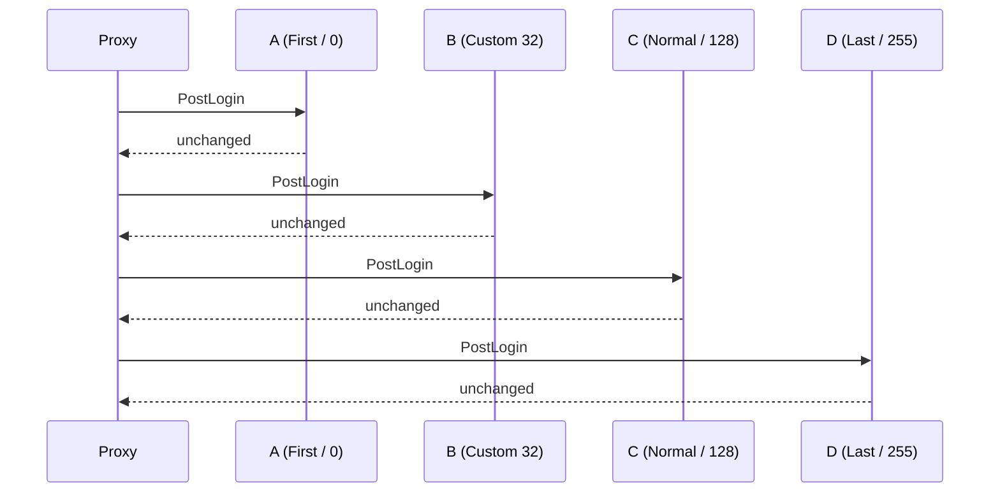

# Events

A WASM plugin reacts to the proxy through the event bus. You subscribe inside `on_enable`, each subscription runs a closure when a matching event fires, and resulted events let the closure read the current result and set the proxy's next action. The `event-bus` capability is part of the baseline set, so every WASM plugin can subscribe without declaring an extra permission.

## Subscribing

`ctx.on::<E>(priority, handler)` registers one handler for event type `E` and returns an `EventSubscription`. The closure receives `&mut E`.

```rust
use infrarust_plugin_sdk::prelude::*;

#[derive(Default)]
struct EventSubscriber;

#[plugin(id = "event-subscriber", name = "Event Subscriber")]
impl Plugin for EventSubscriber {
    fn on_enable(&self, ctx: &Context) -> Result<(), PluginError> {
        ctx.on::<PostLoginEvent>(EventPriority::Normal, |event| {
            info!("{} joined", event.player.username);
        })?;
        Ok(())
    }
}
```

The signature is synchronous. A guest handler cannot `.await`; it returns when the closure returns.

```rust
pub fn on<E: GuestEvent>(
    &self,
    priority: EventPriority,
    handler: impl FnMut(&mut E) + 'static,
) -> Result<EventSubscription, Error>
```

`on` returns an error when the host refuses the subscription: without the `event-bus` capability, for `ChatMessageEvent` or `CommandExecuteEvent` without `chat-intercept`, or for `PluginMessageEvent` without `plugin-messaging`. The error's kind is `PermissionDenied`. The `?` in `on_enable` turns it into a failed enable; drop the error instead if the plugin should run without that event.

:::tip
Subscribe in `on_enable`. The subscription stays active for the life of the plugin unless you cancel it, so you do not need to keep the returned handle.
:::

### Cancelling

`EventSubscription::cancel` removes that one handler. Other handlers on the same event keep running.

```rust
let sub = ctx.on::<PostLoginEvent>(EventPriority::Normal, |_| {})?;
sub.cancel();
```

## Priority

`EventPriority` is an enum whose `value()` is a `u8`. Handlers run from the lowest value to the highest, so `First` (0) runs before `Last` (255). Use `Custom(u8)` for a value between the named levels.

| Variant | Value | Runs |
| --- | --- | --- |
| `First` | 0 | earliest |
| `Early` | 64 | |
| `Normal` | 128 | default choice |
| `Late` | 192 | |
| `Last` | 255 | latest |
| `Custom(v)` | `v` | at exactly `v` |

Multiple handlers, native or WASM, can share one event kind. The proxy runs them in priority order over one shared native event.

## Results

A resulted event carries the proxy's next action. The SDK hands the handler the **current** result, the one set by the handlers that ran before it, and tracks whether the handler changed it:

- `event.result()` reads the current result.
- The helpers (`allow`, `deny`, `redirect_to`, `modify`, ...) and `set_result` set a new result. So does editing the ping response through `response_mut`.
- A handler that only reads leaves the result as it is. Setting a result always applies, even when it equals the current one.

That makes the WASM behaviour match a native handler: a later handler can undo an earlier one.

```rust
ctx.on::<PreLoginEvent>(EventPriority::Late, |event| {
    if let PreLoginResult::Denied(_) = event.result() {
        if event.profile.username == "Notch" {
            event.allow();
        }
    }
})?;
```

Under the hood the SDK answers the host with the WIT `event-outcome::unchanged` when the handler did not touch the result, and with the new result otherwise. See [the WIT events](./api-reference#events).

If a result carries a text component the host cannot accept, such as one nested deeper than 64 levels, the decision still applies with a placeholder text and the host logs a warning.

## Event reference

The SDK exposes 36 event types, one for every native event a plugin can subscribe to. Player-scoped events carry `player: PlayerRef` (`id`, `uuid`, `username`); call `event.player.handle()` for a `Player` you can message or move. The events that carry a full `GameProfile` (`uuid`, `username`, `properties`) are the ones whose native event does: `PreLoginEvent`, `GameProfileRequestEvent` and `PostLoginEvent`. `RawPacketEvent` carries only the player's id, like its native counterpart.

The events arrive in the order described in the native [player lifecycle](../dev/events#player-lifecycle), and the same guarantees hold: `PostLoginEvent` runs once the player is registered, and every player who got it gets exactly one `DisconnectEvent`.

### Observe-only events

| Rust type | Fields |
| --- | --- |
| `PostLoginEvent` | `player`, `profile`, `protocol` |
| `DisconnectEvent` | `player`, `last_server: Option<ServerId>`, `cause: DisconnectCause` |
| `OnlineAuthFailedEvent` | `username` |
| `ServerConnectedEvent` | `player`, `server`, `previous_server` |
| `ServerPostConnectEvent` | `player`, `server`, `previous_server`; `switched_from()` answers the previous server when it differs |
| `ServerStateChangeEvent` | `server`, `old_state`, `new_state` |
| `ConfigReloadEvent` | `provider`, `added`, `removed`, `updated` (lists of `ServerId`) |
| `BackendHealthEvent` | `address`, `servers`, `state: BackendState` |
| `ProxyInitializeEvent` | none (unit) |
| `ProxyShutdownEvent` | none (unit) |
| `ConnectionRejectedEvent` | `remote_addr`, `virtual_host`, `reason: RejectReason` |
| `LimboEnterEvent` | `player`, `handlers`, `context: EntryContext` |
| `LimboExitEvent` | `player`, `reason: LimboExitReason`, `next_server` |
| `PlayerClientBrandEvent` | `player`, `brand` |
| `PlayerSettingsChangedEvent` | `player`, `settings: ClientSettings` |
| `PlayerChannelRegisterEvent` | `player`, `channels`, `direction: PacketDirection` |
| `PlayerResourcePackStatusEvent` | `player`, `pack_id: Option<Uuid>`, `status: ResourcePackStatus`, `origin: ResourcePackOrigin` |
| `BanIssuedEvent` | `entry: BanEntry`, `source: BanSource`, `silent` |
| `BanRevokedEvent` | `entry: BanEntry`, `source: BanSource`, `silent` |
| `PluginEnabledEvent` | `plugin_id`, `version` |
| `PluginDisabledEvent` | `plugin_id` |

`DisconnectCause` is `ClientQuit`, `Kicked(Option<Component>)`, `BackendClosed(Option<Component>)`, `Shutdown` or `Error`; `cause.reason()` returns the text when there is one.

`RejectReason` is `IpFilter`, `RateLimit`, `UnknownDomain`, `IpBanned`, `Banned`, `ServerUnavailable` or `Plugin(Option<String>)` (the plugin that refused the handshake). `LimboExitReason` is `Released`, `Redirected`, `SentToLimbo(handlers)`, `Kicked(Component)`, `Disconnected`, `TimedOut` or `Shutdown`. `BanSource` says who issued or lifted a ban: `Console`, `Player { uuid, name }`, `Plugin(id)`, `WebApi(actor)` or `System`. `ResourcePackStatus` keeps an unknown status id as `Unknown(i32)`, and `is_final()` tells whether the client is done with the pack.

### Resulted events

| Rust type | Fields | Result and helpers |
| --- | --- | --- |
| `PreLoginEvent` | `profile`, `remote_addr: SocketAddr`, `protocol`, `server_domain` | `PreLoginResult`: `allow()`, `deny(reason)`, `force_offline()`, `force_online()` |
| `PermissionsSetupEvent` | `player`, `online_mode` | `PermissionsSetupResult`: `use_default()`, `provide(snapshot)` |
| `PlayerChooseInitialServerEvent` | `player`, `initial_server` | `PlayerChooseInitialServerResult`: `allow()`, `redirect_to(server)`, `send_to_limbo(handlers)` |
| `ServerPreConnectEvent` | `player`, `server`, `previous_server`, `cause: ConnectCause` | `ServerPreConnectResult`: `allow()`, `redirect_to(server)`, `send_to_limbo(handlers)`, `deny(reason)` |
| `KickedFromServerEvent` | `player`, `server`, `reason: Option<Component>`, `cause: KickCause`, `during_connect`, `previous_server` | `KickedFromServerResult`: `disconnect(reason)`, `redirect_to(server)`, `send_to_limbo(handlers)`, `notify(message)` |
| `ChatMessageEvent` | `player`, `message`, `signed`, `server` | `ChatMessageResult`: `allow()`, `deny(reason)`, `deny_silently()`, `modify(message)`. Needs `chat-intercept` |
| `ProxyPingEvent` | `remote_addr`, `server`, `virtual_host`, `protocol`, `legacy` | the `PingResponse`: `response()`, `response_mut()`, `set_response(r)` |
| `ConnectionHandshakeEvent` | `remote_addr`, `virtual_host`, `raw_host`, `port`, `protocol`, `intent: HandshakeIntent`, `legacy`, `server` | `ConnectionHandshakeResult`: `allow()`, `deny(reason)`, `deny_silently()`, `drop_silently()` |
| `GameProfileRequestEvent` | `original: GameProfile`, `online_mode`, `remote_addr`, `virtual_host`, `protocol` | the profile the player gets: `profile()`, `profile_mut()`, `set_profile(p)`, `is_modified()` |
| `LoginEvent` | `player`, `online_mode` | `LoginResult`: `allow()`, `deny(reason)` |
| `CommandExecuteEvent` | `player`, `command`, `signed`, `server`; `label()` is the first word | `CommandExecuteResult`: `allow()`, `deny(reason)`, `deny_silently()`, `modify(command)`, `forward_to_backend()`. Needs `chat-intercept` |
| `PreTransferEvent` | `player`, `host`, `port`, `origin: TransferOrigin` | `PreTransferResult`: `allow()`, `deny(reason)`, `redirect(host, port)` |
| `PluginMessageEvent` | `player`, `source: MessageEndpoint`, `channel: ChannelId`, `raw_channel`, `data: Vec<u8>`, `phase: MessagePhase` | `PluginMessageResult`: `forward()`, `handled()`, `replace(data)`. Needs `plugin-messaging` |
| `NamedEvent` | `name`, `source_plugin`, `content_type`, `payload: Vec<u8>` | cancelled flag and response: `cancel()`, `uncancel()`, `respond(content_type, payload)`, `respond_text(text)`, `clear_response()` |
| `RawPacketEvent` | `player: PlayerId`, `direction`, `packet_id`, `data` | `RawPacketResult`: `pass()`, `drop_packet()`, `modify(packet_id, data)`. Needs `raw-packet`, subscribed with `on_packets` |

Every reason and message is anything that converts into a `Component`, so `deny("Banned")` and `deny(Component::text("Banned").color(NamedColor::Red))` both work.

`ConnectCause` is `Initial`, `Switch`, `LimboExit`, `KickRedirect` or `PluginMessage`. `KickCause` is `Unreachable(error)`, `LoginRefused`, `ConfigDisconnect`, `PlayDisconnect` or `ConnectionLost`. `KickedFromServerEvent` starts with `DisconnectPlayer(None)`, the proxy's default.

`PingResponse` has `description`, `max_players`, `online_players`, `protocol`, `version_name`, `favicon` and `player_sample` (name and UUID pairs). Reading it leaves the response alone; `response_mut()` sends the whole response back. A description you did not change keeps the native component exactly as it was, including parts the contract cannot carry.

```rust
ctx.on::<ProxyPingEvent>(EventPriority::Normal, |event| {
    let response = event.response_mut();
    response.max_players = 1000;
    response.description = Component::text("Welcome").color(NamedColor::Gold);
})?;
```

`PermissionsSetupEvent::provide(snapshot)` replaces the player's checker with a `PermissionSnapshot` for this session; `use_default()` keeps the checker of the active provider. The host holds the snapshot, so `Permissions::set_snapshot` can change it while the player is online. See [Permissions](./permissions).

`GameProfileRequestEvent` hands you the profile the player is about to get. Edit it in place with `profile_mut()`; `original` stays the profile the proxy started from, and a handler that leaves the profile alone keeps whatever an earlier handler set.

```rust
ctx.on::<GameProfileRequestEvent>(EventPriority::Normal, |event| {
    if !event.online_mode {
        event.profile_mut().username = format!("~{}", event.original.username);
    }
})?;
```

:::info Capabilities
Subscribing needs the baseline `event-bus` capability. `ChatMessageEvent` and `CommandExecuteEvent` also need the opt-in `chat-intercept` capability, `PluginMessageEvent` needs `plugin-messaging` and `RawPacketEvent` needs `raw-packet`: without it the subscription returns a `PermissionDenied` error and the handler never runs. `send_to_limbo` routes a player to a limbo handler, which needs the opt-in `limbo` capability on the plugin that registered it. See [Capabilities](./capabilities).
:::

### Chat messages

`ChatMessageEvent` fires for the chat a player types on a server and in limbo, where it runs before the limbo handler's `on_chat`. `deny(reason)` drops the message and shows `reason` to the player, `deny_silently()` drops it without a word, and `modify(message)` sends `message` in its place, signed messages included: the proxy keeps the backend's message acknowledgements in step (see [Signed chat and acknowledgements](../dev/events#signed-chat-and-acknowledgements)). `signed` tells whether the client signed the message and `server` names the backend it is going to.

`CommandExecuteEvent` is its counterpart for the commands a player types (the leading `/` is already gone). `modify(command)` runs another command in its place, `forward_to_backend()` hands the line to the backend even when a proxy command has that name, and `deny` drops it. Like chat, it needs `chat-intercept`.

### Plugin messages

`PluginMessageEvent` fires for a message on a channel some plugin registered, whichever side sent it. `source` is `MessageEndpoint::Client` or `MessageEndpoint::Backend(server)`, `channel` carries both names the proxy knows for it and `raw_channel` the one on the wire. `handled()` stops the message, `replace(data)` forwards other bytes. The subscription needs `plugin-messaging`, and a message only fires for a registered channel, so register yours in `on_enable` with [`Messaging::register`](./services#plugin-messaging).

```rust
ctx.on::<PluginMessageEvent>(EventPriority::Normal, |event| {
    if event.channel.matches("myplugin:ping") && event.from_client() {
        let _ = Messaging::send_to_player(event.player.id, &event.channel, b"pong");
        event.handled();
    }
})?;
```

## Named events

A named event is a custom event any plugin, native or WASM, can fire and answer. It carries a name, the id of the plugin that fired it, a content type and raw bytes; the listeners can cancel it and leave a response. The SDK stays serde-free: you choose the encoding, and `fire_named_text`, `text()` and `respond_text` cover plain text.

```rust
ctx.on_named("chat:relay", EventPriority::Normal, |event| {
    info!("{} relayed {:?}", event.source_plugin, event.text());
    event.respond_text("received");
})?;

let outcome = ctx.fire_named("chat:relay", "application/json", br#"{"text":"hi"}"#)?;
if let Some(response) = outcome.response {
    info!("answered with {} bytes of {}", response.payload.len(), response.content_type);
}
```

`on_named(name, priority, handler)` only sees events with that name. `ctx.on::<NamedEvent>` sees every named event, like a native subscription to `NamedEvent`. `fire_named` runs the listeners in priority order and returns the final `NamedOutcome` (`cancelled`, `response`); it waits for them within the call's deadline and returns a `Timeout` error if they take longer. Firing and subscribing both need only `event-bus`.

A native plugin fires the same event with `ctx.event_bus().fire(NamedEvent::new(name, content_type, payload))` and gets the WASM answers back, and a WASM plugin receives the named events native plugins fire.

:::warning Firing an event you listen to
The host never enters a WASM instance that is still running the call that led to the event, since that call is waiting for the event to finish. When a plugin fires a named event it listens to itself, directly or through other plugins, its own listener gets the event right after the current call returns, and the proxy does not wait for it: that listener's cancel or response is not part of the outcome `fire_named` returned, and the host logs a warning. The same applies to any event the plugin causes inside its own call. A native plugin's listener runs inline instead, so it does see its own events; keep the listener and the firing code in separate plugins if the answer matters.
:::

## Raw packets

`on_packets(filters, priority, handler)` delivers the packets that match any of the filters, before the proxy forwards them. A `PacketFilter` names a packet id, a connection state and a direction; `PacketFilter::serverbound(id, state)` and `clientbound` build one. The handler can `drop_packet()` or `modify(packet_id, data)`. Subscribing needs `raw-packet`.

```rust
ctx.on_packets(
    &[PacketFilter::serverbound(0x06, ConnectionState::Play)],
    EventPriority::Normal,
    |event| {
        if event.data.len() > 256 {
            event.drop_packet();
        }
    },
)?;
```

The proxy only builds the event for the packet ids someone subscribed to, and the lookup stays constant time, so unrelated packets pay nothing. A matching packet waits on the connection's path for a full guest call: a hop through the plugin's call queue and across the component boundary, which costs far more than a native handler and grows when the plugin is busy with another call or event. Keep filters narrow. A [codec filter](./codec-filters) runs inside the connection with its own per-connection instance and is the tool for anything on the hot path; `on_packets` suits occasional packets. `event-bus.subscribe` with the `raw-packet` kind is refused with `InvalidArgument`, since a packet subscription needs its filters.

## Multiple handlers and ordering

This plugin registers several handlers on `PostLoginEvent` at different priorities and cancels one before any event fires.

```rust
use infrarust_plugin_sdk::prelude::*;

#[derive(Default)]
struct MultiHandler;

#[plugin(id = "multi-handler", name = "Multi Handler")]
impl Plugin for MultiHandler {
    fn on_enable(&self, ctx: &Context) -> Result<(), PluginError> {
        ctx.on::<PostLoginEvent>(EventPriority::First, |_| append("A"))?; // 0
        ctx.on::<PostLoginEvent>(EventPriority::Custom(32), |_| append("B"))?; // 32
        ctx.on::<PostLoginEvent>(EventPriority::Normal, |_| append("C"))?; // 128
        let leaked = ctx.on::<PostLoginEvent>(EventPriority::Normal, |_| append("L"))?; // 128
        ctx.on::<PostLoginEvent>(EventPriority::Last, |_| append("D"))?; // [!code focus]
        leaked.cancel(); // [!code focus]
        Ok(())
    }
}
```

The `L` handler is cancelled, so it never runs. The remaining handlers fire in priority order, producing `ABCD` per login.



## See also

- [API reference](./api-reference): the WIT event records and the `event-outcome` pattern.
- [Services](./services): read and act on players, servers, and bans from a handler.
- [Commands](./commands): register commands and tab-completion.
- [Limbo](./limbo): where `send_to_limbo` routes a player.
- [Codec filters](./codec-filters): per-connection packet rewriting on the hot path.
- [Migrating to 0.3](./migration-0.3): what changed from 0.2.3.
