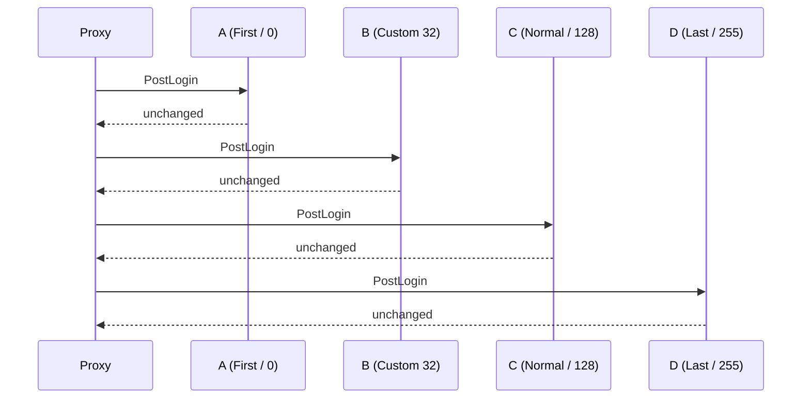

# Events

A WASM plugin reacts to the proxy through the event bus. You subscribe inside `on_enable`, each subscription runs a closure when a matching event fires, and resulted events let the closure read the current result and set the proxy's next action. The `event-bus` capability is part of the baseline set, so every WASM plugin can subscribe without declaring an extra permission.

## Subscribing

`ctx.on::<E>(priority, handler)` registers one handler for event type `E` and returns an `EventSubscription`. The closure receives `&mut E`.

```rust
use infrarust_plugin_sdk::prelude::*;

#[derive(Default)]
struct EventSubscriber;

#[plugin(id = "event-subscriber", name = "Event Subscriber")]
impl Plugin for EventSubscriber {
    fn on_enable(&self, ctx: &Context) -> Result<(), PluginError> {
        ctx.on::<PostLoginEvent>(EventPriority::Normal, |event| {
            info!("{} joined", event.player.username);
        })?;
        Ok(())
    }
}
```

The signature is synchronous. A guest handler cannot `.await`; it returns when the closure returns.

```rust
pub fn on<E: GuestEvent>(
    &self,
    priority: EventPriority,
    handler: impl FnMut(&mut E) + 'static,
) -> Result<EventSubscription, Error>
```

`on` returns an error when the host refuses the subscription: without the `event-bus` capability, or for `ChatMessageEvent` without `chat-intercept`. The error's kind is `PermissionDenied`. The `?` in `on_enable` turns it into a failed enable; drop the error instead if the plugin should run without that event.

:::tip
Subscribe in `on_enable`. The subscription stays active for the life of the plugin unless you cancel it, so you do not need to keep the returned handle.
:::

### Cancelling

`EventSubscription::cancel` removes that one handler. Other handlers on the same event keep running.

```rust
let sub = ctx.on::<PostLoginEvent>(EventPriority::Normal, |_| {})?;
sub.cancel();
```

## Priority

`EventPriority` is an enum whose `value()` is a `u8`. Handlers run from the lowest value to the highest, so `First` (0) runs before `Last` (255). Use `Custom(u8)` for a value between the named levels.

| Variant | Value | Runs |
| --- | --- | --- |
| `First` | 0 | earliest |
| `Early` | 64 | |
| `Normal` | 128 | default choice |
| `Late` | 192 | |
| `Last` | 255 | latest |
| `Custom(v)` | `v` | at exactly `v` |

Multiple handlers, native or WASM, can share one event kind. The proxy runs them in priority order over one shared native event.

## Results

A resulted event carries the proxy's next action. The SDK hands the handler the **current** result, the one set by the handlers that ran before it, and tracks whether the handler changed it:

- `event.result()` reads the current result.
- The helpers (`allow`, `deny`, `redirect_to`, `modify`, ...) and `set_result` set a new result. So does editing the ping response through `response_mut`.
- A handler that only reads leaves the result as it is. Setting a result always applies, even when it equals the current one.

That makes the WASM behaviour match a native handler: a later handler can undo an earlier one.

```rust
ctx.on::<PreLoginEvent>(EventPriority::Late, |event| {
    if let PreLoginResult::Denied(_) = event.result() {
        if event.profile.username == "Notch" {
            event.allow();
        }
    }
})?;
```

Under the hood the SDK answers the host with the WIT `event-outcome::unchanged` when the handler did not touch the result, and with the new result otherwise. See [the WIT events](./api-reference#events).

If a result carries a text component the host cannot accept, such as one nested deeper than 64 levels, the decision still applies with a placeholder text and the host logs a warning.

## Event reference

The SDK exposes 17 event types. Player-scoped events carry `player: PlayerRef` (`id`, `uuid`, `username`); call `event.player.handle()` for a `Player` you can message or move. The events that carry a full `GameProfile` (`uuid`, `username`, `properties`) are the ones whose native event does: `PreLoginEvent` and `PostLoginEvent`.

The events arrive in the order described in the native [player lifecycle](../dev/events#player-lifecycle), and the same guarantees hold: `PostLoginEvent` runs once the player is registered, and every player who got it gets exactly one `DisconnectEvent`. The native `GameProfileRequestEvent` and `LoginEvent` are not part of contract 0.3.0 yet.

### Observe-only events

| Rust type | Fields |
| --- | --- |
| `PostLoginEvent` | `player`, `profile`, `protocol` |
| `DisconnectEvent` | `player`, `last_server: Option<ServerId>`, `cause: DisconnectCause` |
| `OnlineAuthFailedEvent` | `username` |
| `ServerConnectedEvent` | `player`, `server`, `previous_server` |
| `ServerPostConnectEvent` | `player`, `server`, `previous_server`; `switched_from()` answers the previous server when it differs |
| `ServerStateChangeEvent` | `server`, `old_state`, `new_state` |
| `ConfigReloadEvent` | `provider`, `added`, `removed`, `updated` (lists of `ServerId`) |
| `BackendHealthEvent` | `address`, `servers`, `state: BackendState` |
| `ProxyInitializeEvent` | none (unit) |
| `ProxyShutdownEvent` | none (unit) |

`DisconnectCause` is `ClientQuit`, `Kicked(Option<Component>)`, `BackendClosed(Option<Component>)`, `Shutdown` or `Error`; `cause.reason()` returns the text when there is one.

### Resulted events

| Rust type | Fields | Result and helpers |
| --- | --- | --- |
| `PreLoginEvent` | `profile`, `remote_addr: SocketAddr`, `protocol`, `server_domain` | `PreLoginResult`: `allow()`, `deny(reason)`, `force_offline()`, `force_online()` |
| `PermissionsSetupEvent` | `player`, `online_mode` | `PermissionsSetupResult::UseDefault`: `use_default()` |
| `PlayerChooseInitialServerEvent` | `player`, `initial_server` | `PlayerChooseInitialServerResult`: `allow()`, `redirect_to(server)`, `send_to_limbo(handlers)` |
| `ServerPreConnectEvent` | `player`, `server`, `previous_server`, `cause: ConnectCause` | `ServerPreConnectResult`: `allow()`, `redirect_to(server)`, `send_to_limbo(handlers)`, `deny(reason)` |
| `KickedFromServerEvent` | `player`, `server`, `reason: Option<Component>`, `cause: KickCause`, `during_connect`, `previous_server` | `KickedFromServerResult`: `disconnect(reason)`, `redirect_to(server)`, `send_to_limbo(handlers)`, `notify(message)` |
| `ChatMessageEvent` | `player`, `message`, `signed`, `server` | `ChatMessageResult`: `allow()`, `deny(reason)`, `deny_silently()`, `modify(message)`. Needs `chat-intercept` |
| `ProxyPingEvent` | `remote_addr`, `server`, `virtual_host`, `protocol`, `legacy` | the `PingResponse`: `response()`, `response_mut()`, `set_response(r)` |

Every reason and message is anything that converts into a `Component`, so `deny("Banned")` and `deny(Component::text("Banned").color(NamedColor::Red))` both work.

`ConnectCause` is `Initial`, `Switch`, `LimboExit`, `KickRedirect` or `PluginMessage`. `KickCause` is `Unreachable(error)`, `LoginRefused`, `ConfigDisconnect`, `PlayDisconnect` or `ConnectionLost`. `KickedFromServerEvent` starts with `DisconnectPlayer(None)`, the proxy's default.

`PingResponse` has `description`, `max_players`, `online_players`, `protocol`, `version_name`, `favicon` and `player_sample` (name and UUID pairs). Reading it leaves the response alone; `response_mut()` sends the whole response back. A description you did not change keeps the native component exactly as it was, including parts the contract cannot carry.

```rust
ctx.on::<ProxyPingEvent>(EventPriority::Normal, |event| {
    let response = event.response_mut();
    response.max_players = 1000;
    response.description = Component::text("Welcome").color(NamedColor::Gold);
})?;
```

`PermissionsSetupEvent` can only reset to the default checker in 0.3.0; installing a custom permission checker from WASM comes with permission snapshots in a later step.

:::info Capabilities
Subscribing needs the baseline `event-bus` capability. `ChatMessageEvent` also needs the opt-in `chat-intercept` capability: without it `ctx.on` returns a `PermissionDenied` error and the handler never runs. `send_to_limbo` routes a player to a limbo handler, which needs the opt-in `limbo` capability on the plugin that registered it. See [Capabilities](./capabilities).
:::

### Chat messages

`ChatMessageEvent` fires for the chat a player types on a server and in limbo, where it runs before the limbo handler's `on_chat`. `deny(reason)` drops the message and shows `reason` to the player, `deny_silently()` drops it without a word, and `modify(message)` sends `message` in its place, signed messages included: the proxy keeps the backend's message acknowledgements in step (see [Signed chat and acknowledgements](../dev/events#signed-chat-and-acknowledgements)). `signed` tells whether the client signed the message and `server` names the backend it is going to. There is no command event: `CommandExecuteEvent` is only available to native plugins.

## Not in the contract yet

Raw packet events are not part of `infrarust:plugin@0.3.0`; packet subscriptions come in a later step. Use a [codec filter](./codec-filters) to see packets today. Handshake, login, limbo, ban, messaging and plugin events are native-only for now.

## Multiple handlers and ordering

This plugin registers several handlers on `PostLoginEvent` at different priorities and cancels one before any event fires.

```rust
use infrarust_plugin_sdk::prelude::*;

#[derive(Default)]
struct MultiHandler;

#[plugin(id = "multi-handler", name = "Multi Handler")]
impl Plugin for MultiHandler {
    fn on_enable(&self, ctx: &Context) -> Result<(), PluginError> {
        ctx.on::<PostLoginEvent>(EventPriority::First, |_| append("A"))?; // 0
        ctx.on::<PostLoginEvent>(EventPriority::Custom(32), |_| append("B"))?; // 32
        ctx.on::<PostLoginEvent>(EventPriority::Normal, |_| append("C"))?; // 128
        let leaked = ctx.on::<PostLoginEvent>(EventPriority::Normal, |_| append("L"))?; // 128
        ctx.on::<PostLoginEvent>(EventPriority::Last, |_| append("D"))?; // [!code focus]
        leaked.cancel(); // [!code focus]
        Ok(())
    }
}
```

The `L` handler is cancelled, so it never runs. The remaining handlers fire in priority order, producing `ABCD` per login.



## See also

- [API reference](./api-reference): the WIT event records and the `event-outcome` pattern.
- [Services](./services): read and act on players, servers, and bans from a handler.
- [Commands](./commands): register commands and tab-completion.
- [Limbo](./limbo): where `send_to_limbo` routes a player.
- [Migrating to 0.3](./migration-0.3): what changed from 0.2.3.
