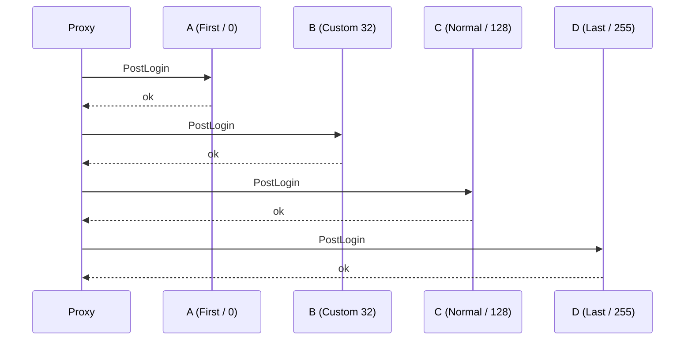

# Events

A WASM plugin reacts to the proxy through the event bus. You subscribe inside `on_enable`, each subscription runs a closure when a matching event fires, and modifiable events let the closure set the proxy's next action. The `event-bus` capability is part of the baseline set, so every WASM plugin can subscribe without declaring an extra permission.

## Subscribing

`ctx.on::<E>(priority, handler)` registers one handler for event type `E` and returns an [`EventSubscription`](./api-reference). The closure receives `&mut E`.

```rust
use infrarust_plugin_sdk::prelude::*;

#[derive(Default)]
struct EventSubscriber;

#[plugin(id = "event-subscriber", name = "Event Subscriber Fixture")]
impl Plugin for EventSubscriber {
    fn on_enable(&self, ctx: &Context) -> Result<(), String> {
        ctx.on::<PostLoginEvent>(EventPriority::Normal, |event| {
            info!("{} joined", event.profile.username);
        });
        Ok(())
    }
}
```

The signature is synchronous. A guest handler cannot `.await`; it returns when the closure returns.

```rust
pub fn on<E: GuestEvent>(
    &self,
    priority: EventPriority,
    handler: impl FnMut(&mut E) + 'static,
) -> EventSubscription
```

:::tip
Subscribe in `on_enable`. The subscription stays active for the life of the plugin unless you cancel it, so you do not need to keep the returned handle.
:::

### Cancelling

`EventSubscription::cancel` removes that one handler. Other handlers on the same event keep running.

```rust
let sub = ctx.on::<PostLoginEvent>(EventPriority::Normal, |_| { /* ... */ });
sub.cancel();
```

## Priority

`EventPriority` is an enum whose `value()` is a `u8`. Handlers run from the lowest value to the highest, so `First` (0) runs before `Last` (255). Use `Custom(u8)` for a value between the named levels.

| Variant | Value | Runs |
| --- | --- | --- |
| `First` | 0 | earliest |
| `Early` | 64 | |
| `Normal` | 128 | default choice |
| `Late` | 192 | |
| `Last` | 255 | latest |
| `Custom(v)` | `v` | at exactly `v` |

```rust
EventPriority::Normal.value(); // 128
EventPriority::Custom(32).value(); // 32
```

Multiple handlers can share one event kind. The proxy runs them in priority order over one shared native event. Each guest closure starts from a clean (unset) result and cannot read what a prior handler set; the prior outcome lives on the native event, not in your `&mut E`.

## Observe-only vs modifiable

Events come in two kinds.

- Observe-only events are read-only records. The closure inspects fields; it cannot set an outcome.
- Modifiable events carry a result. The closure calls a method such as `deny`, `redirect_to`, or `modify` to choose what the proxy does next.

If a handler sets no outcome on a modifiable event, the host leaves the native event's current result untouched, so a higher-priority handler keeps whatever a lower-priority one set. `allow()` sets the guest result to unset, which the host reads as "no change"; it does not clear a result a prior handler set. To override a prior decision, set a concrete outcome such as `deny` or `redirect_to`.

```rust
ctx.on::<ServerPreConnectEvent>(EventPriority::Normal, |event| {
    event.redirect_to("backend-1");
});
```

```rust
ctx.on::<ChatMessageEvent>(EventPriority::Normal, |event| {
    if event.message.contains("spoiler") {
        event.deny("blocked");
    }
});
```

## Event reference

The SDK exposes 16 event types. Field names below match the generated bindings exactly. The `profile` field on the connection events is a `GameProfile` with `uuid`, `username`, and `properties`.

### Observe-only events

| Rust type | Key fields | Notes |
| --- | --- | --- |
| `PostLoginEvent` | `profile`, `player_id`, `protocol_version` | player finished login |
| `DisconnectEvent` | `player_id`, `username`, `last_server: Option<String>` | player left |
| `OnlineAuthFailedEvent` | `username` | Mojang auth failed |
| `PermissionsSetupEvent` | `player_id`, `profile`, `online_mode: bool` | see the note below |
| `ServerConnectedEvent` | `player_id`, `server` | reached a backend |
| `ServerSwitchEvent` | `player_id`, `previous_server`, `new_server` | moved between backends |
| `ServerStateChangeEvent` | `server`, `old_state`, `new_state` | backend state changed |
| `ProxyInitializeEvent` | none (unit) | proxy started |
| `ProxyShutdownEvent` | none (unit) | proxy stopping |
| `ConfigReloadEvent` | none (unit) | config reloaded |

### Modifiable events

| Rust type | Key fields | Outcome methods |
| --- | --- | --- |
| `PreLoginEvent` | `profile`, `remote_addr`, `protocol_version`, `server_domain` | `deny(reason)`, `force_offline()`, `force_online()`, `allow()` |
| `ServerPreConnectEvent` | `player_id`, `profile`, `original_server` | `redirect_to(server)`, `send_to_limbo(handlers)`, `deny(reason)`, `allow()` |
| `KickedFromServerEvent` | `player_id`, `server`, `reason` | `disconnect_player(reason)`, `redirect_to(server)`, `send_to_limbo(handlers)`, `notify(message)` |
| `PlayerChooseInitialServerEvent` | `player_id`, `profile`, `initial_server` | `redirect(server)`, `send_to_limbo(handlers)`, `allow()` |
| `ProxyPingEvent` | `remote_addr`, `response` | mutate `response` in place |
| `ChatMessageEvent` | `player_id`, `message` | `deny(reason)`, `modify(message)`, `allow()` |

`ProxyPingEvent` has no result variant. The handler mutates `event.response`, whose fields are `description`, `max_players`, `online_players`, `protocol_version`, `version_name`, and `favicon: Option<String>`.

```rust
ctx.on::<ProxyPingEvent>(EventPriority::Normal, |event| {
    event.response.max_players = 1000;
    event.response.version_name = "Infrarust".to_string();
});
```

:::info Capabilities for outcome methods
Subscribing needs only the baseline `event-bus` capability. `send_to_limbo` routes a player to a limbo session and needs the opt-in `limbo` capability. Capability strings in config are kebab-case. See [api-reference](./api-reference) for the full set.
:::

## Not exposed by the SDK

Two items in the WIT contract (`infrarust:plugin@0.2.3`) are present in the wire protocol but not surfaced by the SDK.

| WIT item | Status |
| --- | --- |
| `raw-packet` | Defined in the WIT contract, not yet exposed by the SDK. There is no `RawPacketEvent` Rust type to subscribe to. |
| `permissions-setup` result | The `PermissionsSetupEvent` is observe-only in the SDK. The contract's `custom(handler-id)` result maps to a separate custom permission-checker path rather than an event outcome. |

:::warning
Do not assume an event exists because it appears in the WIT `event-kind` enum. The enum lists 17 kinds; the SDK exposes the 16 listed above. `raw-packet` is contract-only.
:::

## Multiple handlers and ordering

This plugin registers several handlers on `PostLoginEvent` at different priorities and cancels one before any event fires.

```rust
use infrarust_plugin_sdk::prelude::*;

#[derive(Default)]
struct MultiHandler;

#[plugin(id = "multi-handler", name = "Multi Handler Fixture")]
impl Plugin for MultiHandler {
    fn on_enable(&self, ctx: &Context) -> Result<(), String> {
        ctx.on::<PostLoginEvent>(EventPriority::First, |_| append("A")); // 0
        ctx.on::<PostLoginEvent>(EventPriority::Custom(32), |_| append("B")); // 32
        ctx.on::<PostLoginEvent>(EventPriority::Normal, |_| append("C")); // 128
        let leaked = ctx.on::<PostLoginEvent>(EventPriority::Normal, |_| append("L")); // 128
        ctx.on::<PostLoginEvent>(EventPriority::Last, |_| append("D")); // [!code focus]
        leaked.cancel(); // [!code focus]
        Ok(())
    }
}
```

The `L` handler is cancelled, so it never runs. The remaining handlers fire in priority order, producing `ABCD` per login.



## See also

- [API reference](./api-reference): `Context`, `EventSubscription`, and the full type list.
- [Services](./services): read and act on players, servers, and bans from a handler.
- [Commands](./commands): register commands and tab-completion.
- [Limbo](./limbo): where `send_to_limbo` routes a player.
- [Getting started](./getting-started): build and load your first WASM plugin.
