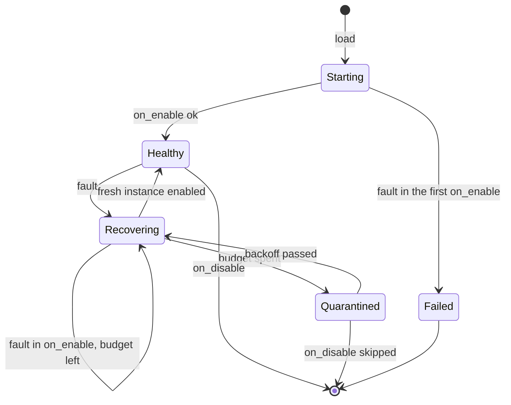

# Fault model

A fault in a WASM plugin does not disable it until the next proxy restart. The proxy throws the faulty instance away, creates a fresh one from the already compiled component, and runs the plugin's `on_enable` again. A plugin that keeps failing is quarantined for a while and then tried again.

This page covers what counts as a fault, what the proxy does about it, what the plugin keeps and loses, and how to write a plugin that recovers well. The limits that cause most faults are described in [Capabilities & Sandbox](./capabilities#the-sandbox); the settings on this page live in [`[wasm.recovery]`](../../configuration/global#recovery-after-a-fault).

## What counts as a fault

Any of these, during any call into the plugin (an event, a command, a tab completion, a scheduled task, a limbo callback):

- A trap: a panic in the plugin, an out-of-bounds memory access, a CPU overrun (`cpu_budget`), a memory-grow failure past `memory_limit_mb`, or the use of a dropped or invalid resource handle.
- A call still running at `max_call_duration`, host calls included. The call is cut off.
- A panic in a host function the plugin called.

These are not faults, and the instance keeps running:

- A caller that stops waiting, such as the event bus after `[events] handler_timeout`. The call still finishes inside the plugin.
- A host call that fails or runs out of time. The plugin gets an error value and decides what to do.
- A callback that returns an error, and a call refused because the plugin's queue is full.

Codec filters are separate instances, one per connection side, and have their own rule: a trap there only disables that one instance, which lets packets through from then on. See [Codec Filters](./codec-filters).

## What happens to the call that faulted

The call that faulted gets no answer from the plugin:

| Call | Result |
|------|--------|
| Event | The event keeps the result it had before this listener |
| Command | Nothing happens |
| Tab completion | No suggestions |
| Limbo `on_player_enter` | The player is denied with "Limbo handler unavailable" |
| Other limbo callbacks | Nothing happens |

The caller gets this answer once the proxy has finished replacing the instance, so when it arrives the fresh instance has already subscribed again and the next event reaches it. A caller that stops waiting earlier, such as the event bus after `[events] handler_timeout`, moves on before that.

## Recovery

When a call faults, the proxy:

1. Logs one error naming the plugin, the call and the cause.
2. Discards the instance and everything it registered with the proxy: its event listeners are removed, its scheduled tasks are cancelled, and every player it still holds in limbo is released with a deny ("Limbo handler unavailable") so nobody is stuck. Calls already queued for the old instance's listeners and tasks are dropped.
3. Creates a fresh instance from the compiled component, with the same plugin context, capabilities, data directory and limits.
4. Runs the guest's `on_enable` in it. A trap, a cut-off or an `Err` from this `on_enable` counts as one more fault.
5. Logs one info line with the new instance's generation (the first instance is generation 1, each fresh one adds 1).

Commands and limbo handlers are known to the proxy by name, so they are not registered twice. When the fresh instance registers a command or a limbo handler under a name the plugin already used, the existing registration is pointed at the fresh instance. A name that the fresh instance does not register again during its `on_enable` is removed: the command is unregistered, and the limbo handler denies players who reach it.

## What survives a recovery

| Kept | Lost |
|------|------|
| Files in the plugin's data directory | Everything in guest memory: statics, caches, counters, `RefCell` maps |
| The plugin's capabilities, configuration and limits | Event subscriptions of the old instance (`on_enable` makes new ones) |
| Commands and limbo handlers that `on_enable` registers again | Commands and limbo handlers registered later, outside `on_enable`, unless `on_enable` registers them again |
| Codec filters (separate instances) | Scheduled tasks (`delay` and `interval`) |
| | Players the old instance held in limbo (released with a deny) |
| | Resource handles the guest held, such as limbo session handles |

`on_enable` runs again for every fresh instance, so it can run many times over the life of the proxy.

The order of listeners can change. The fresh instance subscribes again, and a new subscription runs after the listeners that already had the same priority. If your plugin and another one both listen to an event at the same priority, the order between them may flip after a recovery. Use distinct priorities when the order matters.

## Restart budget and quarantine

The proxy starts a fresh instance straight away, up to `max_restarts` times (5 by default) within a sliding `window` (5 minutes). A fault beyond that quarantines the plugin:

- It stays quarantined for `backoff_initial` (1 second), doubled for each quarantine in a row, up to `backoff_max` (5 minutes). The warning logged on quarantine carries the time until the next attempt (`retry_in`).
- Every call to a quarantined plugin is answered at once without running guest code, with the same results as in the table above: events keep their result, commands do nothing, limbo handlers deny the player.
- When the backoff has passed, the proxy tries a fresh instance again, on its own or when the next call arrives, whichever comes first. If it works the plugin is healthy again; if it fails the plugin is quarantined for the next, longer backoff.

Restarts older than `window` stop counting. Once a fault can be restarted straight away again, the backoff starts over from `backoff_initial`.



### A fault in the first `on_enable`

The budget only applies once the plugin has been enabled. If the first `on_enable` faults, the enable fails, the proxy reports that the plugin could not be enabled, and no fresh instance is tried.

## Disable and unload

On `on_disable`, a plugin with a live instance runs its guest `on_disable` as usual. A quarantined plugin has no instance to run it in, so the call is skipped with a warning. In every case the proxy then removes the instance's listeners and scheduled tasks, releases the players it holds in limbo, and stops the plugin's task. Unloading the plugin does the same without calling `on_disable`.

## Configuration

```toml
[wasm.recovery]
max_restarts = 5
window = "5m"
backoff_initial = "1s"
backoff_max = "5m"

[plugins.flaky.wasm.recovery]
max_restarts = 1
backoff_max = "30m"
```

A plugin-level table overrides only the keys it sets. See [`[wasm.recovery]`](../../reference/config-schema#wasm-recovery) for the ranges.

## Writing a plugin that recovers well

- **Persist what matters.** Write state you cannot lose to the data directory (`/` inside the sandbox) and read it back in `on_enable`. Treat guest memory as a cache.
- **Keep `on_enable` repeatable.** It must succeed when it runs a second time with files left over from the first run, and it should be quick: the caller that hit the fault waits for it.
- **Register everything in `on_enable`.** Commands and limbo handlers registered there are rebound to the fresh instance; ones registered later are removed after a recovery.
- **Expect held players to be released.** A player your plugin held in limbo is denied when the instance goes away. They can reconnect and meet the fresh instance.
- **Watch the logs.** Repeated `wasm plugin instance failed` errors, or a `quarantined` warning, mean the plugin has a bug that recovery only hides.

## See also

- [Lifecycle](./lifecycle): the stages from discovery to disable.
- [Capabilities & Sandbox](./capabilities): the limits that cause most faults.
- [Limbo](./limbo): holds, session handles and the fail-closed rule.
- [Global configuration](../../configuration/global#wasm-plugin-sandbox): the `[wasm]` limits.
