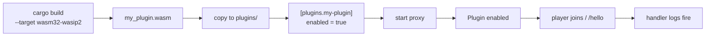

# Getting Started with WASM Plugins

This tutorial builds a sandboxed WASM plugin that logs when players join and registers a `/hello` command. By the end you have a `.wasm` component that Infrarust loads at startup. The plugin runs in a wasmtime sandbox against the `infrarust:plugin@0.2.3` contract, separate from the proxy binary.

::: info Native plugins are different
The native plugin API (`infrarust-api`, `BoxFuture`, statically compiled into the proxy) is a separate system. The WASM guest `Plugin` trait is synchronous and the build, packaging, and capability model differ. For the native path see [Getting Started with Plugin Development](../dev/getting-started).
:::

## Prerequisites

- Rust toolchain, edition 2024
- The `wasm32-wasip2` compilation target
- [`cargo generate`](https://cargo-generate.github.io/cargo-generate/) for scaffolding

```bash
rustup target add wasm32-wasip2
cargo install cargo-generate
```

## Scaffold from the template

Generate a crate from the official template under `templates/plugin-template`:

```bash
cargo generate --git https://github.com/Shadowner/Infrarust.git templates/plugin-template
```

The template asks how the crate should depend on `infrarust-plugin-sdk`. The choices come from `cargo-generate.toml`:

| Variable | Values | Meaning |
|----------|--------|---------|
| `crate_name` | any | Your plugin crate name. The macro derives the plugin id from it (`CARGO_PKG_NAME`). |
| `sdk_source` | `git`, `path`, `crates-io` | Where the SDK dependency comes from. Default `git`. |
| `sdk_git` | URL | Git URL for the SDK when `sdk_source = "git"`. Default the Infrarust repo. |
| `sdk_path` | path | Local checkout path to `crates/infrarust-plugin-sdk`. Asked only when `sdk_source = "path"`. |

:::tip Local development
When iterating against a local Infrarust checkout, pick `sdk_source = "path"` so the SDK resolves to your working tree:

```bash
cargo generate --git https://github.com/Shadowner/Infrarust.git templates/plugin-template \
  --define sdk_source=path
```
:::

## The generated plugin

The template's `src/lib.rs` is the plugin in full:

```rust
use infrarust_plugin_sdk::prelude::*;

#[derive(Default)] // [!code focus]
struct MyPlugin;

#[plugin] // [!code focus]
impl Plugin for MyPlugin {
    fn on_enable(&self, ctx: &Context) -> Result<(), String> { // [!code focus]
        // React to players joining.
        ctx.on::<PostLoginEvent>(EventPriority::Normal, |event| {
            info!("{} joined", event.profile.username);
        });

        // Register a "/hello [name]" command.
        ctx.command("hello", |invocation| {
            let who = invocation.args.first().map_or("world", String::as_str);
            info!("hello, {who}!");
        })
        .description("Say hello")
        .register();

        Ok(())
    }
}
```

Four pieces do the work.

### The plugin type

The struct holds plugin state and must implement `Default`; the `#[plugin]` macro instantiates it. The guest is single-threaded with no async runtime, so keep any mutable state in `Cell`/`RefCell` fields rather than locks.

### The `#[plugin]` attribute

`#[plugin]` turns the `impl Plugin` block into a loadable component: it generates the WIT `Guest` glue and the component `export!`. It also derives `metadata()` from `Cargo.toml` (`CARGO_PKG_NAME`, `CARGO_PKG_VERSION`, `CARGO_PKG_AUTHORS`, `CARGO_PKG_DESCRIPTION`). Override individual fields inline when the crate name is not the id you want:

```rust
#[plugin(id = "hello", name = "Hello", description = "Logs joins, adds /hello")]
impl Plugin for MyPlugin { /* ... */ }
```

The `id` is what you reference in config. It defaults to `CARGO_PKG_NAME`, not the `.wasm` file name.

### `on_enable`

The guest `Plugin` trait is synchronous and reports errors as `String`:

```rust
fn on_enable(&self, ctx: &Context) -> Result<(), String>;
```

Returning `Err(message)` aborts enabling the plugin. Register every event handler, command, and scheduled task here. The optional `on_disable(&self, ctx: &Context) -> Result<(), String>` runs at shutdown and defaults to `Ok(())`.

### Subscribing to an event

`ctx.on::<E>` subscribes a handler for a typed event. `PostLoginEvent` fires after a player authenticates; its `profile.username` field is the player name. The handler is `FnMut(&mut E)`. `EventPriority` orders handlers when several listen to the same kind (`First`, `Early`, `Normal`, `Late`, `Last`, or `Custom(u8)`).

```rust
ctx.on::<PostLoginEvent>(EventPriority::Normal, |event| {
    info!("{} joined", event.profile.username);
});
```

The SDK exposes a subset of the event kinds in the WIT contract. See [Events](./events) for the full list of what the SDK exposes.

### Registering a command

`ctx.command` returns a builder. Chain `.description(...)` and finish with `.register()`. The handler receives a `CommandInvocation { args: Vec<String>, player: Option<u64> }`, where `player` is `None` for console.

```rust
ctx.command("hello", |invocation| {
    let who = invocation.args.first().map_or("world", String::as_str);
    info!("hello, {who}!");
})
.description("Say hello")
.register();
```

See [Commands](./commands) for aliases and tab completion.

:::details Getting a Context inside a callback
`Context` is a zero-sized handle to the guest runtime. Callbacks that do not receive a `&Context` (for example a limbo handler that wants to schedule a task) can construct one for free with `Context::new()`.
:::

The `info!`, `warn!`, `error!`, `debug!`, and `trace!` macros forward formatted messages to the host log.

## Cargo.toml essentials

The template's manifest produces a component and optimizes for size:

```toml
[package]
name = "my-plugin"
version = "0.1.0"
edition = "2024"

[lib]
crate-type = ["cdylib"] # [!code focus]

[dependencies]
infrarust-plugin-sdk = { git = "https://github.com/Shadowner/Infrarust.git" }

[profile.release]
opt-level = "s"      # [!code focus]
lto = true           # [!code focus]
strip = true         # [!code focus]
panic = "abort"      # [!code focus]

[profile.dev]
panic = "abort"
```

`crate-type = ["cdylib"]` is required to emit a WASM component. The release profile keeps the `.wasm` small: `opt-level = "s"` optimizes for size, `lto` and `strip` shrink the artifact, and `panic = "abort"` removes unwinding code. `wit-bindgen` is embedded in the SDK, so no `cargo-component` is needed.

## Build

Compile for `wasm32-wasip2` in release mode:

```bash
cargo build --release --target wasm32-wasip2
```

The template ships a `.cargo/config.toml` with `target = "wasm32-wasip2"`, so plain `cargo build --release` produces the same component.

The component lands at:

```
target/wasm32-wasip2/release/my_plugin.wasm
```

Cargo replaces `-` with `_` in the artifact name, so crate `my-plugin` produces `my_plugin.wasm`. More build options are in [Building plugins](./building).

## Deploy

Infrarust discovers WASM plugins by scanning its `plugins/` directory for `.wasm` files and keying each by its metadata `id`. Copy the artifact there:

```bash
cp target/wasm32-wasip2/release/my_plugin.wasm /path/to/infrarust/plugins/
```

Enable it with a `[plugins.<id>]` block in the proxy config, keyed by the metadata `id` (here `my-plugin`), not the file name:

```toml
[plugins.my-plugin]
enabled = true
```

Events and commands are covered by the baseline capabilities granted to every WASM plugin, so this plugin needs no `permissions`. Opt-in capabilities (such as `ban`, `server-manage`, `codec-filter`, `limbo`) are listed there when a plugin uses them:

```toml
[plugins.my-plugin]
enabled = true
permissions = ["ban", "server-manage"]
```

| Field | Type | Notes |
|-------|------|-------|
| `enabled` | bool | Whether the plugin loads. Defaults to `true`. |
| `permissions` | array of strings | Opt-in capabilities, kebab-case. Baseline grants are always present. |
| `path` | string | Optional. WASM plugins are auto-discovered, so this is unset for them. |

See [Capabilities](./capabilities) for the full baseline and opt-in tables, and the [configuration reference](../../configuration/) for the surrounding config.

## Run and verify

Start the proxy. On startup the manager loads each enabled plugin and logs it:

```
INFO Plugin enabled plugin=my-plugin
```

Join the server with a Minecraft client. The `PostLoginEvent` handler fires and the host log shows the join. Running `/hello` (or `/hello Steve`) writes the command output:

```
INFO Steve joined
INFO hello, Steve!
```

Two log lines that match your handlers mean the plugin loaded, the capabilities resolved, and dispatch reached your code.



## Next steps

- [Architecture](./architecture): how the host runs a guest component.
- [Events](./events): every event kind the SDK exposes.
- [Commands](./commands): aliases, descriptions, and tab completion.
- [Capabilities](./capabilities): baseline grants and opt-in permissions.
- [Building](./building) and [Deploying](./deploying): the full build and packaging workflow.
- [Examples](./examples): complete plugins to read.
