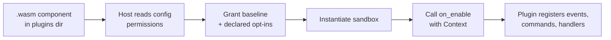

# WASM Plugins

::: warning Beta: expect breaking changes
Infrarust is in beta, and the plugin API is not stable yet. The `infrarust:plugin` WIT contract and the SDK can change between releases without a compatibility guarantee until the stable release. Pin the SDK version you build against, and expect to update plugins when you upgrade the proxy.
:::

A WASM plugin is a WebAssembly Component, built for the `wasm32-wasip2` target, that Infrarust loads at runtime from its plugins directory. The host runs each plugin inside a sandbox and grants it only the capabilities its config declares. You write the plugin against [`infrarust-plugin-sdk`](./api-reference), which generates the host/guest glue so you never touch the raw `wit-bindgen` surface.

The host/guest contract is the WIT world `infrarust:plugin@0.3.0`. The SDK implements the guest side of that contract and exposes a typed API that mirrors the native one: implement the `Plugin` trait, subscribe to events, register commands and scheduled tasks, and call host services. Players are addressed by `PlayerId`, text is a `Component` tree, and every host call that can fail returns `Result<_, Error>`.

```rust
use infrarust_plugin_sdk::prelude::*;

#[derive(Default)]
struct MyPlugin;

#[plugin(id = "my-plugin", name = "My Plugin")]
impl Plugin for MyPlugin {
    fn on_enable(&self, ctx: &Context) -> Result<(), PluginError> {
        ctx.on::<PostLoginEvent>(EventPriority::Normal, |e| {
            info!("{} joined", e.player.username);
        })?;
        Ok(())
    }
}
```

:::warning Upgrading from 0.2.3
The proxy refuses components built for `infrarust:plugin@0.2.3` with a message asking for a rebuild. See [Migrating to 0.3](./migration-0.3) for every change.
:::

:::tip New here?
Start with [Getting Started](./getting-started) for a full build-and-run walkthrough, then come back to this page to pick the feature you need.
:::

## WASM vs native plugins

Infrarust has two plugin systems. Native plugins are Rust crates compiled into the proxy binary against `infrarust-api`; see [native plugin development](../dev/getting-started). WASM plugins are separate component files loaded at runtime. They target different trade-offs.

| Aspect | WASM plugin | Native plugin |
|--------|-------------|---------------|
| Distribution | Drop a `.wasm` file into the plugins directory | Recompile the proxy with a Cargo feature |
| Isolation | Sandboxed in its own component instance | In-process, fully trusted |
| Capabilities | Baseline grants plus opt-ins declared in config | All capabilities |
| Resource limits | CPU and memory bounded by the sandbox | None |
| Language | Any language targeting `wasm32-wasip2` (the SDK is Rust) | Rust only |
| API shape | Synchronous `Plugin` trait | Async `Plugin` trait (`BoxFuture`) |

Transport filters run below the codec layer at the TCP stream level and stay native-only: the `transport-filter` capability is never grantable through config, so a WASM plugin cannot register one.

:::info Choosing between them
Pick WASM when you want to ship a plugin as a file, run untrusted or third-party code, or write in a language other than Rust. Pick native when you need transport-level filters, unrestricted host access, or the async API.
:::

## The capability model

Every WASM plugin starts with a baseline set of capabilities and gains more only by listing them in its config. Baseline capabilities are granted automatically: `event-bus`, `player-read`, `player-write`, `command`, `scheduler`, and `config-read`. Opt-in capabilities such as `ban`, `server-manage`, `codec-filter`, `limbo`, and `raw-packet` must appear in the plugin's `permissions` list. Capability strings are kebab-case, and unknown strings are rejected at load time. Native plugins receive every capability; a WASM plugin receives baseline plus its declared opt-ins.

```toml
[plugins.my-plugin]
permissions = ["limbo", "ban"]
```

See [Capabilities](./capabilities) for the full table and what each one unlocks.

## What a WASM plugin can do

### React to events

Subscribe to lifecycle, connection, chat and proxy events with a priority and a closure. Observe-only events let you read what happened; the resulted events carry the current result, set by earlier handlers, and let a handler deny, redirect, rewrite or reset it.

```rust
ctx.on::<ChatMessageEvent>(EventPriority::Normal, |e| {
    if e.message.contains("spam") {
        e.deny(Component::text("blocked").color(NamedColor::Red));
    }
})?;
```

The `event-bus` capability is part of the baseline, so any plugin can react to events. Chat is the exception: a `ChatMessageEvent` handler like the one above needs the opt-in `chat-intercept` capability. See [Events](./events) for the kinds the SDK exposes.

### Add commands

Register proxy-level chat commands. A command handler receives the parsed arguments and who ran it, and can reply.

```rust
ctx.command("greet")
    .description("Say hello")
    .handler(|inv| {
        let _ = inv.reply(format!("hello, {}!", inv.sender.name()));
    })
    .register()?;
```

The `command` capability is baseline. See [Commands](./commands).

### Filter packets

Inspect or modify Minecraft protocol packets as they pass through the proxy. Register codec filters by implementing `CodecFilter` and returning a `Verdict` per packet. Filters need the opt-in `codec-filter` capability.

See [Codec Filters](./codec-filters).

### Gate players in limbo

Hold a player in a proxy-hosted void world before they reach a backend: show titles, send messages, wait for commands, then release or disconnect them. Limbo handlers need the opt-in `limbo` capability.

See [Limbo](./limbo).

### Provide bans or permissions

Become the proxy's ban provider or permission provider, the way LibertyBans or LuckPerms do for other proxies: answer login checks and store bans with a `BanProvider`, hand out permission snapshots with a `PermissionProvider`, and change a player's permissions while they are online. The operator selects the plugin with `[ban] provider` or `[permissions] provider` and grants `ban-provider` or `permission-provider`.

See [Bans](./bans) and [Permissions](./permissions).

### Call host services

Read the player registry, manage servers, query config, and use the ban service through typed accessors. Each accessor maps to a host import gated by a capability. `Players` and `Config` reads are baseline, while `Servers` needs `server-manage` and `Bans` needs `ban`. A call the plugin lacks the capability for returns an `Error` of kind `PermissionDenied`.

```rust
let online = Players::count();
if let Some(notch) = Players::by_name("Notch") {
    notch.handle().send_message("hi")?;
}
```

See [Host Services](./services).

## How loading works



The plugin runs single-threaded with no async runtime. Keep mutable state in `Cell` or `RefCell` fields rather than across threads. Read the [Architecture](./architecture) page for how the host instances, the sync codec path, and the async limbo instance fit together.

If the plugin traps or runs past its limits, the host replaces its instance with a fresh one and runs `on_enable` again, with `ctx.enable_reason()` reporting the recovery, so anything kept only in memory is lost. Persist what matters to the data directory. See the [Fault Model](./fault-model).

## Section map

| Page | Topic |
|------|-------|
| [Getting Started](./getting-started) | Build and run your first WASM plugin end to end. |
| [Architecture](./architecture) | Host instances, the contract, and the execution model. |
| [Fault Model](./fault-model) | What happens when a plugin traps: fresh instances, restart budget, quarantine. |
| [Capabilities](./capabilities) | Baseline and opt-in capabilities, and the config that grants them. |
| [Events](./events) | The event kinds the SDK exposes and how to handle them. |
| [Commands](./commands) | Registering and handling proxy commands. |
| [Codec Filters](./codec-filters) | Inspecting and modifying protocol packets. |
| [Limbo](./limbo) | Holding players in a proxy-hosted void world. |
| [Permissions](./permissions) | Permission snapshots, the permission provider, live updates. |
| [Bans](./bans) | Being the proxy's ban provider. |
| [Host Services](./services) | Player registry, server manager, config, and bans. |
| [Building](./building) | Compiling to a `wasm32-wasip2` component. |
| [Deploying](./deploying) | Installing and configuring a plugin on a running proxy. |
| [Virtual Backend](./virtual-backend) | Serving a backend from a plugin (planned). |
| [API Reference](./api-reference) | The full SDK surface. |
| [Examples](./examples) | Complete sample plugins. |
| [Migrating to 0.3](./migration-0.3) | What changed from the 0.2.3 contract and how to port a plugin. |

:::warning Planned, not implemented
Virtual Backend is not implemented. The native traits and the `virtual-backend` capability exist, but the capability is unenforced and there is no WASM bridge. Treat [Virtual Backend](./virtual-backend) as a design preview.
:::

## Building a component

Compile to a WebAssembly Component with a `cdylib` crate type. Add the target once, then build with `cargo`. No `cargo-component` is needed: the SDK embeds `wit-bindgen`.

:::code-group

```bash [add target]
rustup target add wasm32-wasip2
```

```bash [build]
cargo build --release --target wasm32-wasip2
```

```toml [Cargo.toml]
[lib]
crate-type = ["cdylib"]
```

:::

## Next steps

- [Getting Started](./getting-started): Build, configure, and load your first WASM plugin.
- [Capabilities](./capabilities): Decide which permissions your plugin declares.
- [Events](./events): The event kinds you can handle.
- [Architecture](./architecture): The host/guest execution model.
- [Native plugin development](../dev/getting-started): The in-process Rust API.
- [Configuration](../../configuration/): The proxy config reference.
