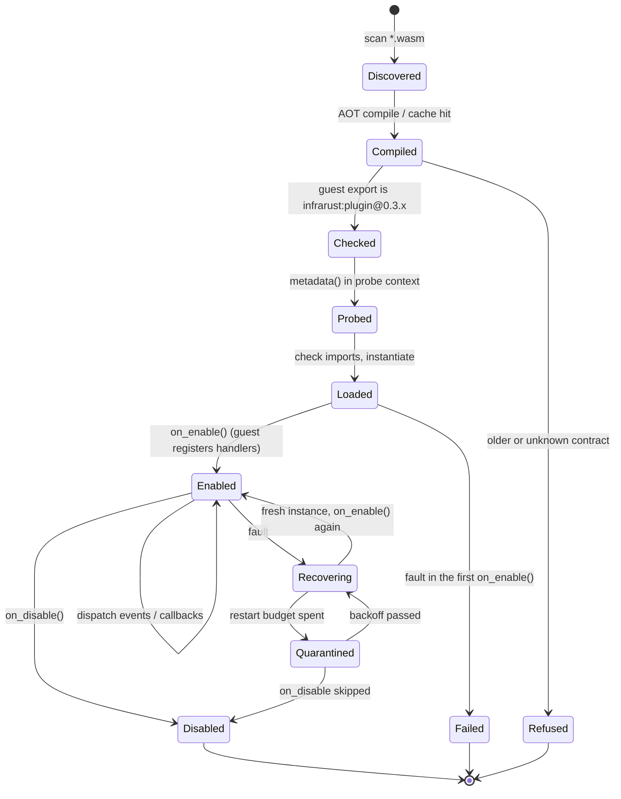
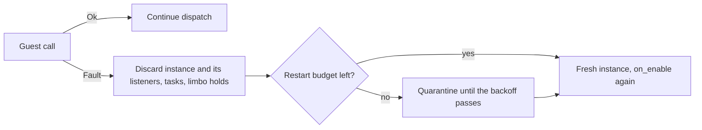

# WASM Plugin Lifecycle

A WASM plugin passes through six stages: discovery, ahead-of-time compilation, the contract check, metadata probing, load, and enable. After enabling, the host dispatches events and callbacks into the guest until the plugin is disabled. A fault after enabling replaces the instance with a fresh one; see [Fault model](./fault-model). This page describes each stage against the loader source.

## State diagram



## Discovery

The loader scans the plugin directory recursively for `*.wasm` files. The `.cache` subdirectory is skipped during the walk, so cached artifacts are never mistaken for plugins.

```rust
// scan_wasm_files in loader.rs
if path.is_dir() {
    if path.file_name().and_then(|n| n.to_str()) != Some(CACHE_SUBDIR) {
        stack.push(path); // recurse, except into .cache
    }
} else if path.extension().and_then(|e| e.to_str()) == Some("wasm") {
    out.push(path);
}
```

If the plugin directory does not exist, discovery returns an empty list rather than an error.

## AOT compilation and caching

Each `*.wasm` is compiled ahead of time and stored as a `.cwasm` artifact under `<plugins_dir>/.cache`. Compilation runs on a blocking task pool (`tokio::task::spawn_blocking`) so it does not stall the async runtime.

The cache key is a SHA-256 hash of the component bytes mixed with two version tags from `consts.rs`:

| Tag | Constant | Value |
|-----|----------|-------|
| Cache subdirectory | `CACHE_SUBDIR` | `.cache` |
| wasmtime line marker | `WASMTIME_CACHE_TAG` | `wasmtime-45` |
| WIT world version | `WORLD_VERSION` | `0.3.0` |

```rust
// AotCache::cache_key in cache.rs
hasher.update(wasm);
hasher.update(b"\0");
hasher.update(WASMTIME_CACHE_TAG.as_bytes()); // wasmtime-45
hasher.update(b"\0");
hasher.update(WORLD_VERSION.as_bytes());      // 0.3.0
```

A change to the component bytes, the wasmtime tag, or the world version produces a different key, so the artifact is recompiled. A stale or corrupt `.cwasm` is removed and rebuilt on the next load.

:::info
The WIT contract is `infrarust:plugin@0.3.0`. `WORLD_VERSION` in `infrarust-plugin-wit` is the single source for that version: the loader's cache key and contract check both read it, and a test keeps it equal to the package declaration in `wit/world.wit`.
:::

:::warning
The loader writes `.cwasm` files atomically into its own cache directory and deserializes only artifacts it produced. Never place a hand-written `.cwasm` in `.cache`; deposit `*.wasm` and let the loader compile it.
:::

## Contract check

Before anything runs, the loader reads which contract the component was built for: the version in the name of its `infrarust:plugin/guest@X.Y.Z` export. It accepts `0.3.M` when `M` is at most the host's patch version, so a host at `0.3.0` loads `0.3.0` plugins only.

| Component | Result |
|-----------|--------|
| Exports `infrarust:plugin/guest@0.3.0` | Continues to the metadata probe |
| Exports `infrarust:plugin/guest@0.2.3`, or any other version | Refused: `plugin built for infrarust:plugin@0.2.3; this host supports infrarust:plugin@0.3.x, rebuild it with an infrarust-plugin-sdk that targets infrarust:plugin@0.3.x` |
| Exports no `infrarust:plugin/guest` interface | Refused: `not an Infrarust plugin component` |

Both refusals are `LoaderError::InvalidFormat` and name the file. See [Migrating to 0.3](./migration-0.3).

## Metadata probe

Before a plugin is loaded with capabilities, the loader instantiates the compiled component in a minimal probe context and calls the guest `metadata()` export. The probe context grants no capabilities (`CapabilitySet::default()`) and no plugin context: a host call made from `metadata()` returns `Unavailable` or a neutral value.

```rust
// extract_metadata in metadata.rs
let wit_md = bindings
    .infrarust_plugin_guest()
    .call_metadata(&mut store)
    .await?;
```

The returned record populates the native `PluginMetadata`:

| Field | Source | Notes |
|-------|--------|-------|
| `id` | `wit_md.id` | Key used for dependency resolution and load lookup |
| `name` | `wit_md.name` | |
| `version` | `wit_md.version` | |
| `authors` | `wit_md.authors` | Each appended via `.author(...)` |
| `description` | `wit_md.description` | Optional |
| `dependencies` | `wit_md.dependencies` | `optional: true` becomes an optional dependency, otherwise a hard dependency. The `#[plugin]` macro fills them from `depends` and `soft_depends` |

A trap in `metadata()` fails the probe with a `Metadata` error and the plugin is not registered.

## Load

`load` looks the plugin up by `id` in the discovered set, asks the context factory for a `PluginContext`, and reads the capabilities granted to that context. It compares the component's imports with those capabilities: each import the plugin lacks the capability for is logged once, or refuses the load when `strict_capabilities` is set (see [Capabilities](./capabilities#the-load-time-report)). The linker wires in every host interface; the capabilities are checked again on each gated call.

```rust
// load in loader.rs
let capabilities = ctx.capabilities().clone();
check_imports(&self.engine, &entry.component, plugin_id, &capabilities, strict)?;
let linker = build_linker(&self.engine, plugin_id)?;

// CodecFilter is opt-in: a separate sync instantiator is built only when granted
let codec = if capabilities.has(Capability::CodecFilter) {
    Some(Arc::new(CodecInstantiator::new(/* ... */)?))
} else {
    None
};
```

The linker is resolved against the component once, into a `PluginPre` (the bindgen wrapper around wasmtime's `InstancePre`). Every instance of the plugin is created from it: the first one at load, and each fresh one after a fault. For each instance a store is created with the plugin state, epoch control is installed, and a memory limiter is attached, then the component is instantiated asynchronously.

```rust
// InstanceFactory in instance.rs
let pre = PluginPre::new(linker.instantiate_pre(component)?)?;

// InstanceFactory::instantiate, once per instance
let mut store = Store::new(&self.engine, state);
install_epoch_control(&mut store, max_epoch_yields);
store.limiter(|s: &mut PluginStoreState| s.limits_mut() as &mut dyn wasmtime::ResourceLimiter);
let bindings = self.pre.instantiate_async(&mut store).await?;
```

The store enforces a linear-memory cap of `MEMORY_LIMIT` (64 MiB) and traps the guest on a memory-grow failure (`trap_on_grow_failure(true)`). An instantiation error that names a missing `infrarust:plugin/` import is reported as a capability denial rather than a generic failure.

See [Capabilities](./capabilities) for which capabilities are granted by default and which are opt-in, and [Architecture](./architecture) for how the store, linker, and engine fit together.

## Enable

`on_enable` is the synchronous guest entry point where the plugin registers everything it needs. The guest `Plugin` trait is synchronous and returns `Result<(), PluginError>`:

```rust
// SDK guest trait (infrarust-plugin-sdk)
pub trait Plugin: 'static {
    fn metadata(&self) -> PluginMetadata;
    fn on_enable(&self, ctx: &Context) -> Result<(), PluginError>;
    fn on_disable(&self, _ctx: &Context) -> Result<(), PluginError> { Ok(()) }
    fn register_codec_filters(_reg: &mut CodecRegistrar) where Self: Sized {}
    fn register_limbo_handlers(_reg: &mut LimboRegistrar) where Self: Sized {}
}
```

`PluginError` converts from `String`, `&str`, `std::io::Error` and the SDK's `Error`, so `?` works on every host call. Inside `on_enable` the plugin uses the `Context` to subscribe to events, register commands, and schedule tasks:

```rust
fn on_enable(&self, ctx: &Context) -> Result<(), PluginError> {
    ctx.on::<PostLoginEvent>(EventPriority::Normal, |e| {
        // observe a login
    })?;

    ctx.command("greet")
        .description("Send a greeting")
        .handler(|inv| {
            // handle /greet
        })
        .register()?;

    ctx.interval(Duration::from_secs(30), || {
        // periodic task
    })?;

    Ok(())
}
```

`ctx.enable_reason()` tells why `on_enable` runs: `EnableReason::Initial` the first time, `EnableReason::Recovered(RecoveryInfo { attempt, cause })` in a fresh instance after a [fault](#faults-and-recovery). `attempt` counts the recoveries so far and `cause` describes the fault that ended the previous instance.

Codec filters and limbo handlers are registered through their own registrar hooks (`register_codec_filters`, `register_limbo_handlers`), each gated by the matching opt-in capability.

`on_enable` runs as the first job of the plugin's task, with a fresh epoch budget. The three outcomes:

| Guest result | Host action |
|--------------|-------------|
| `Ok(())` | Plugin is enabled |
| `Err(error)` | Returned as `PluginError::InitFailed(message)`; plugin not enabled |
| Trap or cut-off | Returned as an error; the plugin is not enabled and no fresh instance is tried |

## Dispatch

After enabling, events and registered callbacks re-enter the guest. Each plugin instance is owned by one task that runs calls one at a time, in the order they arrive, from a queue of `queue_capacity` entries (`[wasm]` in `infrarust.toml`, default 1024). A call that finds the queue full is refused immediately and logged as a rate-limited warning. A call that has started runs to the end even if its caller stops waiting; a queued call whose caller has already given up, or whose [deadline](#deadlines) has passed, is skipped. See [Capabilities & Sandbox](./capabilities#one-call-at-a-time).

Each call into the guest resets the epoch budget first, so a single long callback cannot exhaust a budget left over from an earlier call. A dedicated OS thread bumps the engine epoch every `epoch_tick` (50 ms by default). On each deadline the callback either grants another tick (cooperative yield) or, once the call has used `cpu_budget` (3 s by default, 60 ticks), interrupts the guest with a trap. A call that is still running after `max_call_duration` (60 s by default), host calls included, is abandoned and the instance is replaced (see [Fault model](./fault-model)).

A synchronous codec `filter` call gets its own budget, `codec_cpu_budget` (800 ms by default, 16 ticks), re-armed before every `create`/`filter`/lifecycle call. See [Events](./events) for the dispatched event kinds and [Limbo](./limbo) for limbo callbacks.

### Deadlines

Each call into the guest carries a deadline, fixed when the call is queued:

| Call | Deadline | Why |
|------|----------|-----|
| Event handler | `[events] handler_timeout` (10 s by default) | The event bus stops waiting for the listener at that point |
| Command, tab completion, scheduled task, limbo callback | `max_call_duration` (60 s by default) | Nothing in the proxy stops waiting earlier, and the call is cut off at that limit |
| `on_enable`, `on_disable` | none | The proxy waits for them, and `on_disable` must run |

The deadline has three effects:

- **Host calls fail in time.** Every host call that waits on the proxy (`start` and `stop` on `server-manager`, every `ban-service` function, `switch-server` on `players`) returns before the deadline, minus a margin. The margin is a fifth of the deadline, capped at 250 ms, so a 10 s `handler_timeout` leaves host calls 9.75 s and a 300 ms one leaves them 240 ms. On expiry the guest gets a `host-error` of kind `timeout`, and no trap. `host_call_timeout` still caps each host call on its own.
- **The guest's decision counts.** Because the error arrives inside the margin, the guest still has time to decide and return before the event bus gives up. A PreLogin handler that denies when the ban service errors fails closed, and its denial is applied to the event. If the host call waited out `host_call_timeout` instead, the bus would already have moved on and the login would go through on the default result.
- **The plugin stays available.** The call ends before its deadline instead of after `host_call_timeout`, so the plugin's next events do not queue behind a stalled service. A call whose deadline passed while it waited in the queue is dropped without running, since its caller can no longer use the result, and a warning names the plugin and the operation.

A running call is not cut at its deadline. Guest code between host calls keeps running until it returns, bounded by `cpu_budget` and, as a last resort, `max_call_duration`. See [Host services](./services#slow-services-and-deadlines) for the plugin-side view.

## Disable

`on_disable` is called on proxy shutdown and when the plugin alone is disabled. `ctx.disable_reason()` reports which: `DisableReason::Shutdown` when the proxy is stopping, `DisableReason::Unload` otherwise. It is queued behind any call still running, and it is the last job of the plugin's task: calls queued behind it are dropped and the task stops once it has run, dropping the instance.

If the plugin is quarantined, or its first `on_enable` failed, there is no live instance: the guest call is skipped and `on_disable` returns `Ok(())` with a warning. That is why the contract's `DisableReason::Quarantine` is never sent today. For a live instance the budget is reset and the guest `on_disable` runs. An `Err(message)` is surfaced as `PluginError::Custom(message)`; a trap during `on_disable` is logged and returned as a `Custom` error, and no fresh instance is started. In every case the host then removes the instance's event listeners and scheduled tasks, releases the players it holds in limbo, removes the plugin's codec filters, and stops the task. `unload` does the same without running the guest.

## Faults and recovery

A fault is a guest trap, a call cut off by `max_call_duration`, or a panic in a host function during a call. Sources of a trap:

- A guest panic.
- An out-of-bounds memory or table access.
- The epoch interrupt after the CPU budget is exceeded.
- A memory-grow failure (the store traps on grow failure once `memory_limit_mb`, 64 MiB by default, is hit).
- Use of a dropped or invalid resource handle.

A caller that stops waiting (for example the event bus after `[events] handler_timeout`) is not a fault: the call keeps running inside the plugin and the instance stays healthy. Host calls inside it return an error before that point anyway, see [Deadlines](#deadlines).

wasmtime cannot re-enter an instance whose call trapped or was cut off, so the host never reuses it. After a fault in an enabled plugin, the plugin's task discards the instance and its host-side registrations, creates a fresh instance from the compiled component and runs `on_enable` in it with `EnableReason::Recovered`. Restarts are budgeted: past `[wasm.recovery] max_restarts` within `window`, the plugin is quarantined with an exponential backoff and every call to it is answered at once without running guest code.



What survives a fresh instance, how commands and limbo handlers are rebound, and how the budget and backoff work are described in [Fault model](./fault-model).

### Resource handle lifetimes

The guest owns resource handles it acquires (for example a limbo session handle). The guest is responsible for dropping them. Using a handle after it has been dropped, or using an invalid handle, traps the guest, which is a fault like any other trap. Handles do not survive a fresh instance. Hold a handle only as long as the underlying object is valid.

## Hot reload

Hot reload of a changed `*.wasm` without a proxy restart is not implemented. `unload` stops the plugin's task and drops its instance; later calls into the plugin return without running guest code. It does not re-run discovery or swap in a new instance. Replacing a plugin requires a restart, which re-runs discovery and rebuilds the cache when the bytes or version tags change.

## See also

- [Fault model](./fault-model): recovery, restart budget and quarantine.
- [Architecture](./architecture): engine, store, and linker layout.
- [Capabilities](./capabilities): baseline versus opt-in grants and their kebab-case strings.
- [Events](./events): the event kinds dispatched into the guest.
- [Limbo](./limbo): limbo handlers and session handles.
- [Deploying](./deploying): where to put `*.wasm` files and how the cache behaves.
- [Native plugin getting started](../dev/getting-started): the async, in-process plugin API for comparison.
