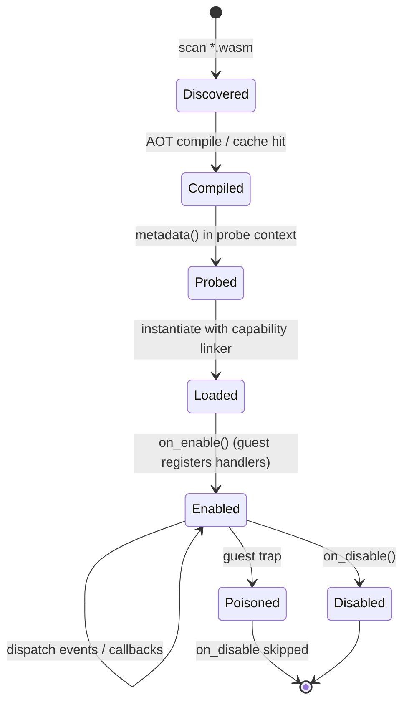
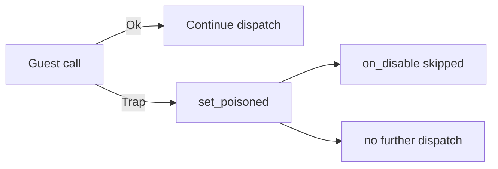

# WASM Plugin Lifecycle

A WASM plugin passes through five stages: discovery, ahead-of-time compilation, metadata probing, load, and enable. After enabling, the host dispatches events and callbacks into the guest until the plugin is disabled. A guest trap at any point poisons the instance and stops further dispatch. This page describes each stage against the loader source.

## State diagram



## Discovery

The loader scans the plugin directory recursively for `*.wasm` files. The `.cache` subdirectory is skipped during the walk, so cached artifacts are never mistaken for plugins.

```rust
// scan_wasm_files in loader.rs
if path.is_dir() {
    if path.file_name().and_then(|n| n.to_str()) != Some(CACHE_SUBDIR) {
        stack.push(path); // recurse, except into .cache
    }
} else if path.extension().and_then(|e| e.to_str()) == Some("wasm") {
    out.push(path);
}
```

If the plugin directory does not exist, discovery returns an empty list rather than an error.

## AOT compilation and caching

Each `*.wasm` is compiled ahead of time and stored as a `.cwasm` artifact under `<plugins_dir>/.cache`. Compilation runs on a blocking task pool (`tokio::task::spawn_blocking`) so it does not stall the async runtime.

The cache key is a SHA-256 hash of the component bytes mixed with two version tags from `consts.rs`:

| Tag | Constant | Value |
|-----|----------|-------|
| Cache subdirectory | `CACHE_SUBDIR` | `.cache` |
| wasmtime line marker | `WASMTIME_CACHE_TAG` | `wasmtime-45` |
| WIT world version | `WORLD_VERSION` | `0.2.3` |

```rust
// AotCache::cache_key in cache.rs
hasher.update(wasm);
hasher.update(b"\0");
hasher.update(WASMTIME_CACHE_TAG.as_bytes()); // wasmtime-45
hasher.update(b"\0");
hasher.update(WORLD_VERSION.as_bytes());      // 0.2.3
```

A change to the component bytes, the wasmtime tag, or the world version produces a different key, so the artifact is recompiled. A stale or corrupt `.cwasm` is removed and rebuilt on the next load.

:::info
The frozen WIT contract is `infrarust:plugin@0.2.3`. The `WORLD_VERSION` constant in `plugin-wit/src/lib.rs` still reads `0.2.0` and is stale; the cache key in `consts.rs` carries the current `0.2.3`.
:::

:::warning
The loader writes `.cwasm` files atomically into its own cache directory and deserializes only artifacts it produced. Never place a hand-written `.cwasm` in `.cache`; deposit `*.wasm` and let the loader compile it.
:::

## Metadata probe

Before a plugin is loaded with capabilities, the loader instantiates the compiled component in a minimal probe context and calls the guest `metadata()` export. The probe context grants no capabilities (`CapabilitySet::default()`) and no plugin context.

```rust
// extract_metadata in metadata.rs
let wit_md = bindings
    .infrarust_plugin_guest()
    .call_metadata(&mut store)
    .await?;
```

The returned record populates the native `PluginMetadata`:

| Field | Source | Notes |
|-------|--------|-------|
| `id` | `wit_md.id` | Key used for dependency resolution and load lookup |
| `name` | `wit_md.name` | |
| `version` | `wit_md.version` | |
| `authors` | `wit_md.authors` | Each appended via `.author(...)` |
| `description` | `wit_md.description` | Optional |
| `dependencies` | `wit_md.dependencies` | `optional: true` becomes an optional dependency, otherwise a hard dependency |

A trap in `metadata()` fails the probe with a `Metadata` error and the plugin is not registered.

## Load

`load` looks the plugin up by `id` in the discovered set, asks the context factory for a `PluginContext`, and reads the capabilities granted to that context. The linker is built against those capabilities, so only the host interfaces the plugin is allowed to call are wired in.

```rust
// load in loader.rs
let capabilities = ctx.capabilities().clone();
let linker = build_linker(&self.engine, plugin_id, &capabilities)?;

// CodecFilter is opt-in: a separate sync instantiator is built only when granted
let codec = if capabilities.has(Capability::CodecFilter) {
    Some(Arc::new(CodecInstantiator::new(/* ... */)?))
} else {
    None
};
```

The store is created with the plugin state, epoch control is installed, and a memory limiter is attached. The component is then instantiated asynchronously.

```rust
let mut store = Store::new(&self.engine, state);
install_epoch_control(&mut store);
store.limiter(|s: &mut PluginStoreState| s.limits_mut() as &mut dyn wasmtime::ResourceLimiter);

let bindings = PluginBindings::instantiate_async(&mut store, &entry.component, &linker).await?;
```

The store enforces a linear-memory cap of `MEMORY_LIMIT` (64 MiB) and traps the guest on a memory-grow failure (`trap_on_grow_failure(true)`). An instantiation error that names a missing `infrarust:plugin/` import is reported as a capability denial rather than a generic failure.

See [Capabilities](./capabilities) for which capabilities are granted by default and which are opt-in, and [Architecture](./architecture) for how the store, linker, and engine fit together.

## Enable

`on_enable` is the synchronous guest entry point where the plugin registers everything it needs. The guest `Plugin` trait is synchronous and returns `Result<(), String>`:

```rust
// SDK guest trait (infrarust-plugin-sdk)
pub trait Plugin: 'static {
    fn metadata(&self) -> PluginMetadata;
    fn on_enable(&self, ctx: &Context) -> Result<(), String>;
    fn on_disable(&self, _ctx: &Context) -> Result<(), String> { Ok(()) }
    fn register_codec_filters(_reg: &mut CodecRegistrar) where Self: Sized {}
    fn register_limbo_handlers(_reg: &mut LimboRegistrar) where Self: Sized {}
}
```

Inside `on_enable` the plugin uses the `Context` to subscribe to events, register commands, and schedule tasks:

```rust
fn on_enable(&self, ctx: &Context) -> Result<(), String> {
    ctx.on(EventPriority::Normal, |e: &mut PostLoginEvent| {
        // observe a login
    });

    ctx.command("greet", |inv: CommandInvocation| {
        // handle /greet
    })
    .description("Send a greeting")
    .register();

    ctx.interval(Duration::from_secs(30), || {
        // periodic task
    });

    Ok(())
}
```

Codec filters and limbo handlers are registered through their own registrar hooks (`register_codec_filters`, `register_limbo_handlers`), each gated by the matching opt-in capability.

`on_enable` runs as the first job of the plugin's task, with a fresh epoch budget. The three outcomes:

| Guest result | Host action |
|--------------|-------------|
| `Ok(())` | Plugin is enabled |
| `Err(message)` | Returned as `PluginError::InitFailed(message)`; plugin not enabled |
| Trap | Instance is poisoned; returned as a trap error carrying the trap message |

## Dispatch

After enabling, events and registered callbacks re-enter the guest. Each plugin instance is owned by one task that runs calls one at a time, in the order they arrive, from a queue of `queue_capacity` entries (`[wasm]` in `infrarust.toml`, default 1024). A call that finds the queue full is refused immediately and logged as a rate-limited warning. A call that has started runs to the end even if its caller stops waiting; a queued call whose caller has already given up is skipped. See [Capabilities & Sandbox](./capabilities#one-call-at-a-time).

Each call into the guest resets the epoch budget first, so a single long callback cannot exhaust a budget left over from an earlier call. A dedicated OS thread bumps the engine epoch every `epoch_tick` (50 ms by default). On each deadline the callback either grants another tick (cooperative yield) or, once the call has used `cpu_budget` (3 s by default, 60 ticks), interrupts the guest with a trap. A call that is still running after `max_call_duration` (60 s by default), host calls included, is abandoned and the instance is poisoned.

A synchronous codec `filter` call gets its own budget, `codec_cpu_budget` (800 ms by default, 16 ticks), re-armed before every `create`/`filter`/lifecycle call. See [Events](./events) for the dispatched event kinds and [Limbo](./limbo) for limbo callbacks.

## Disable

`on_disable` is called on proxy shutdown. It is queued behind any call still running, and it is the last job of the plugin's task: calls queued behind it are dropped and the task stops once it has run, dropping the instance.

If the instance is poisoned, the guest call is skipped and `on_disable` returns `Ok(())` with a warning. For a healthy instance the budget is reset and the guest `on_disable` runs. An `Err(message)` is surfaced as `PluginError::Custom(message)`; a trap during `on_disable` is logged and returned as a `Custom` error.

## Trap and the poisoning model

Any guest trap poisons the instance. The poison flag lives on the store state (`PluginStoreState::poisoned`) and is set on the first trap. Sources of a trap:

- A guest panic.
- An out-of-bounds memory or table access.
- The epoch interrupt after the CPU budget is exceeded.
- A memory-grow failure (the store traps on grow failure once `memory_limit_mb`, 64 MiB by default, is hit).
- Use of a dropped or invalid resource handle.

A call that did not finish poisons the instance the same way: one cut off by `max_call_duration`, or one interrupted by a panic in a host function. A caller that stops waiting (for example the event bus after `[events] handler_timeout`) does not: the call keeps running inside the plugin and the instance stays healthy.

The model is fail-closed: once an instance is poisoned, `on_disable` is skipped and the instance is not asked to run cleanup that could trap again or observe inconsistent state. A poisoned instance is not reused for further dispatch.



:::danger
Poisoning is one-way. There is no recovery path that un-poisons a running instance; the plugin stays inert until the proxy restarts.
:::

### Resource handle lifetimes

The guest owns resource handles it acquires (for example a limbo session handle). The guest is responsible for dropping them. Using a handle after it has been dropped, or using an invalid handle, traps the guest, which poisons the instance under the same fail-closed rule. Hold a handle only as long as the underlying object is valid.

## Hot reload

Hot reload of a changed `*.wasm` without a proxy restart is not implemented. `unload` stops the plugin's task and drops its instance; later calls into the plugin return without running guest code. It does not re-run discovery or swap in a new instance. Replacing a plugin requires a restart, which re-runs discovery and rebuilds the cache when the bytes or version tags change.

## See also

- [Architecture](./architecture): engine, store, and linker layout.
- [Capabilities](./capabilities): baseline versus opt-in grants and their kebab-case strings.
- [Events](./events): the event kinds dispatched into the guest.
- [Limbo](./limbo): limbo handlers and session handles.
- [Deploying](./deploying): where to put `*.wasm` files and how the cache behaves.
- [Native plugin getting started](../dev/getting-started): the async, in-process plugin API for comparison.
