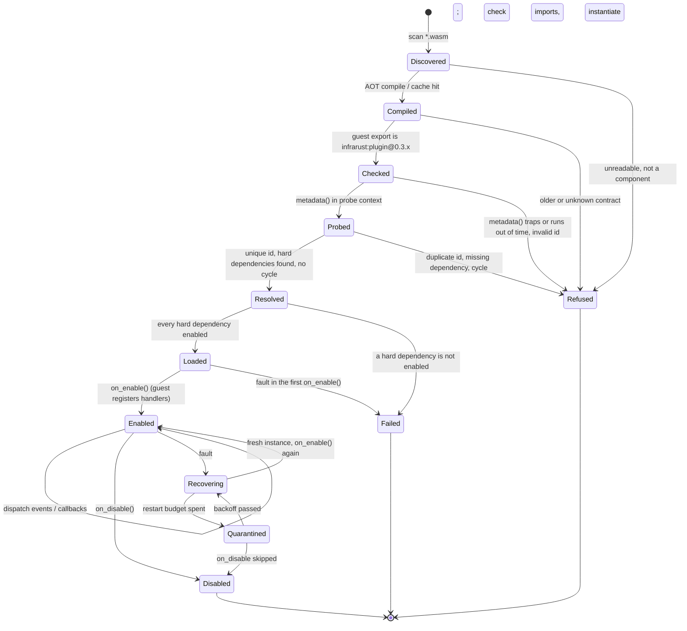
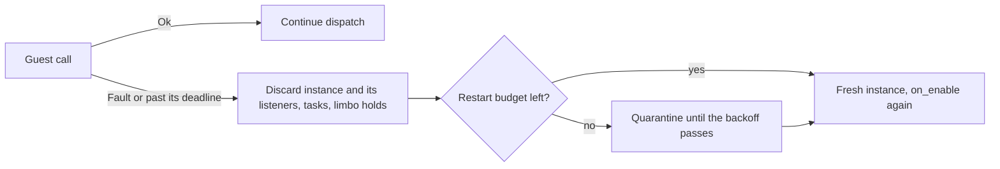

# WASM Plugin Lifecycle

A WASM plugin passes through six stages: discovery, ahead-of-time compilation, the contract check, metadata probing, load, and enable. After enabling, the host dispatches events and callbacks into the guest until the plugin is disabled. A fault after enabling replaces the instance with a fresh one; see [Fault model](./fault-model). This page describes each stage against the loader source.

## State diagram


```mermaid
stateDiagram-v2
    [*] --> Discovered: scan *.wasm
    Discovered --> Compiled: AOT compile / cache hit
    Discovered --> Refused: unreadable, not a component
    Compiled --> Checked: guest export is infrarust:plugin@0.3.x
    Compiled --> Refused: older or unknown contract
    Checked --> Probed: metadata() in probe context
    Checked --> Refused: metadata() traps or runs out of time, invalid id
    Probed --> Resolved: unique id, hard dependencies found, no cycle
    Probed --> Refused: duplicate id, missing dependency, cycle
    Resolved --> Loaded: every hard dependency enabled; check imports, instantiate
    Resolved --> Failed: a hard dependency is not enabled
    Loaded --> Enabled: on_enable() (guest registers handlers)
    Enabled --> Enabled: dispatch events / callbacks
    Enabled --> Disabled: on_disable()
    Enabled --> Recovering: fault
    Recovering --> Enabled: fresh instance, on_enable() again
    Recovering --> Quarantined: restart budget spent
    Quarantined --> Recovering: backoff passed
    Quarantined --> Disabled: on_disable skipped
    Loaded --> Failed: fault in the first on_enable()
    Disabled --> [*]
    Failed --> [*]
    Refused --> [*]
```

`Refused` and `Failed` apply to one plugin. The proxy logs one error for each and starts with the other plugins.

## Discovery

The loader reads the top level of the plugin directory, in sorted order, and takes each regular file named `*.wasm`, or symlink to one. It never enters a subdirectory: the plugins' data directories (`plugins_dir/<id>`, mounted read-write as each guest's `/`) live there, and a component a plugin writes into its data directory must not become a plugin at the next start. A file reached through two links is probed once, under the first name in sorted order.

If the plugin directory does not exist, discovery returns an empty list. If it exists but cannot be read, discovery fails and the proxy does not start. Everything below that is per plugin:

| Problem | What happens |
|---------|--------------|
| An entry named `*.wasm` is a directory | Ignored |
| An entry named `*.wasm` cannot be read (a dangling symlink or a symlink loop) or is not a regular file (a FIFO, a socket) | That entry is refused and never opened |
| A file cannot be read, is empty, is not a binary WebAssembly component, is larger than 256 MiB, or does not compile | That file is refused, see [File check](#file-check) |
| The component targets another contract | That file is refused, see [Contract check](#contract-check) |
| `metadata()` traps, runs out of time, or reports an invalid id | That file is refused, see [Metadata probe](#metadata-probe) |
| Several files report the same id | All of them are refused, see [Duplicate ids and dependencies](#duplicate-ids-and-dependencies) |

A refused file is logged once at `error`, as `WASM plugin refused`, with its path and the cause. The cause is cut at 1 KiB and ends with `[...]` when it was longer, so a compiler error or a guest's trap message cannot flood the log. Discovery goes on with the next file, and the proxy starts with the plugins that passed.

## File check

The loader opens each file and reads its first eight bytes before reading the rest. A component starts with the WebAssembly magic `\0asm` followed by the component header `0d 00 01 00`. Any other file is refused from those bytes:

| File | Cause logged |
|------|--------------|
| Empty | `not a WebAssembly component: the file is empty` |
| Shorter than the header | `not a WebAssembly component: the file ends inside the WebAssembly header` |
| A core module (`\0asm 01 00 00 00`) | `not a WebAssembly component: it is a core WebAssembly module; build the plugin as a component for wasm32-wasip2 with the Infrarust plugin SDK` |
| A component in another binary encoding | `not a WebAssembly component: it is a component in binary encoding version 14, this host reads version 13` |
| WebAssembly text, starting with `(` or `;` | `not a WebAssembly component: WebAssembly text format is not accepted, compile it to a binary component` |
| Anything else | `not a WebAssembly component: the file does not start with the WebAssembly magic bytes \0asm` |
| Larger than 256 MiB | `the plugin file is <size> bytes, above the 268435456-byte limit for a component` |
| Unreadable | `cannot read the plugin file: <system error>` |

The proxy is built without wasmtime's text parser, so WebAssembly text never reaches the compiler. A 512 MiB file of junk is refused in milliseconds, without the rest of it being read.

## AOT compilation and caching

Each component is compiled ahead of time to native code. Compilation runs on a blocking task pool (`tokio::task::spawn_blocking`) so it does not stall the async runtime. The result is kept in the AOT cache, the directory named by `[wasm] cache_dir`, so the next start loads it instead of compiling again. The default is `./cache/wasm`, resolved from the working directory like `plugins_dir` and `servers_dir`. The cache never lives in `plugins_dir`: startup fails when `cache_dir` is `plugins_dir` or a directory inside it.

### Cache key

An entry is a file named `<key>.cwasm`, where the key is the SHA-256 of three parts:

| Part | What it covers |
|------|----------------|
| The component bytes | The `.wasm` file |
| The engine tag | A SHA-256 of wasmtime's `precompile_compatibility_hash()` for the proxy's engine: the exact wasmtime version, the target and its CPU features, and the engine settings that shape compiled code |
| The contract version | `WORLD_VERSION`, `0.3.0` |

Changing the plugin, running a proxy built with another wasmtime version (patch releases included), moving the cache to a CPU with other features, or changing the contract gives a new key, and the plugin is compiled again. `instance_pool` does not change the compiled code, so it does not change the key. The engine tag comes from wasmtime itself, and a test compares the key with the one of the wasmtime version in `Cargo.lock`, so it cannot fall behind a wasmtime upgrade.

:::info
The WIT contract is `infrarust:plugin@0.3.0`. `WORLD_VERSION` in `infrarust-plugin-wit` is the single source for that version: the loader's cache key and contract check both read it, and a test keeps it equal to the package declaration in `wit/world.wit`.
:::

### Loading and writing an entry

For each plugin the loader computes the key and looks for `<key>.cwasm` in `cache_dir`. When the entry exists and passes the checks below, it is loaded. Otherwise the component is compiled in memory and loaded from the compiled bytes, which are then written to the cache: first to a temporary file with a random name in `cache_dir` (`<key>.<random>.cwasm.tmp`), flushed to disk, then renamed over `<key>.cwasm`. The rename is atomic, so a reader never sees a partial entry, and several loaders writing the same entry at once, in one process or in containers that share a volume, each leave a complete one.

An entry that exists but does not load, because it is corrupt or was written by another engine, is compiled again. It is replaced only when the fresh compilation loads, with a warning `AOT cache entry could not be loaded; replaced by a fresh compilation`. When the fresh compilation does not load either, the entry is kept and the plugin is refused with the whole cause, for example with `instance_pool` set: `failed to load the compiled component of <path>: module table does not fit in pooling allocator requirements: table index 0 has a minimum element size of 20000 which exceeds the limit of 512`.

### What the loader trusts

Loading an entry runs its content as native code inside the proxy, and wasmtime cannot verify it. The loader does not sign or authenticate entries: a process that can write into `cache_dir` as the proxy user can already replace the proxy binary. It relies on `cache_dir` being writable by the proxy user only, which is why it is kept out of `plugins_dir`, and on Unix it loads an entry only when the opened file:

- is a regular file, not a symbolic link, and was not swapped between that check and the read;
- is owned by the user the proxy runs as;
- is not writable by group or others.

Any other entry is logged as `AOT cache entry refused; the plugin is compiled again and the entry replaced`, with the reason (`owned by uid 0, not by the user the proxy runs as (uid 1000)`, `writable by group or others (mode 664)`, `not a regular file`), then compiled again and replaced by an entry the proxy owns. The directories the cache creates have mode `0700` and its entries `0600`. On Windows only the regular-file check applies; restrict the directory with its access control list.

:::warning
Never put a `.cwasm` in the cache by hand. Deposit `*.wasm` in `plugins_dir` and let the loader compile it.
:::

### Unwritable cache directory

When `cache_dir` cannot be created or written (a read-only filesystem, a container working directory the proxy user does not own), the loader logs one warning, `AOT cache directory cannot be written; plugins are compiled in memory and compiled again at the next start`, with the directory and the error. Every plugin is then compiled in memory and loads normally: the cache never causes a plugin to be refused. Each start then pays the compilation, about 0.1 s for a typical plugin.

### Removing unused entries

After each discovery the loader removes from `cache_dir` every entry whose key no plugin file of that discovery maps to, so the artifact of a replaced or deleted plugin is gone after the next start. It also removes temporary files older than ten minutes, which a crash during a write can leave. It only touches the names it writes itself: 64 lowercase hexadecimal digits followed by `.cwasm`, or that name's temporary pattern. Two proxies that share one `cache_dir` with different plugins remove each other's entries and compile them again at their next start; give each proxy its own `cache_dir`.

### The cache of earlier versions

Earlier versions kept the cache in `plugins_dir/.cache`. That directory is no longer read and its entries are not migrated, since anyone allowed to add plugin files could have put an entry there. When the loader finds it, it logs once, at `info`, that the directory is no longer read and can be deleted.

## Contract check

Before anything runs, the loader reads which contract the component was built for: the version in the name of its `infrarust:plugin/guest@X.Y.Z` export. It accepts `0.3.M` when `M` is at most the host's patch version, so a host at `0.3.0` loads `0.3.0` plugins only.

| Component | Result |
|-----------|--------|
| Exports `infrarust:plugin/guest@0.3.0` | Continues to the metadata probe |
| Exports `infrarust:plugin/guest@0.2.3`, or any other version | Refused: `plugin built for infrarust:plugin@0.2.3; this host supports infrarust:plugin@0.3.x, rebuild it with an infrarust-plugin-sdk that targets infrarust:plugin@0.3.x` |
| Exports no `infrarust:plugin/guest` interface | Refused: `not an Infrarust plugin component` |

Both refusals are logged with the file and refuse only that file. See [Migrating to 0.3](./migration-0.3).

## Metadata probe

Before a plugin is loaded with capabilities, the loader instantiates the compiled component in a minimal probe context and calls the guest `metadata()` export. The probe context grants no capabilities (`CapabilitySet::default()`) and no plugin context: a gated host call made from `metadata()` returns `PermissionDenied`, and an ungated one returns `Unavailable` or a neutral value.

```rust
// call_metadata in metadata.rs, run under the time limit below
let wit_md = bindings
    .infrarust_plugin_guest()
    .call_metadata(&mut store)
    .await?;
```

The returned record populates the native `PluginMetadata`:

| Field | Source | Notes |
|-------|--------|-------|
| `id` | `wit_md.id` | Key used for dependency resolution and load lookup |
| `name` | `wit_md.name` | |
| `version` | `wit_md.version` | |
| `authors` | `wit_md.authors` | Each appended via `.author(...)` |
| `description` | `wit_md.description` | Optional |
| `dependencies` | `wit_md.dependencies` | `optional: true` becomes an optional dependency, otherwise a hard dependency. The `#[plugin]` macro fills them from `depends` and `soft_depends` |

The probe, instantiation included, has to finish within the smaller of `max_call_duration` and 5 seconds. The limit is wall-clock time, so it also stops a `metadata()` that waits in a host call, such as a sleep, during which the CPU budget does not run. The probe runs before the plugin id is known, so it uses the proxy-wide `[wasm]` values, not a `[plugins.<id>.wasm]` override. A `metadata()` still running at the limit refuses the file with `metadata() did not return within 5s` (or the shorter `max_call_duration`).

The host then checks the id against the plugin id rule: 1 to 64 characters, lowercase ASCII letters, digits, `-` and `_`, starting with a letter or a digit. It is the rule the `#[plugin]` macro applies at compile time, from the same definition in `infrarust-plugin-common`, so it also catches a component that writes its own `metadata()` or is not built with the SDK. The id names the plugin's data directory, `plugins_dir/<id>`, which is mounted as the guest's `/`: an id such as `../x`, an absolute path or `.cache` would place that directory elsewhere. A file whose id breaks the rule is refused with the reason, for example ``plugin id `../x` must start with a lowercase letter or a digit``.

A trap in `metadata()` refuses the file with a `Metadata` error.

## Duplicate ids and dependencies

Once every file is probed, the proxy puts together the plugins of all loaders, the ones compiled into the proxy included, and resolves the load order. Each problem refuses only the plugins it concerns, with one error for each:

| Problem | Refused | Error |
|---------|---------|-------|
| Two or more `.wasm` files report the same id | Every one of those files | One error naming all the files: `several files declare the same plugin id, keep only one of them` |
| A `.wasm` reports the id of a plugin compiled into the proxy | The `.wasm` | `plugin 'x' from loader 'wasm' (<path>) is refused: loader 'static' already provides that id` |
| A hard dependency is not installed | The plugin | `plugin 'x' requires 'y', which was not found` |
| Plugins depend on each other in a cycle | Every plugin in the cycle | `plugin 'x' is refused: its dependencies form a cycle (x, y)` |
| A hard dependency was refused | The plugin, and so on down the chain | `plugin 'x' requires 'y', which is not enabled` |

No copy of a duplicated id is kept, so which one runs never depends on the order of the scan. A backup copy in a subdirectory of `plugins_dir` is not scanned and does not count. An optional dependency that is missing or refused is ignored.

A plugin refused here shows the `error` state with the same message. The proxy then enables the others in dependency order.

## Load

`load` looks the plugin up by `id` in the discovered set, asks the context factory for a `PluginContext`, and reads the capabilities granted to that context. It compares the component's imports with those capabilities: each import the plugin lacks the capability for is logged once, or refuses the load when `strict_capabilities` is set (see [Capabilities](./capabilities#the-load-time-report)). The linker wires in every host interface; the capabilities are checked again on each gated call. It holds nothing specific to a plugin, so the loader builds it once, with its engine, and the metadata probe and every load share it.

```rust
// load in loader.rs
let capabilities = ctx.capabilities().clone();
check_imports(&self.engine, &entry.component, plugin_id, &capabilities, strict)?;
// self.linker was built once in WasmPluginLoader::new

// CodecFilter is opt-in: a separate sync instantiator is built only when granted
let codec = if capabilities.has(Capability::CodecFilter) {
    Some(Arc::new(CodecInstantiator::new(/* ... */)?))
} else {
    None
};
```

The linker is resolved against the component once, into a `PluginPre` (the bindgen wrapper around wasmtime's `InstancePre`). Every instance of the plugin is created from it: the first one at load, and each fresh one after a fault. For each instance a store is created with the plugin state, epoch control is installed, and a memory limiter is attached, then the component is instantiated asynchronously.

```rust
// InstanceFactory in instance.rs
let pre = PluginPre::new(linker.instantiate_pre(component)?)?;

// InstanceFactory::instantiate, once per instance
let mut store = Store::new(&self.engine, state);
install_epoch_control(&mut store, max_epoch_yields);
store.limiter(|s: &mut PluginStoreState| s.limits_mut() as &mut dyn wasmtime::ResourceLimiter);
let bindings = self.pre.instantiate_async(&mut store).await?;
```

The store enforces the linear-memory cap set by `memory_limit_mb` (64 MiB by default, from `[wasm]` or `[plugins.<id>.wasm]`) and traps the guest on a memory-grow failure (`trap_on_grow_failure(true)`). Any instantiation error, a missing `infrarust:plugin/` import included, is reported as `WasmLoaderError::Instantiate` with wasmtime's message. `CapabilityDenied` is only returned with `strict_capabilities = true`, for a plugin that imports a host function whose capability it lacks.

See [Capabilities](./capabilities) for which capabilities are granted by default and which are opt-in, and [Architecture](./architecture) for how the store, linker, and engine fit together.

## Enable

`on_enable` is the synchronous guest entry point where the plugin registers everything it needs. The guest `Plugin` trait is synchronous and returns `Result<(), PluginError>`:

```rust
// SDK guest trait (infrarust-plugin-sdk)
pub trait Plugin: 'static {
    fn metadata(&self) -> PluginMetadata;
    fn on_enable(&self, ctx: &Context) -> Result<(), PluginError>;
    fn on_disable(&self, _ctx: &Context) -> Result<(), PluginError> { Ok(()) }
    fn register_codec_filters(_reg: &mut CodecRegistrar) where Self: Sized {}
    fn register_limbo_handlers(_reg: &mut LimboRegistrar) where Self: Sized {}
}
```

`PluginError` converts from `String`, `&str`, `std::io::Error` and the SDK's `Error`, so `?` works on every host call. Inside `on_enable` the plugin uses the `Context` to subscribe to events, register commands, and schedule tasks:

```rust
fn on_enable(&self, ctx: &Context) -> Result<(), PluginError> {
    ctx.on::<PostLoginEvent>(EventPriority::Normal, |e| {
        // observe a login
    })?;

    ctx.command("greet")
        .description("Send a greeting")
        .handler(|inv| {
            // handle /greet
        })
        .register()?;

    ctx.interval(Duration::from_secs(30), || {
        // periodic task
    })?;

    Ok(())
}
```

`ctx.enable_reason()` tells why `on_enable` runs: `EnableReason::Initial` the first time, `EnableReason::Recovered(RecoveryInfo { attempt, cause })` in a fresh instance after a [fault](#faults-and-recovery). `attempt` numbers the fresh instances the host has started for this plugin since it was loaded, failed ones included (1, 2, 3, ..., never reset), and `cause` describes the fault that ended the previous instance.

Codec filters and limbo handlers are registered through their own registrar hooks (`register_codec_filters`, `register_limbo_handlers`), each gated by the matching opt-in capability.

Before loading a plugin, the proxy checks its hard dependencies. If one of them is not enabled, because `enabled = false` keeps it off, it was refused, it failed to load, or its first `on_enable` failed, the plugin is not loaded either. It gets the `error` state `plugin 'x' requires 'y', which is not enabled`, and one error is logged for it. Plugins are enabled in dependency order, so the check carries on to the dependents of that plugin. An optional dependency never keeps a plugin off.

`on_enable` runs as the first job of the plugin's task, with a fresh epoch budget. The three outcomes:

| Guest result | Host action |
|--------------|-------------|
| `Ok(())` | Plugin is enabled |
| `Err(error)` | Returned as `PluginError::InitFailed(message)`; the instance is discarded with the listeners and tasks it registered, the plugin is not enabled and no fresh instance is tried |
| Trap or cut-off | Returned as an error; the instance is discarded the same way, the plugin is not enabled and no fresh instance is tried |

## Dispatch

After enabling, events and registered callbacks re-enter the guest. Each plugin instance is owned by one task that runs calls one at a time, in the order they arrive, from a queue of `queue_capacity` entries (`[wasm]` in `infrarust.toml`, default 1024). A call that finds the queue full is refused immediately and logged as a rate-limited warning. A call that has started runs until it returns or until its [deadline](#deadlines), where it is cut off; a queued call whose caller has already given up, or whose deadline has passed, is skipped. See [Capabilities & Sandbox](./capabilities#one-call-at-a-time).

Each call into the guest resets the epoch budget first, so a single long callback cannot exhaust a budget left over from an earlier call. A dedicated OS thread bumps the engine epoch every `epoch_tick` (50 ms by default). On each deadline the callback either grants another tick (cooperative yield) or, once the call has used `cpu_budget` (3 s by default, 60 ticks), interrupts the guest with a trap. A call that is still running after `max_call_duration` (60 s by default), host calls included, is abandoned and the instance is replaced (see [Fault model](./fault-model)).

A synchronous codec `filter` call gets its own budget, `codec_cpu_budget` (800 ms by default, 16 ticks), re-armed before every `create`/`filter`/lifecycle call. See [Events](./events) for the dispatched event kinds and [Limbo](./limbo) for limbo callbacks.

### Deadlines

Each call into the guest carries a deadline, fixed when the call is queued:

| Call | Deadline | Why |
|------|----------|-----|
| Event handler | `[events] handler_timeout` minus a margin (9.75 s with the default 10 s) | The event bus stops waiting for the listener at `handler_timeout`; the margin lets the plugin's answer, or the proxy's deny, reach the event first |
| Ban provider call, permission snapshot | The same as an event; a ban check ends at `[ban] check_timeout` when that comes first | The login waits on the answer; see [Bans](./bans) and [Permissions](./permissions) |
| Command, tab completion, scheduled task, limbo callback | `max_call_duration` (60 s by default), counted from when the call is queued | Nothing in the proxy stops waiting earlier |
| `on_enable`, `on_disable` | none | The proxy waits for them, and `on_disable` must run. Each is still cut off at `max_call_duration`, and during a proxy shutdown `on_disable` is stopped after 5 seconds, see [Proxy shutdown](#proxy-shutdown) |

The margin is a fifth of the budget, capped at 250 ms. The deadline has four effects:

- **Host calls fail in time.** Every host call that waits on the proxy (`start` and `stop` on `server-manager`, every `ban-service` function, `switch-server`, `connect`, `transfer`, `request-cookie` and `refresh-permissions` on `players`, `fire-named` on `event-bus`, `set-snapshot` and `release` on `permissions`) returns before the deadline, minus the same margin, so a 10 s `handler_timeout` leaves host calls 9.5 s and a 300 ms one leaves them 192 ms. On expiry the guest gets a `host-error` of kind `timeout`, and no trap. `host_call_timeout` still caps each host call on its own, except `switch-server`, which has its own 250 ms cap.
- **The guest's decision counts.** Because the error arrives inside the margin, the guest still has time to decide and return before its deadline. A PreLogin handler that denies when the ban service errors fails closed, and its denial is applied to the event.
- **The call ends at its deadline.** A guest call still running at its deadline is cut off, like a call that reaches `max_call_duration`: the instance is discarded and replaced, and the cut counts as a fault with the cause `the call ran past the event deadline`. Every caller gets its answer by the deadline, a failure if the plugin did not answer; for an [access event](./events#a-listener-that-does-not-answer) that means the event is denied. `cpu_budget` still bounds guest code between host calls, and `max_call_duration` the whole call from when it starts.
- **The plugin stays available.** A slow call no longer holds the calls queued behind it: they run on the fresh instance within their own deadlines. A call whose deadline passed while it waited in the queue is dropped without running, since its caller can no longer use the result.

See [Host services](./services#slow-services-and-deadlines) for the plugin-side view.

## Disable

`on_disable` is called on proxy shutdown and when the plugin alone is disabled. `ctx.disable_reason()` reports which: `DisableReason::Shutdown` when the proxy is stopping, `DisableReason::Unload` otherwise. When the plugin alone is disabled, `on_disable` is queued behind any call still running, and it is the last job of the plugin's task: calls queued behind it are dropped and the task stops once it has run, dropping the instance. A plugin that is replacing its instance after a fault stops recovering as soon as the restart in progress ends, so `on_disable` and `unload` wait for one restart at most, not for the whole restart budget.

### Proxy shutdown

The proxy stops in three steps: it closes the player sessions and waits up to 30 seconds for the connections to drain, it fires `ProxyShutdownEvent`, then it disables the plugins. The event and the plugins together get 10 seconds, the plugin phase.

- **Calls in flight are cut when the shutdown starts.** A guest call still running when the proxy starts to stop, and the calls queued behind it, are not waited for: the sessions they serve are closing anyway. The host cuts the call, discards the instance and logs `wasm plugin call cut: the proxy is shutting down; the plugin stops without running on_disable`. An access event whose listener is cut this way is denied, see [A listener that does not answer](./events#a-listener-that-does-not-answer). A plugin whose call was cut has no instance left, so it gets neither `ProxyShutdownEvent` nor `on_disable`. A plugin that was idle at that moment keeps its instance: it receives the events of the closing sessions, `ProxyShutdownEvent` and `on_disable` as usual. Calls that start after the shutdown began are not cut by it; their own [deadline](#deadlines) still applies.
- **No recovery.** A plugin that faults once the shutdown has started is not given a fresh instance, and a quarantined plugin is not retried.
- **Plugins are disabled in parallel, dependents first.** The plugins that no enabled plugin depends on are disabled first, all at once; then the plugins that only those depend on, and so on down to the plugins everything else depends on. Each level starts once the previous one is done. Native and WASM plugins take part in the same levels.
- **`on_disable` is stopped after 5 seconds.** A guest `on_disable` still running then is cut, the proxy logs `Plugin on_disable() did not return in time during shutdown; stopping the plugin without it`, and the plugin's listeners, tasks, limbo holds and codec filters are removed as usual. `max_call_duration` still applies when it is shorter.
- **The plugin phase ends after 10 seconds.** When it runs out, `on_disable` is no longer waited for: a level that has not finished is cut, and the next levels are stopped without running `on_disable`. Their cleanup still runs, and every plugin task is stopped before the proxy exits, so no guest is left running a call when the runtime shuts down.

A second SIGTERM or Ctrl-C while the proxy is stopping exits at once, with code 143 for SIGTERM and 130 for Ctrl-C, after one log line. The console `stop` command counts as the first request, so a single signal after it exits at once. The 5 and 10 second limits are fixed for the `infrarust` binary; a program that embeds the proxy sets them with `ProxyRuntimeBuilder::plugin_disable_timeout` and `plugin_shutdown_timeout`.

### No live instance

If the plugin is quarantined, or its first `on_enable` failed, there is no live instance: the guest call is skipped and `on_disable` returns `Ok(())` with a warning. That is why the contract's `DisableReason::Quarantine` is never sent today. For a live instance the budget is reset and the guest `on_disable` runs. An `Err(message)` is surfaced as `PluginError::Other` carrying the message; a trap during `on_disable` is logged and returned as an `Other` error wrapping the loader error, and no fresh instance is started. In every case the host then removes the instance's event listeners and scheduled tasks, releases the players it holds in limbo, removes the plugin's codec filters, and stops the task. `unload` does the same without running the guest.

## Faults and recovery

A fault is a guest trap, a call cut off at its [deadline](#deadlines) or at `max_call_duration`, or a panic in a host function during a call. Sources of a trap:

- A guest panic.
- An out-of-bounds memory or table access.
- The epoch interrupt after the CPU budget is exceeded.
- A memory-grow failure (the store traps on grow failure once `memory_limit_mb`, 64 MiB by default, is hit).
- Use of a dropped or invalid resource handle.

A caller that stops waiting before the call's deadline (for example a session that ends because the player left) is not a fault: the call keeps running inside the plugin, until it returns or reaches its deadline, and the instance stays healthy. The event bus never gives up before an event's deadline: the deadline is set a margin before `[events] handler_timeout`, see [Deadlines](#deadlines).

wasmtime cannot re-enter an instance whose call trapped or was cut off, so the host never reuses it. After a fault in an enabled plugin, the plugin's task discards the instance and its host-side registrations, creates a fresh instance from the compiled component and runs `on_enable` in it with `EnableReason::Recovered`. Restarts are budgeted: past `[wasm.recovery] max_restarts` within `window`, the plugin is quarantined with an exponential backoff and every call to it is answered at once without running guest code. Until a fresh instance is enabled, the access events the plugin listened to are denied, see [A listener that does not answer](./events#a-listener-that-does-not-answer).


```mermaid
flowchart LR
    A[Guest call] -->|Ok| B[Continue dispatch]
    A -->|Fault or past its deadline| C[Discard instance and its listeners, tasks, limbo holds]
    C --> D{Restart budget left?}
    D -->|yes| E[Fresh instance, on_enable again]
    D -->|no| F[Quarantine until the backoff passes]
    F --> E
```

What survives a fresh instance, how commands and limbo handlers are rebound, and how the budget and backoff work are described in [Fault model](./fault-model).

### Resource handle lifetimes

The guest owns resource handles it acquires (for example a limbo session handle). The guest is responsible for dropping them. Using a handle after it has been dropped, or using an invalid handle, traps the guest, which is a fault like any other trap. Handles do not survive a fresh instance. Hold a handle only as long as the underlying object is valid.

## Hot reload

Hot reload of a changed `*.wasm` without a proxy restart is not implemented. `unload` stops the plugin's task and drops its instance; later calls into the plugin return without running guest code. It does not re-run discovery or swap in a new instance. Replacing a plugin requires a restart, which re-runs discovery and rebuilds the cache when the bytes or version tags change.

## See also

- [Fault model](./fault-model): recovery, restart budget and quarantine.
- [Architecture](./architecture): engine, store, and linker layout.
- [Capabilities](./capabilities): baseline versus opt-in grants and their kebab-case strings.
- [Events](./events): the event kinds dispatched into the guest.
- [Limbo](./limbo): limbo handlers and session handles.
- [Deploying](./deploying): where to put `*.wasm` files and how the cache behaves.
- [Native plugin getting started](../dev/getting-started): the async, in-process plugin API for comparison.
