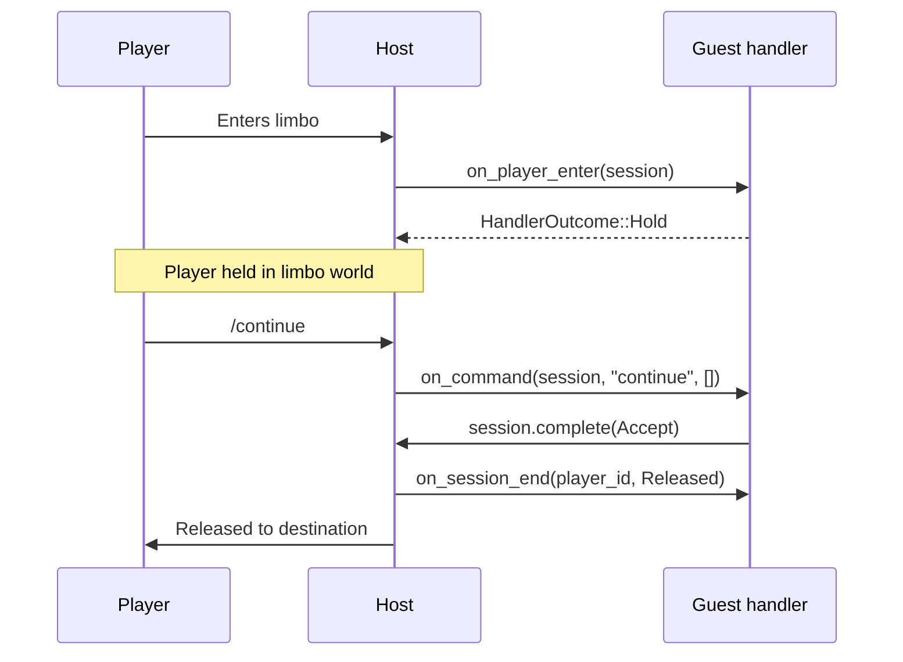

# Limbo Handlers

A limbo session is a player the proxy holds in a minimal world of its own instead of connecting them to a backend. The player sees a flat void, can receive chat, titles, and action-bar messages, and can run commands, but no backend is involved until the handler releases them. Use limbo for an auth gate, a queue, or a maintenance screen.

This page covers the WASM limbo API: the `LimboHandler` trait, the borrowed `LimboSession`, the storable `SessionHandle`, and the outcome types that release, deny, or redirect a held player.

## Capability

Limbo is opt-in. Declare it in the plugin's config permissions; the capability string is `limbo`.

```toml
[plugins.my-gate]
path = "plugins/my-gate.wasm"
permissions = ["limbo"]
```

Without the capability, `reg.add` still compiles and runs, but the host rejects the registration and logs a warning. The handler never fires.

:::info
Capabilities are listed in kebab-case. The baseline set (event bus, player read/write, command, scheduler, config read) is granted to every WASM plugin; `limbo` is one of the opt-ins you must list. See [Capabilities](./capabilities) for the full table.
:::

## Registering a handler

Implement `Plugin::register_limbo_handlers` and call `reg.add(name, handler)`. The `name` is what a server's `limbo_handlers` config references.

```rust
use infrarust_plugin_sdk::prelude::*;

#[derive(Default)]
struct MyPlugin;

struct Gate;

impl LimboHandler for Gate {
    fn on_player_enter(&self, session: &LimboSession) -> HandlerOutcome {
        session
            .send_message(Component::text("Type /continue to proceed"))
            .ok();
        HandlerOutcome::Hold
    }

    fn on_command(&self, session: &LimboSession, command: &str, _args: &[String]) {
        if command == "continue" {
            session.complete(HandlerOutcome::Accept);
        }
    }
}

#[plugin(id = "my-gate", name = "My Gate")]
impl Plugin for MyPlugin {
    fn on_enable(&self, _ctx: &Context) -> Result<(), String> {
        Ok(())
    }

    fn register_limbo_handlers(reg: &mut LimboRegistrar) {
        reg.add("gate", Gate);
    }
}
```

Reference the registered name from the server config:

```toml
limbo_handlers = ["gate"]
```

The proxy routes a player into limbo for that server using the chain in `limbo_handlers`, executed in order. See [Server configuration](../../configuration/servers) for where `limbo_handlers` lives.

## The LimboHandler trait

`on_player_enter` is the entry point and the only required method. It runs once when the player enters limbo and returns a [`HandlerOutcome`](#handleroutcome). The rest have default no-op implementations.

```rust
pub trait LimboHandler {
    fn on_player_enter(&self, session: &LimboSession) -> HandlerOutcome;
    fn on_command(&self, session: &LimboSession, command: &str, args: &[String]) {}
    fn on_chat(&self, session: &LimboSession, message: &str) {}
    fn on_disconnect(&self, player_id: u64) {}
    fn on_session_end(&self, player_id: u64, reason: SessionEndReason) {}
}
```

| Method | When it fires | Receives |
|--------|---------------|----------|
| `on_player_enter` | Player enters limbo | `&LimboSession`, returns `HandlerOutcome` |
| `on_command` | Player runs a command while held | `&LimboSession`, command name, args |
| `on_chat` | Player sends a chat message while held | `&LimboSession`, message text |
| `on_disconnect` | Player's connection drops | `player_id` |
| `on_session_end` | Session ends for any reason | `player_id`, `SessionEndReason` |

:::tip
The plugin state is single-threaded with no async runtime. Keep mutable handler state in `Cell`/`RefCell` fields, as the fixture's `Gate` does with a `RefCell<HashSet<u64>>` of waiting player IDs.
:::

## HandlerOutcome

The value `on_player_enter` returns, and the value you pass to `complete` to end a hold. The variants:

| Variant | Effect |
|---------|--------|
| `Accept` | Release the player to their original destination |
| `Deny(Component)` | Disconnect the player with the given message |
| `Hold` | Keep the player in limbo; release later via `complete` |
| `HoldWithTimeout { after, on_timeout }` | Hold, then resolve with `on_timeout` if `complete` is not called within `after` |
| `Redirect(String)` | Send the player to the named server |
| `SendToLimbo(Vec<String>)` | Route the player through another limbo-handler chain |

```rust
pub enum HandlerOutcome {
    Accept,
    Deny(Component),
    Hold,
    HoldWithTimeout { after: Duration, on_timeout: TimeoutOutcome },
    Redirect(String),
    SendToLimbo(Vec<String>),
}
```

### TimeoutOutcome

`HoldWithTimeout` carries a `TimeoutOutcome`, not a `HandlerOutcome`. A timeout is terminal and cannot re-arm another hold; the type forbids it.

```rust
pub enum TimeoutOutcome {
    Accept,
    Deny(Component),
    Redirect(String),
    SendToLimbo(Vec<String>),
}
```

The engine owns the timer for `HoldWithTimeout`. It fires even if the plugin's own scheduled tasks die, so a timed gate stays bounded without the plugin tracking a deadline.

```rust
fn on_player_enter(&self, session: &LimboSession) -> HandlerOutcome {
    session
        .send_message(Component::text("Type /continue within 5s"))
        .ok();
    HandlerOutcome::HoldWithTimeout {
        after: Duration::from_secs(5),
        on_timeout: TimeoutOutcome::Deny(Component::text("Timed out")),
    }
}
```

## LimboSession

`LimboSession` is borrowed. It is valid only for the duration of the dispatch call that received it (`on_player_enter`, `on_command`, `on_chat`). Do not store the reference. To act on a held player after the call returns, take a [`SessionHandle`](#sessionhandle).

| Method | Returns | Purpose |
|--------|---------|---------|
| `player_id()` | `u64` | The held player's session id |
| `profile()` | `GameProfile` | The player's game profile |
| `entry_context()` | `EntryContext` | Why the player entered limbo |
| `send_message(Component)` | `Result<(), PlayerError>` | Send a chat message |
| `send_title(TitleData)` | `Result<(), PlayerError>` | Send a title |
| `send_action_bar(Component)` | `Result<(), PlayerError>` | Send an action-bar message |
| `complete(HandlerOutcome)` | `()` | Release, deny, or redirect a held player |
| `handle()` | `SessionHandle` | Mint a storable handle for later completion |

### EntryContext

`entry_context()` reports how the player arrived in limbo:

```rust
pub enum EntryContext {
    InitialConnection(String),                          // server id
    KickedFromServer { server: String, reason: String },
    PluginRedirect(Option<String>),                     // optional server id
}
```

Branch on this to vary the gate, for example a maintenance message for `InitialConnection` versus a reconnect prompt for `KickedFromServer`.

## SessionHandle

`SessionHandle` is owned and storable across calls. Mint one with `session.handle()` while a `LimboSession` is live, move it into a scheduled task or an event handler, and complete the hold later.

| Method | Returns | Purpose |
|--------|---------|---------|
| `player_id()` | `u64` | The held player's session id |
| `send_message(Component)` | `Result<(), PlayerError>` | Send a chat message |
| `send_title(TitleData)` | `Result<(), PlayerError>` | Send a title |
| `send_action_bar(Component)` | `Result<(), PlayerError>` | Send an action-bar message |
| `complete(HandlerOutcome)` | `()` | Release, deny, or redirect the held player |
| `cancelled()` | `bool` | True once the session has ended |

`complete` on a stale handle is a safe no-op: the host captures the hold generation when the handle is minted, so a completion that arrives after the session advanced or ended does nothing. `cancelled()` returns `true` once the engine has ended the session, which lets a repeating task know to stop.

### Async hold pattern

Return `Hold` from `on_player_enter`, store the handle in a scheduled task, and complete the hold when the work finishes. Check `cancelled()` first so a disconnected player is not acted on.

```rust
struct DelayedGate;

impl LimboHandler for DelayedGate {
    fn on_player_enter(&self, session: &LimboSession) -> HandlerOutcome {
        let handle = session.handle();                  // [!code focus]
        Context::new().delay(Duration::from_millis(50), move || {
            if !handle.cancelled() {                     // [!code focus]
                handle.complete(HandlerOutcome::Accept); // [!code focus]
            }
        });
        HandlerOutcome::Hold                             // [!code focus]
    }
}
```

`Context::new()` is a zero-sized handle to the runtime, so a `LimboHandler` that does not receive a `&Context` can still schedule tasks and subscribe to events. `delay` runs the task once after the duration; `interval` runs it repeatedly. Both return a `TaskHandle` you can pass to `ctx.cancel`.

## Session lifecycle



### on_session_end

`on_session_end` fires when the player's limbo session ends, for any reason. Use it to drop a stored `SessionHandle` and cancel scheduled tasks tied to that player.

```rust
pub enum SessionEndReason {
    Disconnected,
    Released,
    Kicked,
    Redirected,
    TimedOut,
    Shutdown,
}
```

| Reason | Cause |
|--------|-------|
| `Disconnected` | Player's connection dropped |
| `Released` | Handler completed with `Accept` |
| `Kicked` | Handler completed with `Deny` |
| `Redirected` | Handler completed with `Redirect` |
| `TimedOut` | A `HoldWithTimeout` deadline elapsed |
| `Shutdown` | The proxy is shutting down |

:::warning
A handle stored across a hold outlives the session if you never drop it. Clean up in `on_session_end` (or `on_disconnect` for connection drops) so stored handles and tasks do not accumulate per player.
:::

## Fail-closed behavior

The host treats a guest trap as a denial, never a silent pass. A trap also poisons the instance, so subsequent dispatches to that instance short-circuit instead of running stale guest code.

| Dispatch | On trap |
|----------|---------|
| `on_player_enter` | Session is denied with "Limbo handler unavailable"; instance poisoned |
| `on_command` | The command is dropped; instance poisoned |
| `on_chat` | The chat message is dropped; instance poisoned |
| `on_disconnect` | Cleanup is skipped; instance poisoned |
| `on_session_end` | Cleanup is skipped; instance poisoned |

A handler that panics in `on_player_enter` denies the player rather than leaving them stuck in limbo:

```rust
struct Boom;

impl LimboHandler for Boom {
    fn on_player_enter(&self, _session: &LimboSession) -> HandlerOutcome {
        panic!("boom: this handler always traps");
    }
}
```

The host also denies the session if it cannot upgrade the instance reference or cannot lend the native session to the guest.

## See also

- [Services](./services): player, server, ban, and config accessors usable from a handler
- [Capabilities](./capabilities): the full capability table and the baseline set
- [API Reference](./api-reference): every exported type and method
- [Examples](./examples): complete plugin sources, including limbo gates
- [Architecture](./architecture): how the host lends sessions and poisons instances
- [Native plugin guide](../dev/getting-started): the async native API, which differs from this synchronous WASM API
