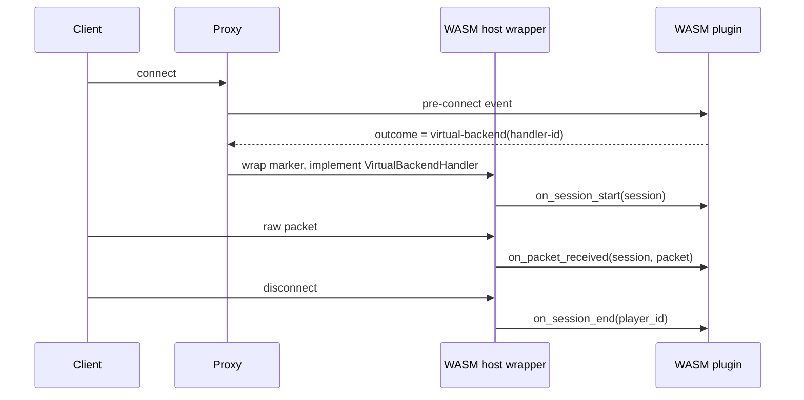

# Virtual Backend (Planned)

::: warning Not implemented
A Virtual Backend lets a plugin act as the player's server, but the WASM side does not exist yet. The `virtual-backend` capability is defined in the enum, it is not enforced, there is no dispatch wiring in the proxy, and there is no WASM bridge. Do not rely on this page for anything you ship today. For held-player use cases that work now, use [Limbo](./limbo).
:::

## What a Virtual Backend is

A Virtual Backend is a plugin-hosted "server" that speaks raw Minecraft packets directly to the client, with no real backend behind it. The plugin takes full control of the connection and handles the protocol itself: join-game packets, chunks, keep-alive responses, chat, and movement.

The use cases are custom lobbies, mini-games, queue screens with interactivity, and protocol bridges that translate to a non-Minecraft service. A real backend server is not required.

::: info Limbo vs. Virtual Backend
[Limbo](./limbo) holds a player in a minimal idle world that the proxy renders for you. A Virtual Backend hands you the raw packet stream so you render the world yourself. Limbo is available now; Virtual Backend is planned.
:::

## What exists today

The native trait surface lives in `infrarust-api` under `src/virtual_backend/`. These traits are defined but not wired into the proxy, and no WASM plugin can implement them.

### The handler trait

A native Virtual Backend implements `VirtualBackendHandler` (`crates/infrarust-api/src/virtual_backend/handler.rs`):

```rust
pub trait VirtualBackendHandler: Send + Sync {
    fn name(&self) -> &str;

    /// Called when a player session starts on this virtual backend.
    fn on_session_start(&self, session: &dyn VirtualBackendSession) -> BoxFuture<'_, ()>;

    /// Called when a packet is received from the client.
    fn on_packet_received(
        &self,
        session: &dyn VirtualBackendSession,
        packet: &RawPacket,
    ) -> BoxFuture<'_, ()>;

    /// Called when the player session ends (disconnect or server switch).
    fn on_session_end(&self, player_id: PlayerId) -> BoxFuture<'_, ()>;
}
```

The trait is async (`BoxFuture`), which is the native plugin shape, not the synchronous guest `Plugin` trait used by WASM plugins. The doc comments state two hard requirements: `on_session_start` must send a `JoinGame` packet and initial world data or the client disconnects, and `on_packet_received` must answer `KeepAlive` packets.

### The session handle

Inside the callbacks the handler receives a `VirtualBackendSession` (`crates/infrarust-api/src/virtual_backend/session.rs`). The trait is sealed, so only the proxy implements it:

```rust
pub trait VirtualBackendSession: Send + Sync + private::Sealed {
    fn player_id(&self) -> PlayerId;
    fn profile(&self) -> &GameProfile;
    fn protocol_version(&self) -> ProtocolVersion;

    /// Sends a raw packet to the client.
    fn send_packet(&self, packet: &RawPacket) -> Result<(), PlayerError>;

    /// Sends a chat message to the player (convenience wrapper).
    fn send_message(&self, message: Component) -> Result<(), PlayerError>;

    /// Switches the player to a real backend server.
    fn switch_server(&self, target: ServerId) -> BoxFuture<'_, Result<(), PlayerError>>;

    /// Disconnects the player with a reason message.
    fn disconnect(&self, reason: Component) -> BoxFuture<'_, ()>;
}
```

| Method | Returns | Purpose |
|--------|---------|---------|
| `player_id()` | `PlayerId` | Identifier for the connected player. |
| `profile()` | `&GameProfile` | The player's game profile (name, UUID, properties). |
| `protocol_version()` | `ProtocolVersion` | Negotiated client protocol version. |
| `send_packet(packet)` | `Result<(), PlayerError>` | Sends a raw packet to the client. |
| `send_message(message)` | `Result<(), PlayerError>` | Sends a chat component to the player. |
| `switch_server(target)` | `BoxFuture<Result<(), PlayerError>>` | Moves the player to a real backend. |
| `disconnect(reason)` | `BoxFuture<()>` | Disconnects the player with a reason. |

`send_packet` and `send_message` return `Err(PlayerError::SendFailed)` when delivery fails.

### The capability

`Capability::VirtualBackend` is a variant in the `Capability` enum (`crates/infrarust-api/src/permissions.rs`), and `to_kebab()` maps it to the config string `virtual-backend`. Its presence in the enum is the full extent of the integration today.

```rust
// crates/infrarust-api/src/permissions.rs, Capability::to_kebab()
Capability::VirtualBackend => "virtual-backend",
```

::: danger Capability not enforced
`virtual-backend` is not in the [baseline](./capabilities). Listing it in `permissions` does insert `Capability::VirtualBackend` into the granted set (unlike `transport-filter`, it is not rejected by `from_config_strings`), but no host code reads it, so granting it has no effect today.
:::

## What does not exist

Three pieces are missing before a WASM plugin can host a backend:

- Enforcement: nothing in the host checks `virtual-backend`. The WASM linker (`crates/infrarust-loader-wasm/src/linker.rs`) conditionally links a host interface only for `event-bus`, `player-read`, `command`, `scheduler`, `config-read`, `server-manage`, `ban`, and `codec-filter`. There is no branch for `virtual-backend`.
- Dispatch: the proxy has no path that routes a player's connection to a registered `VirtualBackendHandler`.
- WASM bridge: there is no host wrapper that forwards `on_session_start`, `on_packet_received`, and `on_session_end` to guest exports.

The WIT contract (`infrarust:plugin@0.2.3`) reflects this. The world header in `crates/infrarust-plugin-wit/wit/world.wit` states the scope of v0.2 and defers virtual backend to a later minor, and the `guest` interface in `guest.wit` repeats it next to the event types:

```wit
// world.wit
// Versioned and frozen. v0.2 adds raw-packet events, codec filters, limbo, and
// custom permission checkers; virtual backend stays deferred to a later minor.

// guest.wit
// ServerPreConnectResult::VirtualBackend stays deferred to a later minor and is
// absent from event-outcome.
```

The `server-pre-connect-result` variant in `guest.wit` has exactly four arms (`allowed`, `connect-to`, `send-to-limbo`, `denied`); there is no `virtual-backend` arm, so a guest has no way to return the marker the dispatch would need.

## The planned approach

When Virtual Backend reaches WASM, the likely shape reuses the marker-plus-proxy pattern that already drives Limbo and custom permission checkers. Nothing below is implemented; it is the intended design, not current behavior.

In that pattern (see [Architecture](./architecture)), a guest registers a `handler-id`, the host wraps that id in a small native struct, and each native callback is forwarded to a guest export keyed by the id. Limbo does this today with `WasmLimboHandler` (`crates/infrarust-loader-wasm/src/limbo.rs`), which implements the native `LimboHandler` trait and calls back into `limbo-on-player-enter`, `limbo-on-command`, and the rest.

A Virtual Backend bridge would follow the same outline:



For this to work, two contract changes are needed that do not exist today: a `virtual-backend(handler-id)` arm on `server-pre-connect-result` (so the guest can return the marker through its `event-outcome`), and guest export functions plus a host wrapper that implements `Box<dyn VirtualBackendHandler>` over a `handler-id`. Because the wrapper shape mirrors the working Limbo bridge, this is a minor WIT bump rather than a redesign, but it still waits on the native dispatch becoming operational first.

## Until then

Use [Limbo](./limbo) to hold a player without a backend. The Limbo path is exposed to WASM through `infrarust:plugin@0.2.3` (`register-limbo-handler`, `hold-with-timeout`, `on-session-end`), covers idle worlds and queue screens, and runs today.

If you need packet-level control before Virtual Backend lands, the [`raw-packet` capability and `RawPacketEvent`](./capabilities) are the relevant contract surface to track; note that `raw-packet` is defined in the WIT contract and not yet exposed by the SDK.

## See also

- [Limbo](./limbo): the held-player path that works now.
- [Capabilities](./capabilities): baseline grants, opt-in capabilities, and config strings.
- [Architecture](./architecture): how the host loads and dispatches to WASM plugins.
- [Native plugin development](../dev/getting-started): where the `VirtualBackendHandler` and `VirtualBackendSession` traits live.
- [Configuration](../../configuration/): the `permissions` list format.
